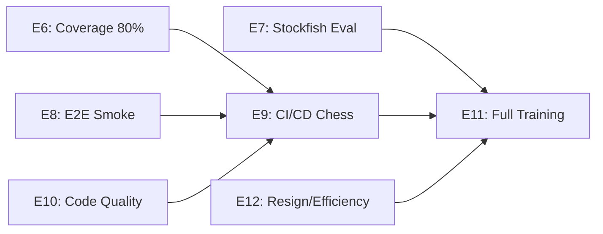

# AlphaGalerkin Chess Self-Play — Sprint Plan

## Goal

Retrain AlphaGalerkin on chess via **pure self-play** (AlphaZero methodology), matching the DeepMind specification: no pre-training against Stockfish, no rule injection. Stockfish is used only as a **benchmark evaluation target** to measure Elo progress.

## Current State (Post-Sprint 1)

| Component | Status | Notes |
| --- | --- | --- |
| `ChessGame` | ✅ Done | 119-channel tensor, 4672 action space, full rule engine |
| `StatefulGameWrapper` | ✅ Done | Bridges `GameInterface` → MCTS protocol |
| `ActionPolicyHead` | ✅ Done | Dense 4672-action policy output head |
| Game-agnostic `SelfPlayWorker` | ✅ Done | Accepts `GameInterface`, uses `StatefulGameWrapper` |
| Game-agnostic `Trainer` | ✅ Done | Wires `game` through pipeline |
| Game-agnostic collators | ✅ Done | Per-experience position-based vs fixed detection |
| `config/train_chess.yaml` | ✅ Done | AlphaZero chess parameters |
| `scripts/train_chess.py` | ✅ Done | Chess training CLI |
| Chess unit tests (29) | ✅ Done | Wrapper, model, self-play |
| Underpromo encode/decode fix | ✅ Done | `[-1,0,1]` → `[0,-1,1]` mismatch |
| Collator mask fix | ✅ Done | `board_size²+1` → `target_policy.size(0)` |
| End-to-end training (10 steps) | ✅ Done | Loss 9.06 → 7.50, checkpoint saved |
| Stockfish benchmark eval | ❌ Missing | `EngineMatch` exists but not wired into training loop |
| CI/CD chess integration | ⚠️ Partial | Pipeline exists but doesn't specifically validate chess |
| Coverage (chess modules) | ⚠️ ~26% | Need to reach 80% per user requirements |
| Full-scale training | ❌ Not started | Only verified with 10 steps / 10 games |

## Sprint 2 (Current): Testing, Coverage & Evaluation

### Epic 6: Reach 80% Test Coverage (L) — Priority 1

**Target**: 80% coverage for all chess-specific modules, matching user's global rule.

| Task | File | Scope |
| --- | --- | --- |
| **E6.1** Chess game edge cases | `tests/games/test_chess.py` | Promotion, castling, en passant, check/checkmate, stalemate, 50-move, threefold repetition |
| **E6.2** Encode/decode roundtrip fuzz | `tests/games/test_chess.py` | Exhaustive roundtrip for all 4672 action indices |
| **E6.3** Collator chess-specific tests | `tests/data/test_collate.py` | Chess experience batching, mask shapes |
| **E6.4** Trainer chess integration | `tests/training/test_trainer.py` | Single training step with chess config |
| **E6.5** Self-play robustness | `tests/training/test_chess_self_play.py` | Multi-game generation, experience shapes, game termination |
| **E6.6** Security/sanity tests | `tests/security/test_chess_inputs.py` | Invalid state injection, out-of-bounds actions |

### Epic 7: Stockfish Benchmark Evaluation (M) — Priority 2

**Problem**: No automated Elo tracking against Stockfish during training.

| Task | Change |
| --- | --- |
| **E7.1** Wire `EngineMatch` into `Trainer.train()` at `eval_interval` | Periodic games vs Stockfish at configurable depth |
| **E7.2** Log Elo to W&B | Track Elo rating curve over training steps |
| **E7.3** Stockfish eval tests | Test evaluation integration (mock Stockfish) |

### Epic 8: E2E Chess Training Smoke Test (S) — Priority 3

| Task | Change |
| --- | --- |
| **E8.1** `tests/e2e/test_chess_training_e2e.py` | Run 2 self-play games + 2 training steps, verify no crash |
| **E8.2** Checkpoint resume test | Save → load → train, verify state continuity |

---

## Sprint 3: CI/CD Hardening & Code Quality

### Epic 9: CI/CD Chess Integration (M)

| Task | Change |
| --- | --- |
| **E9.1** Add chess-specific `pytest` marker: `@pytest.mark.chess` | Tag all chess tests |
| **E9.2** Add chess test stage to `.github/workflows/ci.yml` | Parallel job for chess unit + integration |
| **E9.3** Coverage gate: `--cov-fail-under=80` for chess modules | Block merge below 80% |
| **E9.4** CD pipeline: Docker build + staging deploy | Containerize training for cloud launch |

### Epic 10: Code Quality Hardening (S)

| Task | Change |
| --- | --- |
| **E10.1** Resolve pre-existing mypy errors in shared modules | `attention.py`, `fnet.py`, `embeddings.py` etc. |
| **E10.2** ADR table formatting | Fix MD060 warnings in `ADR-chess-self-play.md` |
| **E10.3** Ruff format check | Ensure `ruff format --check` passes |

---

## Sprint 4: Full-Scale Training Launch

### Epic 11: Production Training Run (XL)

| Task | Description |
| --- | --- |
| **E11.1** Configure multi-hour training run | 5K-50K steps, 100-400 MCTS sims, LR schedule |
| **E11.2** Monitor W&B dashboard | Loss curves, Elo vs Stockfish, game length |
| **E11.3** Iterative hyperparameter tuning | Adjust c_puct, n_simulations, temperature schedule |
| **E11.4** Resume/checkpoint validation | Verify training continues correctly from checkpoint |

### Epic 12: Resign & Efficiency (S)

| Task | Description |
| --- | --- |
| **E12.1** Implement resign threshold (-0.9 value) | Skip rest of game when position is lost |
| **E12.2** Batch MCTS evaluation | GPU-batch multiple MCTS leaf nodes |

---

## Dependencies

## Risks & Mitigations

| Risk | Impact | Mitigation |
| --- | --- | --- |
| Coverage gaps slow merge | Blocks CI | Sprint 2 priority 1 |
| Stockfish binary unavailable in CI | No eval testing | Mock Stockfish in tests, real eval local |
| GPU memory at full MCTS sims | Training crashes | Reduce batch_size, use AMP (both configured) |
| Long training time (~hours) | Iteration slow | Small-scale validation first, then scale |

## DeepMind Specification Alignment

| Parameter | AlphaZero | Our Value | Status |
| --- | --- | --- | --- |
| Self-play (pure, no opponents) | ✅ | ✅ | ✅ Implemented |
| Dirichlet α (chess) | 0.3 | 0.3 | ✅ |
| Dirichlet ε | 0.25 | 0.25 | ✅ |
| Temperature: 1.0 → 0 at move 30 | ✅ | ✅ | ✅ |
| c_puct | 2.5 | 2.5 | ✅ |
| LR schedule | step | cosine | ⚠️ Close, could match |
| MCTS sims/move | 800 | 10-400 | ⚠️ Scaled for single-GPU |
| Resign threshold | -0.9 | Not impl | ❌ Sprint 4 |
