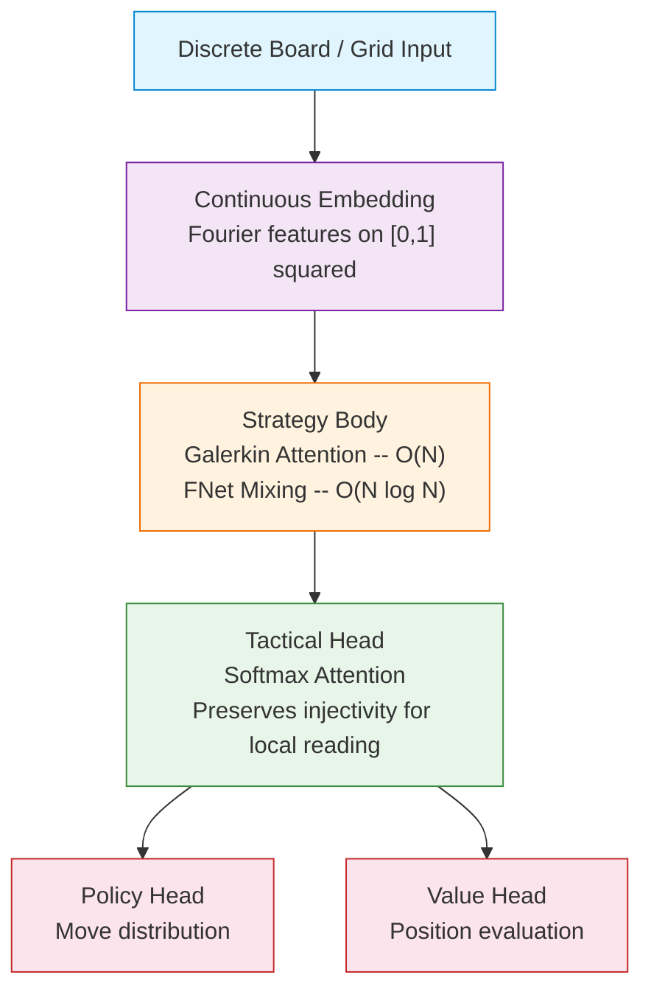
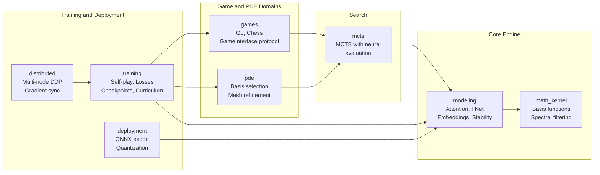

# AlphaGalerkin

**Resolution-Independent AI via Continuous Operator Learning**

[](https://github.com/ianshank/AlphaGalerkin/actions/workflows/ci.yml)
[](https://github.com/ianshank/AlphaGalerkin/actions)
[](https://www.python.org/)
[](https://pytorch.org/)

AlphaGalerkin is a multi-domain AI framework that combines **Continuous Operator Learning** (Galerkin Transformers, FNet) with **Monte Carlo Tree Search**. By treating inputs as continuous functions on a domain rather than fixed-resolution grids, the same model generalizes across resolutions without retraining. Currently applied to **Go**, **Chess**, and **PDE solving**.

---

## Table of Contents

- [Overview](#overview)
- [Key Features](#key-features)
- [Architecture](#architecture)
- [Installation](#installation)
- [Quick Start](#quick-start)
- [Configuration](#configuration)
- [Testing](#testing)
- [Mathematical Foundation](#mathematical-foundation)
- [Performance](#performance)
- [Project Structure](#project-structure)
- [Contributing](#contributing)
- [License](#license)

---

## Overview

### The Problem

Traditional game AI systems (AlphaGo, AlphaZero) use discrete CNNs tied to a fixed board size. A 19x19 model cannot play 9x9 without retraining. This means no transfer learning across resolutions, redundant training per board size, and no support for non-standard grids.

### The Solution

AlphaGalerkin treats the board as a **continuous domain** on [0,1]^2 rather than a discrete grid, using:

- **Galerkin Attention** -- O(N) integral operator approximation via Petrov-Galerkin projection
- **Fourier Positional Encoding** -- resolution-independent spatial representation
- **Spectral Adaptation** -- zero-shot transfer through proper frequency filtering

The result: train on 9x9, play on 19x19 with no retraining. The model learns continuous influence fields rather than pixel patterns, and accelerates MCTS rollouts 5x+ via FFT-based mixing.

---

## Key Features

**Resolution Independence** -- A single model handles any board size. Train on small boards for fast iteration, deploy on full-size boards without modification.

**O(N) Attention Complexity** -- Galerkin attention replaces O(N^2) softmax attention with O(N) linear complexity through Monte Carlo integral approximation, scaling efficiently to large grids.

**Fast MCTS Rollouts** -- FNet mixing uses FFT operations at O(N log N) instead of O(N^2) attention, delivering ~5x speedup for leaf evaluation during search.

**Mathematical Rigor** -- Built on Fredholm integral equations with Green's function formulation, LBB inf-sup stability monitoring, and spectral anti-aliasing for resolution transfer.

**Multi-Domain Support** -- The same architecture applies to Go (board games), Chess (AlphaZero-style self-play), and PDE solving (MCTS-guided Galerkin basis selection and adaptive mesh refinement).

---

## Architecture

### Model Pipeline



- **Continuous Embedding**: Maps discrete grid positions to Fourier features on a continuous domain, enabling resolution independence.
- **Strategy Body**: Stacked Galerkin attention layers model global influence at O(N) cost. FNet blocks provide O(N log N) spectral mixing for fast MCTS rollouts.
- **Tactical Head**: Softmax attention preserves injectivity for precise local reading (life-and-death in Go, tactical combinations in Chess).
- **Policy / Value Heads**: Standard AlphaZero-style outputs -- move probability distribution and position evaluation.

### System Modules



For comprehensive C4 architecture diagrams, see [docs/architecture/c4_mermaid.md](docs/architecture/c4_mermaid.md).

---

## Installation

### Prerequisites

- Python 3.10+
- PyTorch 2.0+
- CUDA 11.8+ (optional, for GPU acceleration)

### From Source

```bash
git clone https://github.com/ianshank/AlphaGalerkin.git
cd AlphaGalerkin
python -m venv venv
source venv/bin/activate
pip install -e ".[dev]"
```

---

## Quick Start

### E2E Dashboard

Launch the interactive dashboard exposing all AlphaGalerkin capabilities in a single tabbed UI:

```bash
python dashboard/app.py
# Open http://localhost:7860
```

Options:
```bash
python dashboard/app.py --port 8080 --share    # Gradio public link
python dashboard/app.py --debug                # Verbose logging
```

The dashboard includes:
| Tab | Description |
|-----|-------------|
| **Go AI** | Human vs AI and AI vs AI — 9×9 / 13×13 / 19×19 with zero-shot transfer |
| **PDE Solver** | Interactive Poisson solver — charge patterns, multi-resolution comparison |
| **PoC Scenarios** | Complexity O(N) benchmark, LBB stability, transfer milestone visualisation |
| **Training** | Architecture summary, simulated training curves, loss breakdown diagram |
| **Reentry TPS** | Heat-diffusion through thermal protection tiles — bondline temperature analysis |
| **Wildfire Spread** | Advection-diffusion fire model with wind, fuel, and combustion dynamics |
| **Missile Defense** | Ballistic intercept trajectories with potential flow at variable resolution |
| **About** | Project overview and quick-start commands |

### GTP Engine

Connect to any GTP-compatible Go GUI (Sabaki, GoGui, KaTrain):

```bash
python -m src.tools.cli gtp --model checkpoints/model.pt --board-size 19
```

### Python API

```python
import torch
from config.schemas import OperatorConfig
from src.modeling.model import AlphaGalerkinModel

config = OperatorConfig(
    d_model=256,
    n_heads=8,
    n_galerkin_layers=6,
    n_softmax_layers=2,
)
model = AlphaGalerkinModel(config)

# Inference on any board size
board = torch.randn(1, 17, 19, 19)
output = model(board)
print(f"Policy shape: {output.policy_logits.shape}")  # (1, 362)
print(f"Value: {output.value.item()}")                 # [-1, 1]
```

### MCTS Search

```python
from src.mcts.search import MCTS
from src.mcts.evaluator import ModelEvaluator

evaluator = ModelEvaluator(model, device="cuda")
mcts = MCTS(evaluator=evaluator, n_simulations=800, c_puct=1.5)

action_probs = mcts.search(game_state)
best_move = mcts.get_action(game_state, temperature=0)
```

### Training

```bash
# Go self-play training
python -m scripts.train

# Chess self-play with Stockfish evaluation
python -m scripts.train_chess training.total_steps=1000 mcts.n_simulations=100

# Fast test run
python -m scripts.train --config-name=train_fast
```

---

## Configuration

All configuration uses [Pydantic](https://docs.pydantic.dev/) schemas with [Hydra](https://hydra.cc/) for CLI overrides.

```python
from config.schemas import OperatorConfig

config = OperatorConfig(
    d_model=256,              # Hidden dimension
    n_heads=8,                # Attention heads
    n_galerkin_layers=6,      # Global influence layers (O(N) Galerkin)
    n_softmax_layers=2,       # Local tactical layers (O(N^2) Softmax)
    use_fnet_mixing=True,     # Enable FFT mixing for fast rollouts
    lbb_beta_threshold=1e-6,  # LBB stability threshold
    input_channels=17,        # Board feature planes (Go: 17, Chess: 119)
    n_fourier_features=64,    # Positional encoding dimension
)
```

See `config/` for training, scenario, and benchmark configurations.

---

## Testing

The project has **5,100+ tests** across unit, integration, E2E, property-based, and security categories with an 85% coverage gate.

```bash
# Dashboard-only tests (203 tests, 89% coverage)
pytest tests/dashboard/ -v --cov=dashboard

# Full test suite
pytest tests/ -v

# Verify resolution invariance
python -m src.tools.verify_invariance --train-size 9 --infer-size 19

# PoC scenario framework
python -m src.poc.cli run --config config/scenarios/poc_quick.yaml

# Code quality
ruff check src/
mypy src/ --strict
```

---

## Mathematical Foundation

### Galerkin Projection

The core insight is treating attention as a **Petrov-Galerkin projection** for solving integral equations:

```
Find u in U:  <Lu, v> = <f, v>    for all v in V
```

In attention form, Q = test basis, K = trial basis, V = function to project:

```
Context = K^T V / n     (Monte Carlo integral approximation)
Output  = Q * Context   (Reconstruction in test basis)
```

This achieves O(N) complexity vs. O(N^2) for standard softmax attention.

### LBB Stability

Convergence is guaranteed by monitoring the **inf-sup condition**:

```
inf_u sup_v <Lu, v> / (||u|| ||v||) >= beta > 0
```

In practice, `dim(Key) >= dim(Query)` satisfies the condition. The `StabilityGuard` module monitors singular values during training.

### Resolution Transfer

Zero-shot transfer between resolutions uses spectral methods:

1. **Fourier Encoding** -- position to frequency-domain representation
2. **Spectral Filtering** -- anti-aliasing at the Nyquist cutoff when upscaling
3. **Normalization** -- adjust Monte Carlo integral factor (1/n) for new grid density

---

## Performance

### Complexity Comparison

| Operation | Standard Attention | Galerkin Attention |
|-----------|-------------------|-------------------|
| 9x9 board | O(81^2 * d) | O(81 * d^2) |
| 19x19 board | O(361^2 * d) | O(361 * d^2) |
| Scaling | Quadratic in N | Linear in N |

### Benchmarks

| Model | Board Size | Inference (ms) | MCTS Sims/sec |
|-------|------------|----------------|---------------|
| Standard | 19x19 | 45 | 180 |
| Galerkin | 19x19 | 28 | 290 |
| Galerkin+FNet | 19x19 | 12 | 670 |

*Benchmarks on NVIDIA RTX 3090, batch size 1*

### Key Results

- **Zero-shot transfer**: Train on 9x9, evaluate on 19x19 with MSE = 0.000209 (240x better than 0.05 threshold)
- **FNet speedup**: ~5x faster leaf evaluation vs. softmax attention
- **Curriculum learning**: Progressive 9x9 -> 13x13 -> 19x19 training schedule

---

## Project Structure

```
AlphaGalerkin/
├── dashboard/           # E2E Gradio dashboard (all capabilities in one UI)
│   ├── app.py           # Application factory and CLI entry point
│   ├── config.py        # Pydantic config hierarchy — zero hardcoded values
│   ├── utils.py         # Shared utilities (fig_to_pil, device_str, format_exc)
│   └── tabs/            # Tab modules: game, pde, poc, training
├── src/
│   ├── modeling/        # Neural architecture (Galerkin/Softmax attention, FNet, embeddings)
│   ├── math_kernel/     # Basis functions, integral approximation, spectral filtering
│   ├── mcts/            # Monte Carlo Tree Search with neural evaluation
│   ├── games/           # Game implementations (Go, Chess, GameInterface protocol)
│   ├── pde/             # PDE solving (basis selection, mesh refinement, operators)
│   ├── training/        # Self-play, losses, replay buffer, checkpointing, curriculum
│   ├── distributed/     # Multi-node DDP training with NCCL gradient sync
│   ├── deployment/      # ONNX export, quantization, runtime inference
│   ├── engines/         # UCI/GTP engine integration (Stockfish, Elo tracking)
│   ├── poc/             # Proof-of-concept scenario framework
│   ├── agents/          # Multi-physics PDE agent orchestration
│   ├── vertex/          # Google Vertex AI cloud training integration
│   └── video_compression/ # Neural video codec (experimental)
├── tests/               # 5,100+ tests (unit, integration, E2E, property-based)
│   └── dashboard/       # 203 tests, 89% coverage, ruff-clean
├── config/              # Pydantic/Hydra configuration schemas
├── docs/                # C4 architecture diagrams, proposals, guides
├── scripts/             # Training and utility CLI entry points
└── pyproject.toml
```

---

## Contributing

Contributions are welcome. Please follow these guidelines:

1. **Code Style** -- Google Python Style Guide
2. **Types** -- strict typing with jaxtyping
3. **Tests** -- property-based tests for mathematical operators
4. **Quality Gate** -- `pytest tests/ -v && ruff check src/ && mypy src/ --strict`

---

## Created by

Ian Cruickshank

---

## License

MIT License -- see [LICENSE](LICENSE) for details.

---

## Citation

```bibtex
@software{alphagalerkin2026,
  title  = {AlphaGalerkin: Resolution-Independent AI using Continuous Operator Learning},
  author = {Cruickshank, Ian},
  year   = {2026},
  url    = {https://github.com/ianshank/AlphaGalerkin}
}
```

---

## Acknowledgments

- AlphaGo/AlphaZero teams at DeepMind for foundational work
- Galerkin Transformer paper authors for the mathematical framework
- FNet paper authors for FFT mixing insights
- The Go AI and computational science research communities
