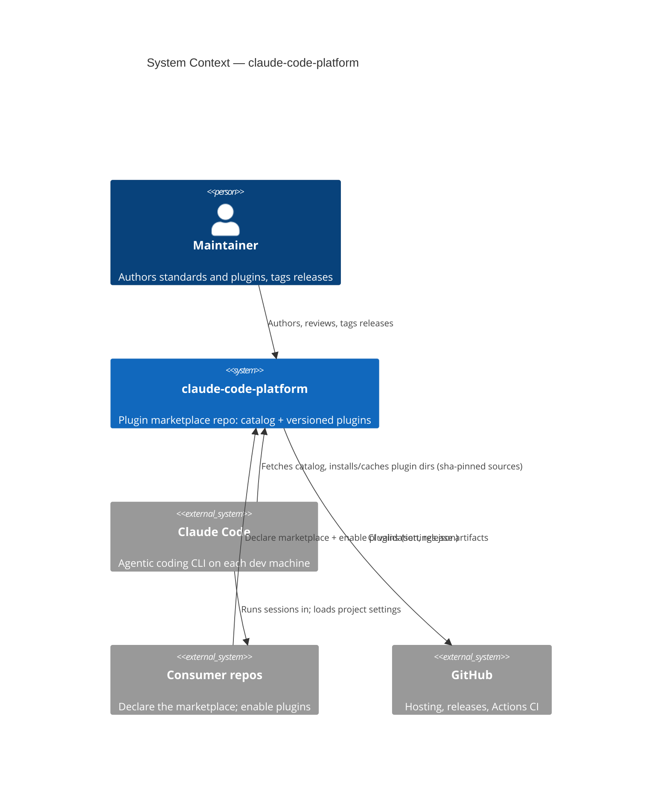
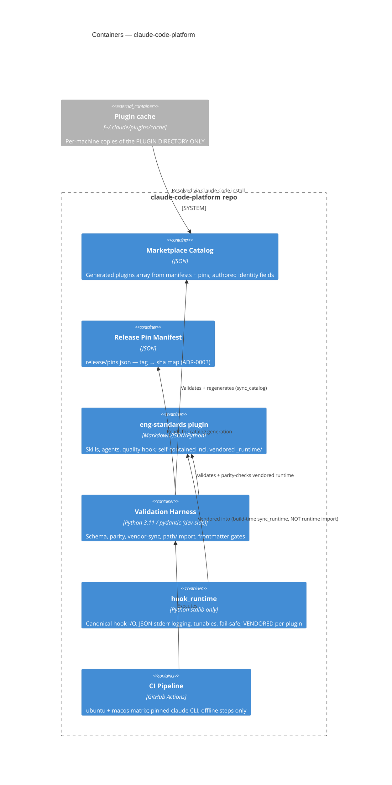
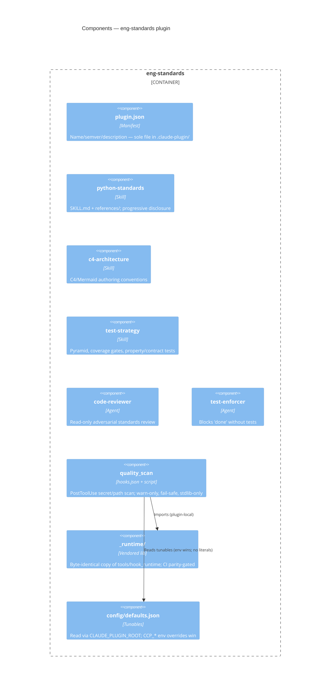
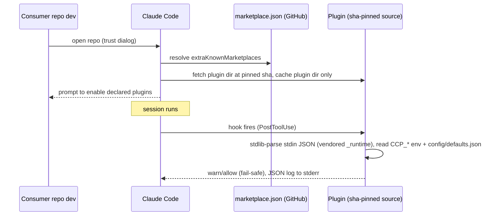

# C4 Architecture — claude-code-platform

## Level 1 — System Context

```mermaid
C4Context
  title System Context — claude-code-platform
  Person(ian, "Maintainer", "Authors standards and plugins, tags releases")
  System(ccp, "claude-code-platform", "Plugin marketplace repo: catalog + versioned plugins")
  System_Ext(cc, "Claude Code", "Agentic coding CLI on each dev machine")
  System_Ext(consumers, "Consumer repos", "Declare the marketplace; enable plugins")
  System_Ext(gh, "GitHub", "Hosting, releases, Actions CI")
  Rel(ian, ccp, "Authors, reviews, tags releases")
  Rel(consumers, ccp, "Declare marketplace + enable plugins (settings.json)")
  Rel(cc, ccp, "Fetches catalog, installs/caches plugin dirs (sha-pinned sources)")
  Rel(cc, consumers, "Runs sessions in; loads project settings")
  Rel(ccp, gh, "CI validation, release artifacts")
```

## Level 2 — Containers

```mermaid
C4Container
  title Containers — claude-code-platform
  System_Boundary(ccp, "claude-code-platform repo") {
    Container(catalog, "Marketplace Catalog", "JSON", "Generated plugins array from manifests + pins; authored identity fields")
    Container(pins, "Release Pin Manifest", "JSON", "release/pins.json — tag → sha map (ADR-0003)")
    Container(p1, "eng-standards plugin", "Markdown/JSON/Python", "Skills, agents, quality hook; self-contained incl. vendored _runtime/")
    Container(harness, "Validation Harness", "Python 3.11 / pydantic (dev-side)", "Schema, parity, vendor-sync, path/import, frontmatter gates")
    Container(hooklib, "hook_runtime", "Python stdlib only", "Canonical hook I/O, JSON stderr logging, tunables, fail-safe; VENDORED per plugin")
    Container(ci, "CI Pipeline", "GitHub Actions", "ubuntu + macos matrix; pinned claude CLI; offline steps only")
  }
  Container_Ext(cache, "Plugin cache", "~/.claude/plugins/cache", "Per-machine copies of the PLUGIN DIRECTORY ONLY")
  Rel(harness, catalog, "Validates + regenerates (sync_catalog)")
  Rel(harness, pins, "Reads for catalog generation")
  Rel(harness, p1, "Validates + parity-checks vendored runtime")
  Rel(hooklib, p1, "Vendored into (build-time sync_runtime, NOT runtime import)")
  Rel(ci, harness, "Executes")
  Rel(cache, catalog, "Resolved via Claude Code install")
```

## Level 3 — Components (eng-standards)

```mermaid
C4Component
  title Components — eng-standards plugin
  Container_Boundary(p1, "eng-standards") {
    Component(manifest, "plugin.json", "Manifest", "Name/semver/description — sole file in .claude-plugin/")
    Component(sk1, "python-standards", "Skill", "SKILL.md + references/; progressive disclosure")
    Component(sk2, "c4-architecture", "Skill", "C4/Mermaid authoring conventions")
    Component(sk3, "test-strategy", "Skill", "Pyramid, coverage gates, property/contract tests")
    Component(ag1, "code-reviewer", "Agent", "Read-only adversarial standards review")
    Component(ag2, "test-enforcer", "Agent", "Blocks 'done' without tests")
    Component(hk, "quality_scan", "hooks.json + script", "PostToolUse secret/path scan; warn-only, fail-safe, stdlib-only")
    Component(rt, "_runtime/", "Vendored lib", "Byte-identical copy of tools/hook_runtime; CI parity-gated")
    Component(cfg, "config/defaults.json", "Tunables", "Read via CLAUDE_PLUGIN_ROOT; CCP_* env overrides win")
  }
  Rel(hk, rt, "Imports (plugin-local)")
  Rel(hk, cfg, "Reads tunables (env wins; no literals)")
```

## Dynamic view — distribution & runtime

```mermaid
sequenceDiagram
  participant Dev as Consumer repo dev
  participant CC as Claude Code
  participant MP as marketplace.json (GitHub)
  participant PL as Plugin (sha-pinned source)
  Dev->>CC: open repo (trust dialog)
  CC->>MP: resolve extraKnownMarketplaces
  CC->>PL: fetch plugin dir at pinned sha, cache plugin dir only
  CC-->>Dev: prompt to enable declared plugins
  Note over CC: session runs
  CC->>PL: hook fires (PostToolUse)
  PL->>PL: stdlib-parse stdin JSON (vendored _runtime), read CCP_* env + config/defaults.json
  PL-->>CC: warn/allow (fail-safe), JSON log to stderr
```
