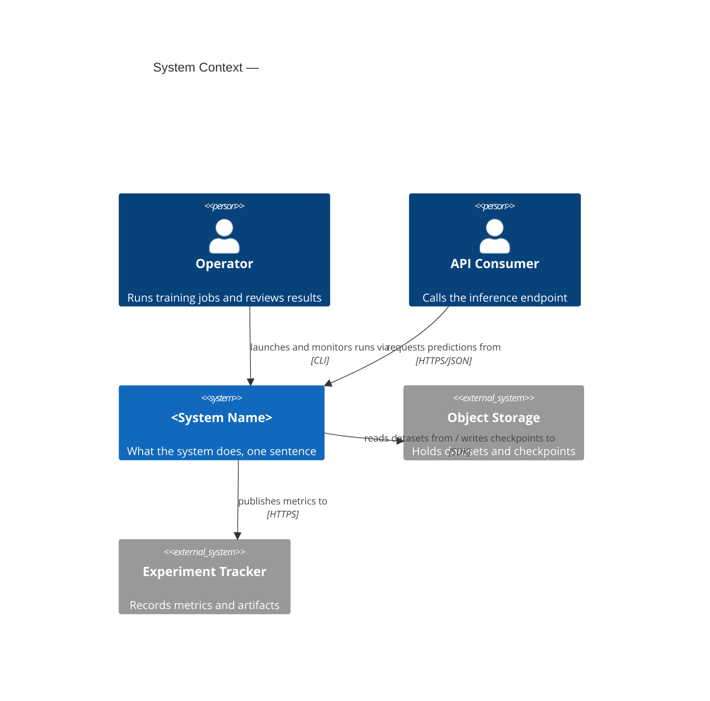
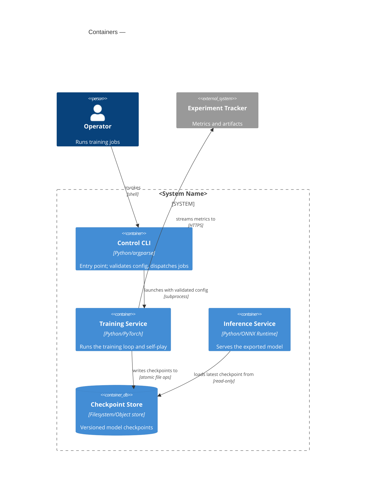
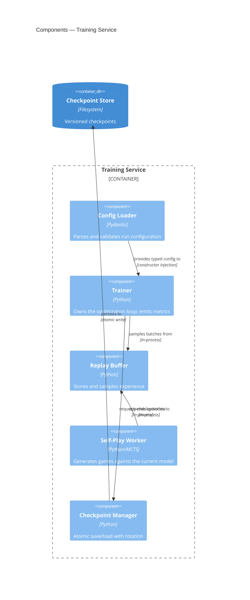
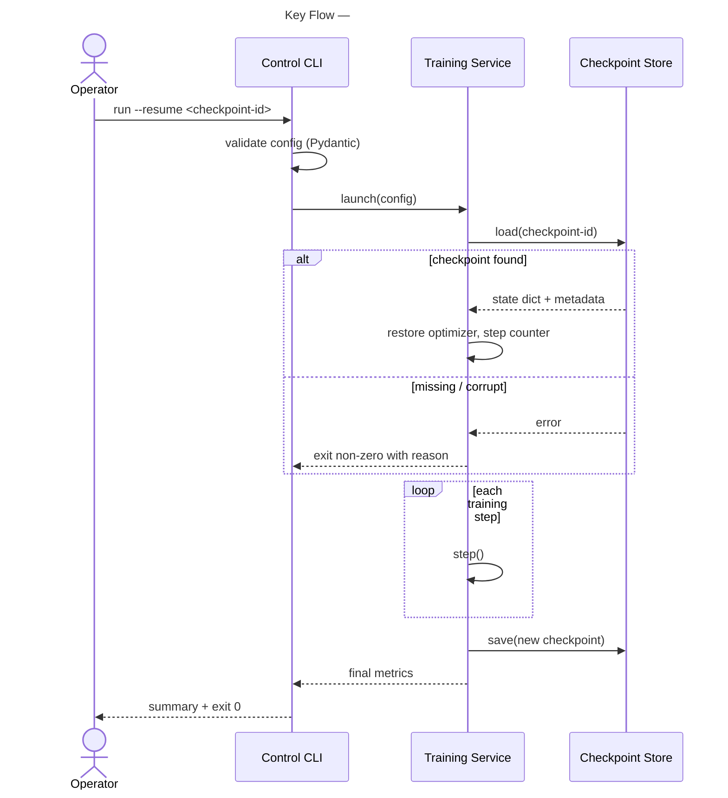

# C4 Mermaid Conventions — Skeletons and Checklist

## L1 — System Context Skeleton

## L2 — Container Skeleton

## L3 — Component Skeleton (one container)

## Dynamic View — sequenceDiagram Template

Rules for dynamic views:
- One flow per diagram; name the flow in the title.
- Show error/fallback branches with `alt`/`else` when the flow has them — a happy-path-only diagram of a retrying flow is wrong.
- Participants map 1:1 to containers (or components, if the flow is intra-container). Do not invent participants that have no C4 element.

## Naming Conventions

| Item | Convention | Example |
|---|---|---|
| Alias | snake_case, stable across levels | `training_service` |
| Label | Title Case, human-readable | `Training Service` |
| Technology arg | concrete tech, slash-separated | `Python/PyTorch` |
| Rel label | active verb phrase | `writes checkpoints to` |
| Rel technology | protocol or mechanism | `HTTPS/JSON`, `in-process` |
| Diagram title | `<Level> — <Scope>` | `Components — Training Service` |

## Review Checklist

- [ ] Correct block type per level (`C4Context`/`C4Container`/`C4Component`), one diagram per block.
- [ ] ≤ ~10 elements; split by boundary if over.
- [ ] Exactly one boundary nesting level per diagram.
- [ ] Every element has a non-empty description stating its single responsibility.
- [ ] Every `Rel` has a verb-phrase label and a technology argument.
- [ ] Rel direction = call direction (use `BiRel` only with a dual-action label).
- [ ] Aliases snake_case and consistent with other levels.
- [ ] Externals use `System_Ext` and sit outside the boundary.
- [ ] Each headline flow has a `sequenceDiagram` with error branches where they exist.
- [ ] Prose summary above each diagram; updated in the same PR as the structural change.
