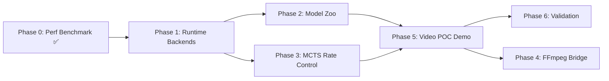

# AlphaGalerkin Video POC — Implementation Plan

> **Branch:** `feature/video-poc-implementation-plan`
> **Created:** 2026-04-30
> **Status:** Draft — Awaiting Review
> **Baseline:** 8,086 tests collected | Phase 0 codec perf benchmark ✅ (98.42% coverage)
> **Target:** End-to-end Video POC demonstrating neural transcoding on consumer hardware

---

## Executive Summary

This plan charts the path from **Phase 0** (codec perf benchmark — ✅ COMPLETE) through a
**working Video POC** that demonstrates AlphaGalerkin's neural video compression with
real-time decode, MCTS rate control, and a user-facing demo.

### Critical Path to Video POC



**Critical path:** P0 → P1 → P2/P3 (parallel) → P5 = **~7-8 weeks to Video POC**

---

## Cross-Cutting Requirements (All Phases)

| Requirement | Enforcement |
|---|---|
| **No hardcoded values** | All params via Pydantic `Field()` with constraints |
| **85% test coverage** | `--cov-fail-under=85` per-module in CI |
| **Backwards compatible** | New config fields have defaults; existing configs unchanged |
| **Modular / reusable** | Follow `BenchmarkSubject` Protocol, registry patterns |
| **Dynamic code** | Use existing `create_registry()`, factory functions |
| **structlog** | No `print()` — structured logging with context binding |
| **Type safety** | `mypy --strict`, `jaxtyping` for tensors |
| **Property-based tests** | Hypothesis for mathematical invariants |

---

## Phase 1 — Decoder Runtime Backends (~2-3 weeks)

**Goal:** Determine which runtime backend achieves ≤3× realtime decode on the
headline config (1080p on `cuda:0`).
**Lead Agent:** Codec Engineer (`src/video_compression/AGENT.md`)
**Supporting Agents:** Deployment Engineer, Training Engineer

### Epic 1.1: `torch.compile` Subject

| Story | File(s) | Acceptance Criteria |
|---|---|---|
| **1.1.1** Create `TorchCompileSubject` | `src/video_compression/perf/subjects.py` | Implements `BenchmarkSubject` Protocol |
| **1.1.2** Add compile config fields | `src/video_compression/perf/config.py` | `CompileConfig` Pydantic model |
| **1.1.3** Tests | `tests/video_compression/perf/test_compile_subject.py` | ≥85% coverage |

### Epic 1.2: ONNX Runtime CUDA Subject

| Story | File(s) | Acceptance Criteria |
|---|---|---|
| **1.2.1** Create `ONNXRuntimeSubject` | `src/video_compression/perf/subjects.py` | Uses `CUDAExecutionProvider` |
| **1.2.2** ONNX export for decoder | `src/video_compression/runtime/export.py` | Dynamic batch/height/width axes |
| **1.2.3** Config fields | `src/video_compression/perf/config.py` | `ONNXConfig` Pydantic model |
| **1.2.4** Tests | `tests/video_compression/perf/test_onnx_subject.py` | Output divergence < 1e-4 |

### Epic 1.3: TensorRT Subject

| Story | File(s) | Acceptance Criteria |
|---|---|---|
| **1.3.1** Create `TensorRTSubject` | `src/video_compression/perf/subjects.py` | FP16 + INT8 paths |
| **1.3.2** Calibration dataset | `src/video_compression/data/calibration.py` | From `SyntheticVideoConfig` |
| **1.3.3** Tests | `tests/video_compression/perf/test_trt_subject.py` | INT8 within 1 dB PSNR |

### Epic 1.4: Mixed-Precision (FP16) Activation

| Story | File(s) | Acceptance Criteria |
|---|---|---|
| **1.4.1** Light up `Precision.FP16` | `src/video_compression/perf/benchmark.py` | Remove `NotImplementedError` |
| **1.4.2** Per-backend FP16 paths | All subject files | Each subject respects `precision` |
| **1.4.3** Tests | `tests/video_compression/perf/test_fp16.py` | PSNR regression < 0.5 dB |

### Phase 1 Acceptance

```bash
python -m scripts.benchmark_codec run --config config/perf/cuda0_headline.yaml
pytest tests/video_compression/perf/ --cov=src/video_compression/perf --cov-fail-under=85 -v
```

---

## Phase 2 — Pretrained Model Zoo (~2 weeks)

**Goal:** Train and ship 8 model checkpoints across the declared λ rate-distortion points.
**Lead Agent:** Training Engineer

### Epic 2.1: Training Infrastructure

| Story | File(s) | Acceptance Criteria |
|---|---|---|
| **2.1.1** Multi-lambda sweep | `scripts/train_compression_sweep.py` | Per-lambda checkpoint |
| **2.1.2** Sweep config | `config/video_compression/train_sweep.yaml` | 8 lambda points |
| **2.1.3** Checkpoint naming | `src/video_compression/training/trainer.py` | Deterministic naming |

### Epic 2.2: Model Registry

| Story | File(s) | Acceptance Criteria |
|---|---|---|
| **2.2.1** `ModelZooRegistry` | `src/video_compression/runtime/model_zoo.py` | Metadata per checkpoint |
| **2.2.2** `ModelZooConfig` | `src/video_compression/runtime/config.py` | Pydantic schema |
| **2.2.3** Auto-download stubs | `src/video_compression/runtime/model_zoo.py` | HuggingFace Hub |
| **2.2.4** Integration with Phase 0 | `config/perf/model_zoo_sweep.yaml` | As `RuntimeProfile`s |

### Epic 2.3: Quality Validation

| Story | File(s) | Acceptance Criteria |
|---|---|---|
| **2.3.1** RD curve generation | `src/video_compression/metrics/rd_curves.py` | BD-rate computation |
| **2.3.2** Per-checkpoint report | `scripts/validate_model_zoo.py` | JSON with PSNR/SSIM/bitrate |
| **2.3.3** Tests | `tests/video_compression/test_model_zoo.py` | ≥85% coverage |

---

## Phase 3 — MCTS Rate Control (~3 weeks)

**Goal:** Wire `src/video_compression/mcts/` into the codec for GOP-level bit allocation.
Resolves the documented "Known Issue" in CLAUDE.md.
**Lead Agent:** Search Strategist (`src/mcts/AGENT.md`)

### Epic 3.1: Rate Control Networks

| Story | File(s) | Acceptance Criteria |
|---|---|---|
| **3.1.1** Train MCTS networks | `src/video_compression/mcts/networks.py` | MuZero-style training |
| **3.1.2** Training data gen | `src/video_compression/mcts/data_gen.py` | (state, action, reward) tuples |
| **3.1.3** Training script | `scripts/train_mcts_rate_control.py` | Config-driven |
| **3.1.4** Config | `config/video_compression/mcts_training.yaml` | All params via Pydantic |

### Epic 3.2: Rate Controller Integration

| Story | File(s) | Acceptance Criteria |
|---|---|---|
| **3.2.1** Wire into codec | `src/video_compression/codec/codec.py` | `rate_control_enabled` flag |
| **3.2.2** GOP state representation | `src/video_compression/mcts/rate_control.py` | Frame complexities, budget |
| **3.2.3** Action space | `src/video_compression/mcts/rate_control.py` | QP adjustments per frame |
| **3.2.4** Enable skipped tests | `tests/video_compression/unit/test_mcts_rate_control.py` | All pass |

### Epic 3.3: Validation

| Story | File(s) | Acceptance Criteria |
|---|---|---|
| **3.3.1** MCTS vs CRF comparison | `scripts/compare_rate_control.py` | MCTS ≥ parity on BD-rate |
| **3.3.2** Bitrate accuracy | `tests/video_compression/integration/test_rate_control_e2e.py` | Within tolerance |
| **3.3.3** Coverage | CI workflow | ≥85% on `src/video_compression/mcts/` |

---

## Phase 4 — FFmpeg Bridge & Daemon (~2-3 weeks)

**Gate:** Only ships if Phases 1-3 produce a competitive codec.

### Epic 4.1: FFmpeg Shim

| Story | File(s) | Acceptance Criteria |
|---|---|---|
| **4.1.1** Custom codec registration | `src/video_compression/ffmpeg/shim.py` | `libagk` codec |
| **4.1.2** CLI wrappers | `scripts/ffmpeg_encode.py` | FFmpeg integration |
| **4.1.3** Config | `config/video_compression/ffmpeg.yaml` | Pydantic |

### Epic 4.2: Background Daemon

| Story | File(s) | Acceptance Criteria |
|---|---|---|
| **4.2.1** Transcode daemon | `src/video_compression/daemon/server.py` | gRPC/REST API |
| **4.2.2** Job queue | `src/video_compression/daemon/queue.py` | Priority queue |
| **4.2.3** Health monitoring | `src/video_compression/daemon/health.py` | GPU metrics |

---

## Phase 5 — End-to-End Video POC Demo (~2 weeks)

**Goal:** Compelling user-facing demonstration of all video compression capabilities.
**Lead Agent:** Validation Scientist (`src/poc/AGENT.md`)

### Epic 5.1: Video POC Scenario

| Story | File(s) | Acceptance Criteria |
|---|---|---|
| **5.1.1** `VideoCompressionScenario` | `src/poc/scenarios/video_compression.py` | Registered in scenario registry |
| **5.1.2** Scenario config | `config/scenarios/video_poc.yaml` | All thresholds via Pydantic |
| **5.1.3** Success criteria | Config-driven | PSNR/FPS/bitrate gates |

### Epic 5.2: Dashboard Integration

| Story | File(s) | Acceptance Criteria |
|---|---|---|
| **5.2.1** Video compression tab | `dashboard/tabs/video_tab.py` | Encode/decode demo, RD curves |
| **5.2.2** Side-by-side viewer | `dashboard/tabs/video_tab.py` | Original vs compressed |
| **5.2.3** Config injection | `dashboard/config.py` | `VideoConfig` Pydantic model |
| **5.2.4** Tests | `tests/dashboard/test_video_tab.py` | ≥85% coverage |

### Epic 5.3: Demo Script & Recording

| Story | File(s) | Acceptance Criteria |
|---|---|---|
| **5.3.1** `demo_video_poc.py` | `scripts/demo_video_poc.py` | End-to-end HTML output |
| **5.3.2** Synthetic test sequences | `src/video_compression/data/test_sequences.py` | Configurable |
| **5.3.3** HTML report | `src/poc/visualization/video_report.py` | Side-by-side, RD curves |

### Phase 5 Acceptance

```bash
python -m src.poc.cli run --scenario video_compression --config config/scenarios/video_poc.yaml
python -m dashboard.app --port 7860
python -m scripts.demo_video_poc --output reports/video_poc_demo.html
pytest tests/video_compression/ tests/dashboard/test_video_tab.py \
  --cov=src/video_compression --cov=dashboard/tabs/video_tab \
  --cov-fail-under=85 -v
```

---

## Phase 6 — Real-World Validation (~2 weeks)

### Epic 6.1: Standard Dataset Benchmarking

| Story | File(s) | Acceptance Criteria |
|---|---|---|
| **6.1.1** Xiph.org loader | `src/video_compression/data/xiph.py` | Cached downloads |
| **6.1.2** H.265 baseline | `src/video_compression/metrics/baselines.py` | `libx265` encode |
| **6.1.3** VP9/AV1 baselines | `src/video_compression/metrics/baselines.py` | `libvpx-vp9`/`libaom-av1` |
| **6.1.4** BD-rate computation | `src/video_compression/metrics/rd_curves.py` | Per-baseline |
| **6.1.5** Results docs | `docs/benchmarks/video_compression.md` | Tables + RD curves |

### Epic 6.2: Perceptual Quality

| Story | File(s) | Acceptance Criteria |
|---|---|---|
| **6.2.1** VMAF integration | `src/video_compression/metrics/quality.py` | Via `libvmaf` |
| **6.2.2** LPIPS metric | `src/video_compression/metrics/quality.py` | Perceptual score |
| **6.2.3** Quality report | `scripts/quality_report.py` | Multi-metric comparison |

---

## Timeline

| Phase | Duration | Priority |
|---|---|---|
| **Phase 1** — Runtime Backends | 2-3 weeks | **P0** |
| **Phase 2** — Model Zoo | 2 weeks | **P1** |
| **Phase 3** — MCTS Rate Control | 3 weeks | **P1** |
| **Phase 5** — Video POC Demo | 2 weeks | **P0** |
| **Phase 4** — FFmpeg Bridge | 2-3 weeks | **P2** |
| **Phase 6** — Validation | 2 weeks | **P2** |

---

## Risks & Mitigations

| Risk | Mitigation |
|---|---|
| No backend hits realtime 1080p | Lower to 720p; batch frames |
| MCTS rate control ≤ CRF | Show advantage on variable-complexity content |
| TensorRT API changes | Pin version; fallback to ONNX RT |
| Training instability at extreme lambdas | Gradient clipping; curriculum lambda |
| GPU memory limits | INT8 quantization; tiled decode |

---

## Verification Commands

```bash
# Full regression
ruff check src/ tests/
mypy src/ --strict
pytest tests/ -v --cov=src --cov-fail-under=85
```
