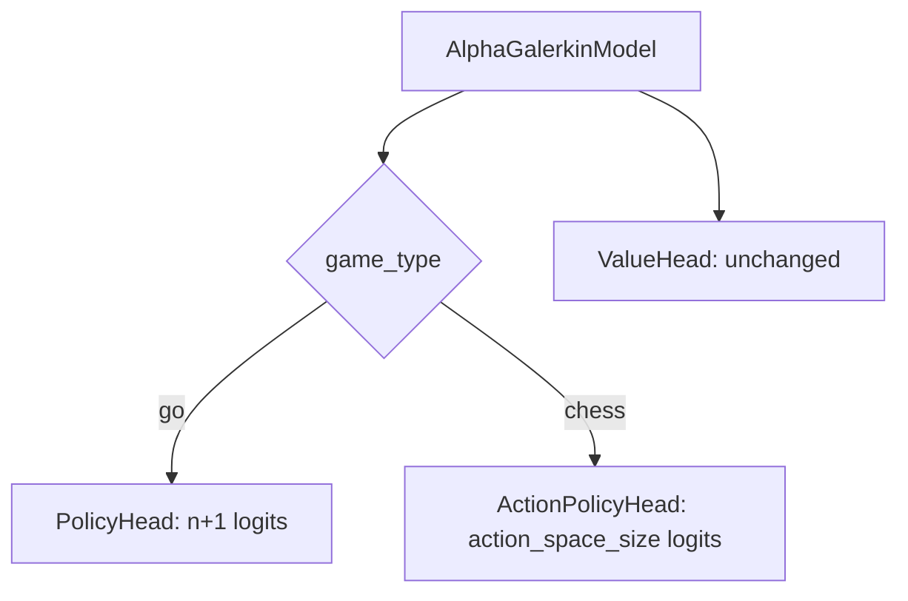
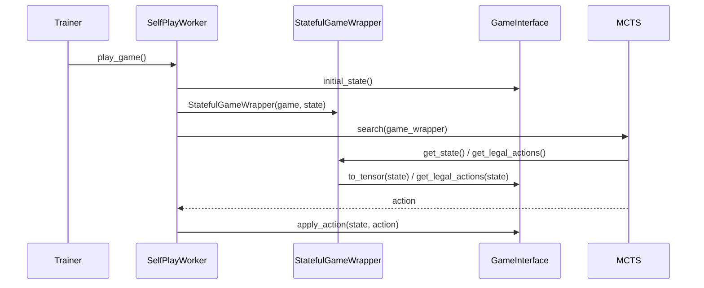
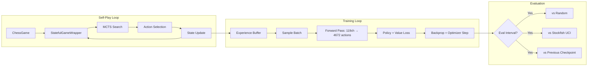

# ADR: Chess Self-Play Training Architecture

## Context

AlphaGalerkin's training pipeline is currently coupled to Go via `SimpleGoGame`. To support chess self-play training per AlphaZero/MuZero methodology, the architecture must become game-agnostic while maintaining backwards compatibility with existing Go training.

## Decision

### 1. Game-Configurable Policy Head

The current `PolicyHead` outputs `n+1` logits (one per board intersection + pass). This works for Go where actions map to positions, but fails for chess's 4672-action encoding.

**Decision**: Introduce `action_space_size` in `OperatorConfig`. When set, use a dense `ActionPolicyHead` instead of the position-based `PolicyHead`.



### 2. Game-Agnostic Self-Play Worker

**Decision**: `SelfPlayWorker` accepts an optional `GameInterface`. When provided, it uses `StatefulGameWrapper` internally. When `None`, it falls back to `SimpleGoGame` for backwards compatibility.



### 3. Configuration Schema Extension

```yaml
# New fields in OperatorConfig
operator:
  input_channels: 119      # Chess: 119, Go: 17
  action_space_size: 4672   # Chess: 4672, Go: null (position-based)
  game_type: chess           # "chess" | "go" | null

# New chess-specific MCTS config
mcts:
  dirichlet_alpha: 0.3      # Chess: 0.3, Go: 0.03
  n_simulations: 400
```

### 4. Data Flow



## Non-Functional Requirements

| Requirement | Target |
|---|---|
| Self-play game time (CPU) | < 120s per game at 100 sims |
| Memory per training batch | < 4GB at batch_size=128 |
| Checkpoint size | < 200MB |
| Backwards compatibility | Go training must still work |

## Risks

| Risk | Severity | Mitigation |
|---|---|---|
| 119-channel tensors cause OOM | High | Use AMP, reduce batch size |
| PolicyHead change breaks Go | High | Maintain both heads, select by config |
| Self-play produces illegal moves | Medium | Validated by MCTS legal action masking |

## Decision Sign-off Required

> [!IMPORTANT]
> The `PolicyHead` splitting into position-based (Go) and action-based (Chess) fundamentally changes the model interface. This is backwards-incompatible for Go checkpoints if `action_space_size` is set.

> [!WARNING]
> Chess training on a single consumer GPU will be ~1000x slower than DeepMind's TPU setup. Expect the model to learn basic piece values and tactics but not reach competitive strength.
