# AlphaGalerkin C4 Architecture (Mermaid Format)

This document provides a comprehensive C4 architecture model for the AlphaGalerkin system using Mermaid diagrams.
The C4 model consists of four levels: System Context, Containers, Components, and Code.

The system supports two primary use cases:
1. **Go AI**: Resolution-independent game playing with zero-shot transfer between board sizes
2. **PDE Solving**: AlphaZero-style MCTS for adaptive basis selection and mesh refinement

---

## Level 1: System Context Diagram

The System Context diagram shows how AlphaGalerkin fits into the broader ecosystem, highlighting the key users and external systems.

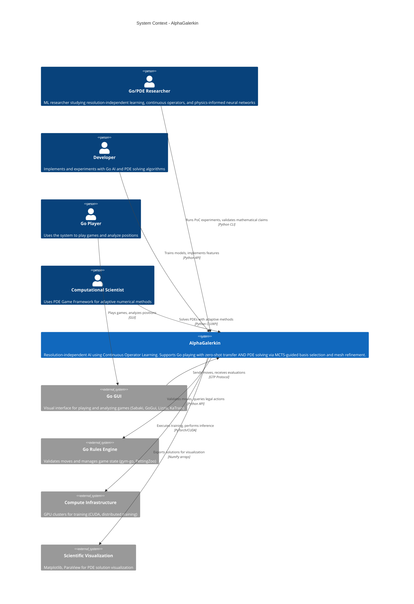

### Key Interactions

- **Researchers** validate core mathematical claims (zero-shot transfer, O(N) complexity, LBB stability)
- **Developers** train models and implement new features using the Python API
- **Go Players** interact via GTP-compatible GUIs
- **Computational Scientists** use MCTS-guided PDE solving for adaptive basis/mesh refinement
- **External Systems** provide game rules validation, compute resources, and visualization

---

## Level 2: Container Diagram

The Container diagram shows the high-level technical building blocks of AlphaGalerkin.

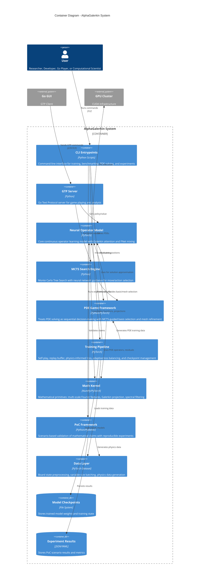

### Container Responsibilities

| Container | Responsibility | Key Technologies |
|-----------|----------------|------------------|
| **CLI Entrypoints** | User interface for training, benchmarking, PDE solving, and experiments | Python, argparse, Hydra |
| **GTP Server** | Game playing interface compatible with Go GUIs | Python, GTP Protocol |
| **Neural Operator Model** | Resolution-independent position evaluation | PyTorch, Galerkin Attention, FNet |
| **MCTS Search Engine** | Tree search with neural guidance for games and PDEs | Python, NumPy, Gumbel AlphaZero |
| **PDE Game Framework** | AlphaZero-style PDE solving via basis/mesh refinement | PyTorch, autodiff, PDE operators |
| **Training Pipeline** | Model training with physics-informed loss and adaptive balancing | PyTorch, ReLoBRaLo, GradNorm |
| **Math Kernel** | Mathematical foundations and operators | NumPy, SciPy, FFT, multi-scale Fourier |
| **PoC Framework** | Validates mathematical claims through experiments | Pydantic, structlog |
| **Data Layer** | Data loading and preprocessing | PyTorch Dataset, padding/masking |

---

## Level 3: Component Diagram - Neural Operator Model

This diagram shows the internal components of the Neural Operator Model container.

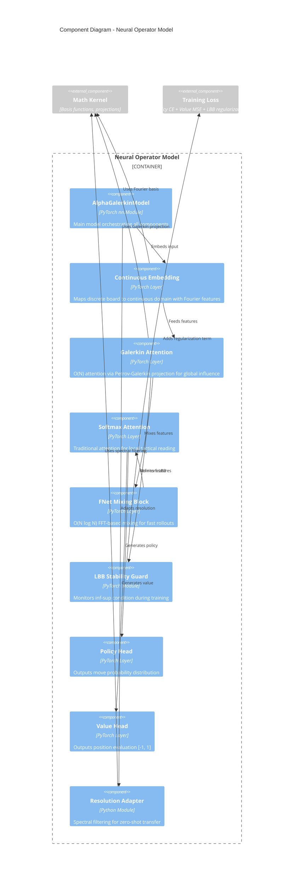

### Component Descriptions

| Component | Responsibility | Mathematical Foundation |
|-----------|----------------|-------------------------|
| **Continuous Embedding** | Maps discrete grid to Fourier features on [0,1]² | Fourier positional encoding |
| **Galerkin Attention** | O(N) global influence modeling | Petrov-Galerkin projection, Monte Carlo integral |
| **Softmax Attention** | Local tactical reading with injectivity | Standard attention mechanism |
| **FNet Mixing** | Fast feature mixing via FFT | Spectral methods, O(N log N) |
| **Stability Guard** | Ensures well-posed learning | LBB inf-sup condition: dim(K) ≥ dim(Q) |
| **Policy Head** | Move distribution prediction | Cross-entropy loss |
| **Value Head** | Position evaluation | MSE loss |
| **Resolution Adapter** | Zero-shot board size transfer | Anti-aliasing, frequency filtering |

---

## Level 3: Component Diagram - Training Pipeline

This diagram shows the internal components of the Training Pipeline container.

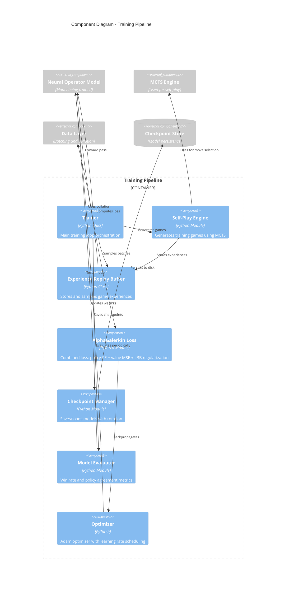

### Training Pipeline Components

| Component | Responsibility | Implementation |
|-----------|----------------|----------------|
| **Trainer** | Main training loop with logging | Python class with Hydra config |
| **Self-Play Engine** | Generates training data via MCTS | Parallel game execution |
| **Replay Buffer** | Experience storage and sampling | Uniform and prioritized replay |
| **Loss Function** | Multi-objective optimization | Policy CE + Value MSE + LBB term |
| **Checkpoint Manager** | Model persistence with best tracking | File I/O with rotation policy |
| **Model Evaluator** | Performance metrics | Win rate, policy agreement |
| **Optimizer** | Weight updates | Adam with warmup and decay |

---

## Level 3: Component Diagram - PoC Framework

This diagram shows the internal components of the Proof-of-Concept Framework container.

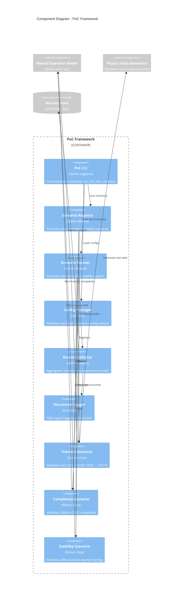

### PoC Framework Components

| Component | Responsibility | Purpose |
|-----------|----------------|---------|
| **PoC CLI** | User interface for running experiments | `run`, `list`, `info`, `compare` commands |
| **Scenario Registry** | Discovery and management of scenarios | Auto-registration, metadata tracking |
| **Scenario Runner** | Parallel execution of experiments | Worker pool, timeout handling |
| **Config Manager** | Configuration validation | Pydantic schemas, YAML/Python configs |
| **Results Collector** | Aggregation and persistence | JSON/YAML output, comparison tools |
| **Transfer Scenario** | Zero-shot transfer validation | Train 9x9 → eval 19x19, MSE < 0.05 |
| **Complexity Scenario** | O(N) complexity verification | Timing benchmarks, scaling analysis |
| **Stability Scenario** | LBB condition monitoring | Singular value tracking, β > 0 check |

---

## Level 3: Component Diagram - Math Kernel

This diagram shows the mathematical primitives that underpin the system.

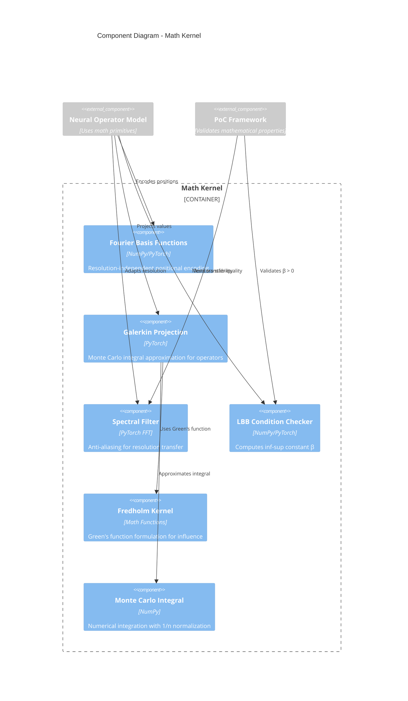

### Math Kernel Components

| Component | Mathematical Foundation | Purpose |
|-----------|------------------------|---------|
| **Fourier Basis** | $\phi_k(x) = e^{2\pi i k \cdot x}$ | Resolution-independent encoding |
| **Galerkin Projection** | $\langle Lu, v \rangle = \langle f, v \rangle$ | O(N) operator approximation |
| **Spectral Filter** | Low-pass filter in frequency domain | Anti-aliasing for transfer |
| **LBB Checker** | $\inf_u \sup_v \frac{\langle Lu, v \rangle}{\|u\| \|v\|} \geq \beta$ | Stability guarantee |
| **Fredholm Kernel** | $u(x) = \int K(x,y) f(y) dy$ | Influence field modeling |
| **Monte Carlo Integral** | $\frac{1}{n} \sum_{i=1}^n f(x_i)$ | Numerical integration |

---

## Level 3: Component Diagram - PDE Game Framework

This diagram shows the internal components of the PDE Game Framework container.

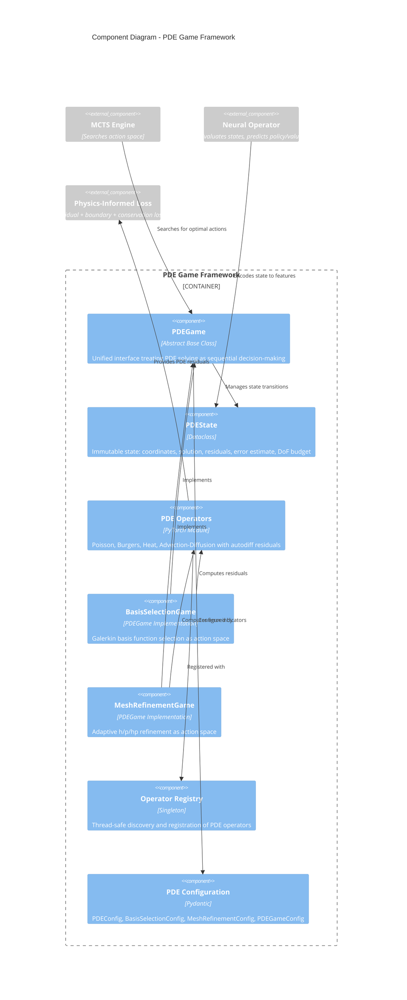

### PDE Game Framework Components

| Component | Responsibility | Key Interface |
|-----------|----------------|---------------|
| **PDEGame** | Abstract base for PDE-as-game formulation | `get_valid_actions()`, `apply_action()`, `get_reward()` |
| **PDEState** | Immutable state representation | `coords`, `solution`, `residuals`, `error_estimate`, `dof` |
| **PDE Operators** | PDE-specific residual and boundary computation | `residual()`, `source_term()`, `boundary_value()` |
| **BasisSelectionGame** | Galerkin basis selection actions | Add/remove/modify Fourier, polynomial, RBF bases |
| **MeshRefinementGame** | Adaptive mesh refinement actions | h-refine, p-refine, coarsen elements |
| **Operator Registry** | Plugin system for PDE types | `register()`, `get()`, `list()` |
| **PDE Configuration** | Validated config schemas | Pydantic models with domain/boundary validation |

---

## Level 3: Component Diagram - Adaptive Loss Balancing

This diagram shows the loss balancing strategies for multi-objective optimization.

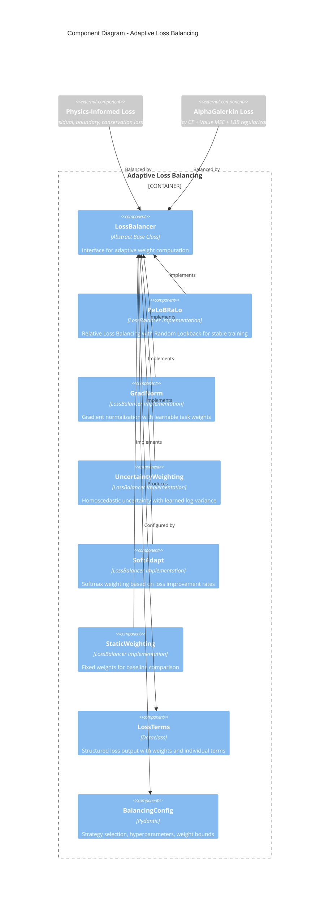

### Loss Balancing Components

| Component | Algorithm | Use Case |
|-----------|-----------|----------|
| **ReLoBRaLo** | Random lookback with softmax normalization | Default for PDE solving, handles scale differences |
| **GradNorm** | Gradient magnitude balancing via shared layer | Multi-task learning with gradient conflicts |
| **UncertaintyWeighting** | Learned log-variance per task | When task uncertainties vary significantly |
| **SoftAdapt** | Improvement rate tracking | When some losses plateau while others improve |
| **StaticWeighting** | Fixed weights | Baseline comparison, known good ratios |

---

## Level 3: Component Diagram - Multi-Scale Fourier Features

This diagram shows the spectral bias mitigation components.

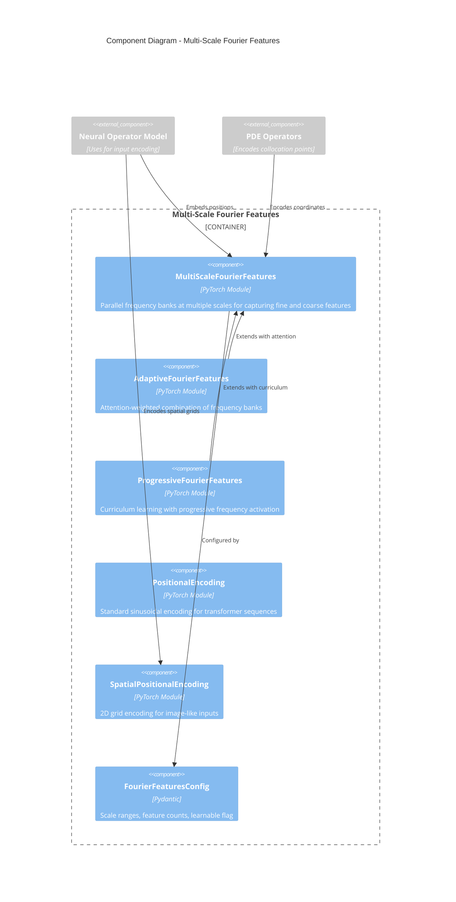

### Fourier Features Components

| Component | Purpose | Mathematical Foundation |
|-----------|---------|-------------------------|
| **MultiScaleFourierFeatures** | Capture both high and low frequencies | $[\sin(2\pi \sigma_k B x), \cos(2\pi \sigma_k B x)]$ for scales $\sigma_k$ |
| **AdaptiveFourierFeatures** | Learn which scales matter for task | Attention-weighted sum of scale-specific features |
| **ProgressiveFourierFeatures** | Avoid spectral bias in early training | Gate high frequencies: $\alpha(t) \cdot \text{high\_freq} + \text{low\_freq}$ |
| **PositionalEncoding** | Standard transformer position embedding | $PE_{pos,2i} = \sin(pos/10000^{2i/d})$ |
| **SpatialPositionalEncoding** | 2D position embedding for grids | Separable encoding: $PE_x \oplus PE_y$ |

---

## Level 3: Component Diagram - Physics-Informed Loss

This diagram shows the physics-informed loss components for PDE solving.

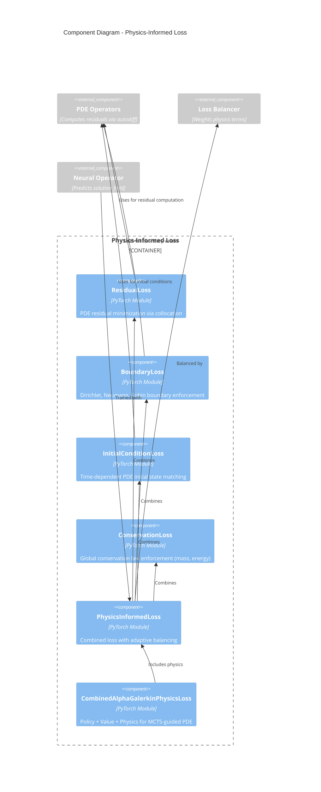

### Physics-Informed Loss Components

| Component | Loss Term | Mathematical Formulation |
|-----------|-----------|--------------------------|
| **ResidualLoss** | PDE residual | $\mathcal{L}_r = \frac{1}{N_r} \sum_i \|Lu(x_i) - f(x_i)\|^2$ |
| **BoundaryLoss** | Boundary conditions | $\mathcal{L}_b = \frac{1}{N_b} \sum_i \|u(x_i) - g(x_i)\|^2$ |
| **InitialConditionLoss** | Initial state | $\mathcal{L}_0 = \frac{1}{N_0} \sum_i \|u(x_i, 0) - u_0(x_i)\|^2$ |
| **ConservationLoss** | Global conservation | $\mathcal{L}_c = \|\int_\Omega u \, dx - C_0\|^2$ |
| **PhysicsInformedLoss** | Combined PINN loss | $\mathcal{L} = \lambda_r \mathcal{L}_r + \lambda_b \mathcal{L}_b + \lambda_0 \mathcal{L}_0 + \lambda_c \mathcal{L}_c$ |

---

## Level 4: Code Diagram - Galerkin Attention

This diagram shows the implementation details of the Galerkin Attention component.

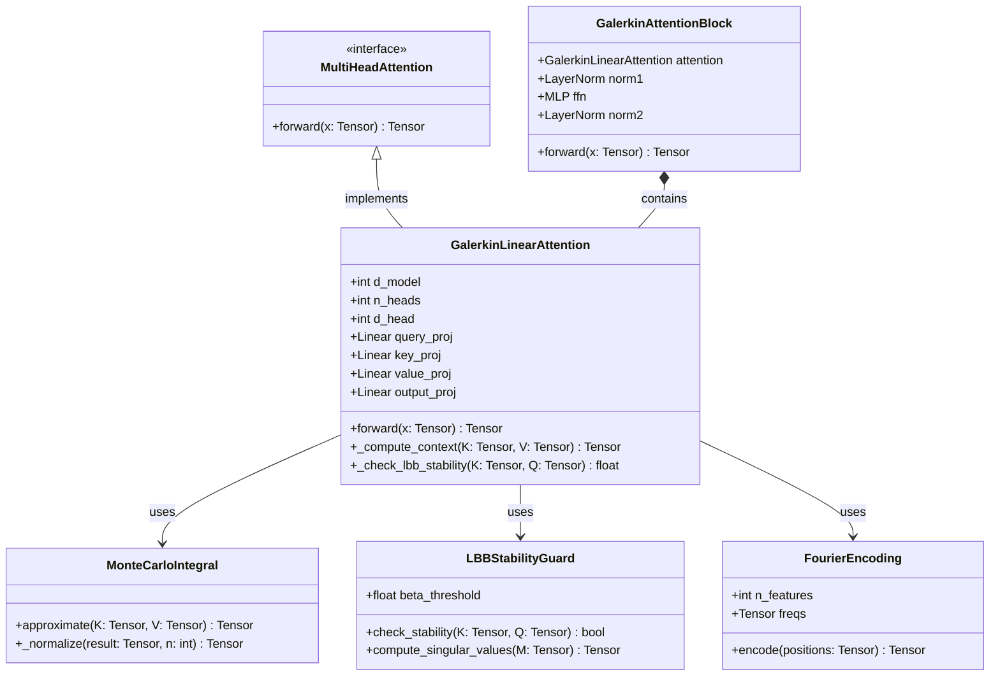

### Key Implementation Details

**Galerkin Attention Algorithm:**
```python
# Step 1: Project to Query, Key, Value spaces
Q = query_proj(x)    # (batch, n, d_head)
K = key_proj(x)      # (batch, n, d_head)
V = value_proj(x)    # (batch, n, d_head)

# Step 2: Monte Carlo integral approximation
# Context = K^T V / n  (not K^T V / sqrt(d))
Context = einsum('bnd,bnm->bdm', K, V) / n

# Step 3: Reconstruct in Query basis
Output = einsum('bnd,bdm->bnm', Q, Context)

# Step 4: LBB stability check (training only)
if training:
    beta = compute_inf_sup_constant(K, Q)
    assert beta > beta_threshold
```

**Complexity Analysis:**
- Standard Attention: O(N² × d)
- Galerkin Attention: O(N × d²)
- For typical Go: N=361, d=32 → **10x speedup**

---

## Level 4: Code Diagram - PDE Game Framework

This diagram shows the implementation details of the PDE Game Framework.

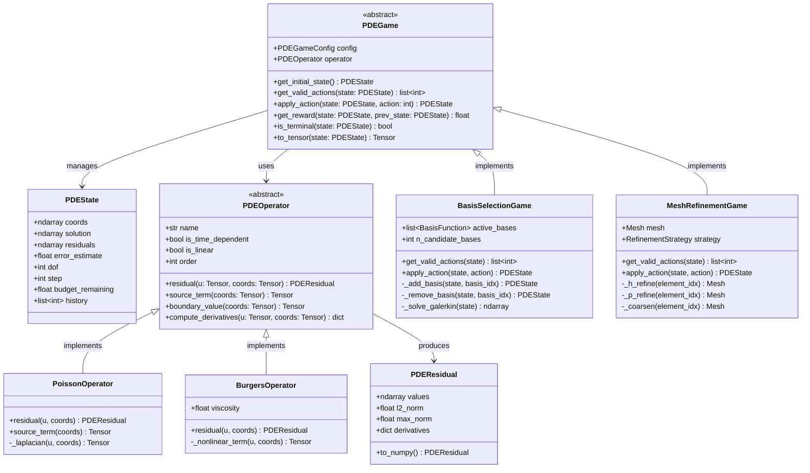

---

## Level 4: Code Diagram - Loss Balancing

This diagram shows the implementation of adaptive loss balancing.

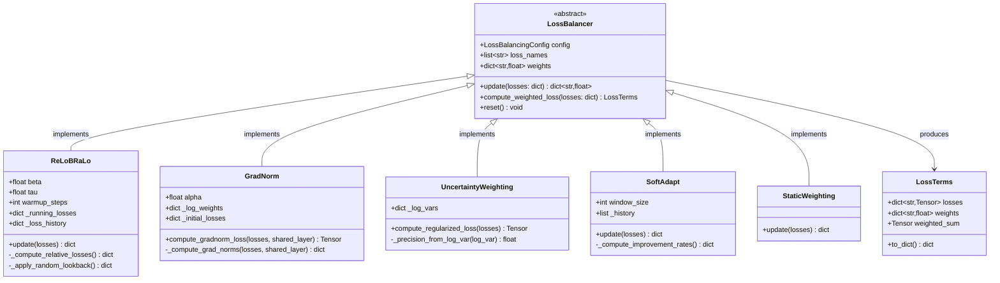

### ReLoBRaLo Algorithm

```python
# Relative Loss Balancing with Random Lookback
def update(self, losses: dict) -> dict:
    # Step 1: Update running averages
    for name, loss in losses.items():
        self._running_losses[name] = (
            self.beta * self._running_losses.get(name, loss.item())
            + (1 - self.beta) * loss.item()
        )
        self._loss_history[name].append(loss.item())

    # Step 2: Random lookback (sample historical point)
    lookback = random.randint(0, len(self._loss_history[name]) - 1)

    # Step 3: Compute relative improvements
    for name in self.loss_names:
        current = self._running_losses[name]
        historical = self._loss_history[name][lookback]
        relative[name] = current / (historical + eps)

    # Step 4: Softmax normalization with temperature
    weights = softmax([relative[n] / self.tau for n in self.loss_names])

    return dict(zip(self.loss_names, weights))
```

---

## Data Flow Diagrams

### Training Data Flow

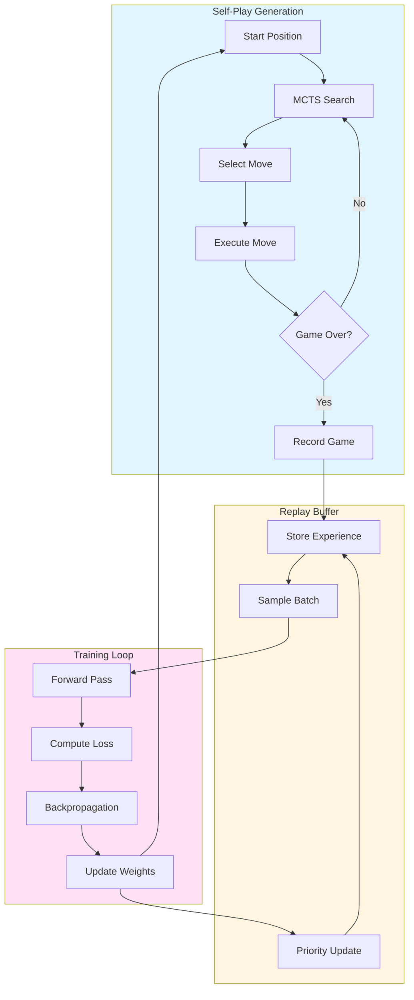

### Inference Data Flow

```mermaid
flowchart LR
    Input[Board State<br/>17×H×W] --> Embed[Continuous<br/>Embedding]
    Embed --> Galerkin[Galerkin<br/>Attention<br/>6 layers]
    Galerkin --> FNet[FNet<br/>Mixing]
    FNet --> Softmax[Softmax<br/>Attention<br/>2 layers]
    
    Softmax --> Policy[Policy Head<br/>361+1 moves]
    Softmax --> Value[Value Head<br/>[-1, 1]]
    
    Policy --> MCTS[MCTS<br/>Search]
    Value --> MCTS
    
    MCTS --> Move[Best Move]
    
    style Input fill:#e1f5ff
    style Policy fill:#ffe1e1
    style Value fill:#e1ffe1
    style Move fill:#ffe1f5
```

### Resolution Transfer Flow

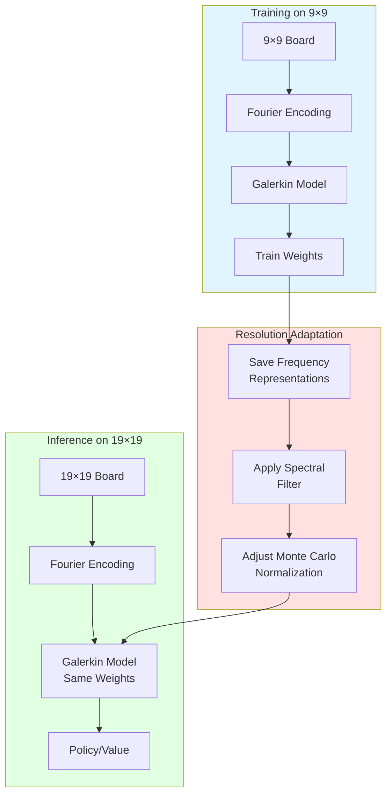

### PDE Solving Data Flow (MCTS-Guided)

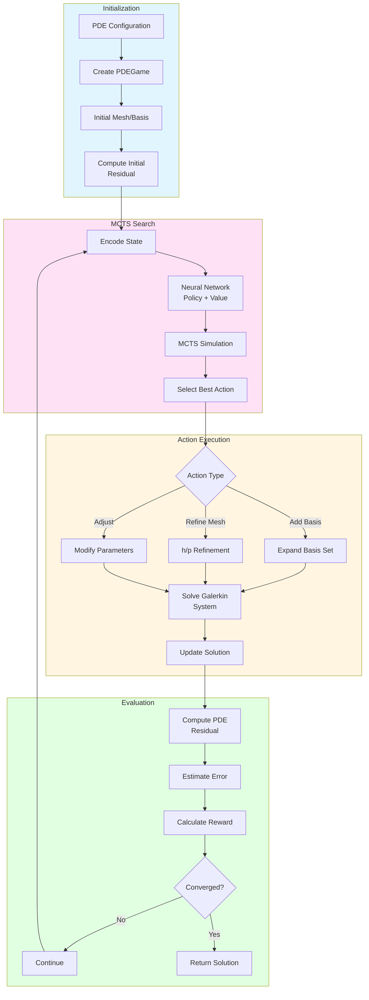

### Physics-Informed Training Flow

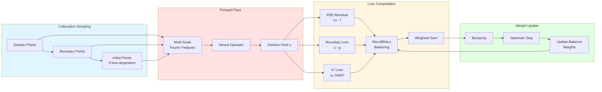

---

## Deployment Diagram

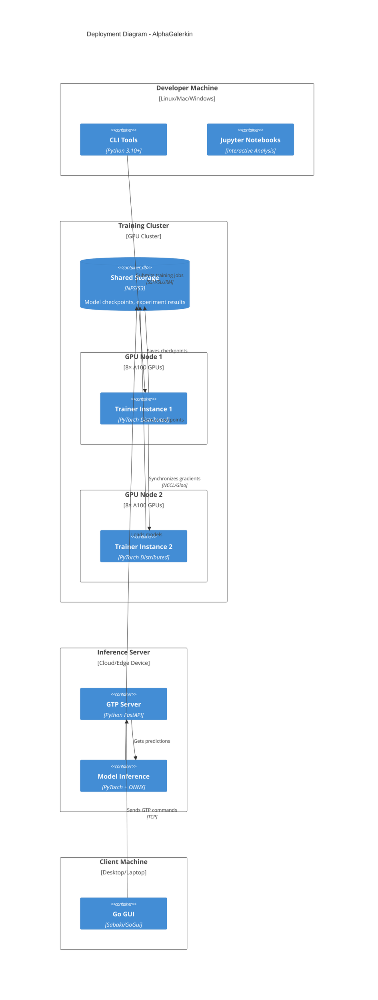

---

## Technology Stack

### Core Technologies

| Layer | Technology | Purpose |
|-------|-----------|---------|
| **Deep Learning** | PyTorch 2.0+ | Neural network implementation |
| **Numerical Computing** | NumPy, SciPy | Mathematical operations |
| **Configuration** | Hydra, Pydantic | Configuration management and validation |
| **Testing** | pytest, hypothesis | Unit and property-based testing |
| **Logging** | structlog | Structured logging |
| **Type Checking** | mypy, jaxtyping | Static type analysis |
| **Code Quality** | ruff | Linting and formatting |

### Key Libraries

```python
# Core dependencies
torch >= 2.0.0          # Deep learning framework
einops >= 0.7.0         # Tensor operations
jaxtyping >= 0.2.25     # Type annotations for arrays
pydantic >= 2.0.0       # Data validation
hydra-core >= 1.3.0     # Configuration management
structlog >= 23.0.0     # Structured logging
numpy >= 1.24.0         # Numerical computing
```

---

## Architecture Principles

### 1. Resolution Independence
- **Continuous Domain**: Treat board as Ω = [0,1]² rather than discrete grid
- **Fourier Encoding**: Position-independent frequency representation
- **Spectral Methods**: Proper anti-aliasing and frequency filtering

### 2. Mathematical Rigor
- **Galerkin Projection**: Well-founded operator approximation theory
- **LBB Stability**: Monitored inf-sup condition ensures convergence
- **Fredholm Operators**: Integral equation formulation for influence

### 3. Performance Optimization
- **O(N) Attention**: Linear complexity via Petrov-Galerkin projection
- **FFT Mixing**: O(N log N) spectral mixing for fast rollouts
- **CUDA Acceleration**: Full GPU utilization for training and inference

### 4. Testability
- **Property-Based Tests**: Mathematical properties verified with Hypothesis
- **PoC Framework**: Reproducible validation of core claims
- **Modular Design**: Independent testing of components

### 5. Configurability
- **Hydra Integration**: Hierarchical configuration management
- **Pydantic Schemas**: Runtime validation of parameters
- **Environment Variables**: Deployment-specific overrides

---

## Key Architectural Decisions

### Decision 1: Galerkin vs Standard Attention
- **Context**: Need O(N) complexity for large board sizes
- **Decision**: Use Petrov-Galerkin projection instead of softmax
- **Rationale**: Reduces complexity from O(N²d) to O(Nd²)
- **Trade-offs**: Requires careful normalization (1/n, not 1/√d)

### Decision 2: Hybrid Architecture (Galerkin + Softmax)
- **Context**: Balance global strategy and local tactics
- **Decision**: Galerkin layers for strategy, softmax for tactics
- **Rationale**: Galerkin captures long-range influence, softmax preserves injectivity for life/death
- **Trade-offs**: More complex than uniform architecture

### Decision 3: FNet for Fast Rollouts
- **Context**: MCTS requires thousands of neural evaluations
- **Decision**: FFT-based mixing as alternative to attention
- **Rationale**: 5× speedup for leaf evaluation
- **Trade-offs**: Slightly lower accuracy vs full attention

### Decision 4: PoC Framework for Validation
- **Context**: Need reproducible validation of mathematical claims
- **Decision**: Config-driven scenario framework
- **Rationale**: Ensures claims are testable and reproducible
- **Trade-offs**: Additional infrastructure complexity

### Decision 5: Pydantic for Configuration
- **Context**: Complex hyperparameter space with mathematical constraints
- **Decision**: Pydantic schemas with validators
- **Rationale**: Runtime validation, type safety, IDE support
- **Trade-offs**: More verbose than plain dicts

### Decision 6: PDE Solving as Sequential Decision-Making
- **Context**: Adaptive basis selection and mesh refinement require intelligent choices
- **Decision**: Model PDE solving as a game with MCTS search
- **Rationale**: Leverages AlphaZero infrastructure, learns optimal refinement strategies
- **Trade-offs**: Training overhead, requires careful reward design

### Decision 7: ReLoBRaLo for Multi-Objective Loss Balancing
- **Context**: Physics-informed losses have vastly different scales (residual vs boundary)
- **Decision**: Use Relative Loss Balancing with Random Lookback
- **Rationale**: Stable training, handles scale differences, minimal hyperparameters
- **Trade-offs**: Randomness in lookback, warmup period needed

### Decision 8: Multi-Scale Fourier Features for Spectral Bias
- **Context**: Neural networks learn low frequencies first (spectral bias)
- **Decision**: Parallel Fourier feature banks at multiple scales
- **Rationale**: Captures both fine and coarse solution features from start
- **Trade-offs**: Increased feature dimension, more parameters

### Decision 9: Autodiff for PDE Residuals
- **Context**: Need derivatives for PDE residual computation
- **Decision**: Use PyTorch autograd for all derivative computations
- **Rationale**: Exact gradients, GPU-accelerated, composable with neural networks
- **Trade-offs**: Memory overhead for computation graph, requires careful batching

---

## Future Architecture Enhancements

### Implemented (v2.0)

1. **PDE Game Framework** ✓
   - PDEGame abstraction for basis selection and mesh refinement
   - PDE operators (Poisson, Burgers, Heat, Advection-Diffusion)
   - MCTS-guided adaptive solving

2. **Physics-Informed Training** ✓
   - Multi-objective loss with residual, boundary, conservation terms
   - ReLoBRaLo, GradNorm, Uncertainty weighting
   - Combined AlphaGalerkin + Physics loss

3. **Multi-Scale Fourier Features** ✓
   - Spectral bias mitigation
   - Adaptive and progressive variants
   - Spatial positional encoding for 2D grids

### Planned Improvements

1. **Distributed Training**
   - Multi-node self-play generation
   - Gradient aggregation via NCCL
   - Model zoo for curriculum learning

2. **ONNX Export**
   - Convert PyTorch models to ONNX
   - Deploy on edge devices (Raspberry Pi, Jetson)
   - Quantization for int8 inference

3. **Multi-Game Support**
   - Abstract game interface
   - Support for Chess, Shogi, etc.
   - Shared continuous operator core

4. **Advanced MCTS**
   - Gumbel AlphaZero search
   - Value-based exploration
   - Policy improvement operators

5. **Enhanced PoC Framework**
   - Automated hyperparameter tuning
   - Statistical significance testing
   - Comparative visualizations

6. **PDE Extensions**
   - 3D domain support
   - Time-stepping for unsteady problems
   - Multi-physics coupling
   - Uncertainty quantification

---

## References

- **C4 Model**: [c4model.com](https://c4model.com)
- **Galerkin Transformers**: Cao et al. (2021)
- **FNet**: Lee-Thorp et al. (2021)
- **AlphaZero**: Silver et al. (2017)
- **Fredholm Theory**: Classical operator theory
- **Physics-Informed Neural Networks**: Raissi et al. (2019)
- **ReLoBRaLo**: Bischof & Kraus (2021)
- **GradNorm**: Chen et al. (2018)
- **Fourier Features**: Tancik et al. (2020)

---

## Related Documentation

- **PDE Game Framework C4**: [pde_game_c4.md](pde_game_c4.md) - Detailed C4 architecture for PDE solving
- **C4 Template**: [../templates/C4_TEMPLATE.md](../templates/C4_TEMPLATE.md) - Template for new modules

---

## Document Metadata

- **Version**: 2.0.0
- **Created**: 2026-01-26
- **Updated**: 2026-01-28
- **Format**: Mermaid C4 Diagrams
- **Status**: Complete
- **Audience**: Developers, Researchers, Computational Scientists, Technical Stakeholders
