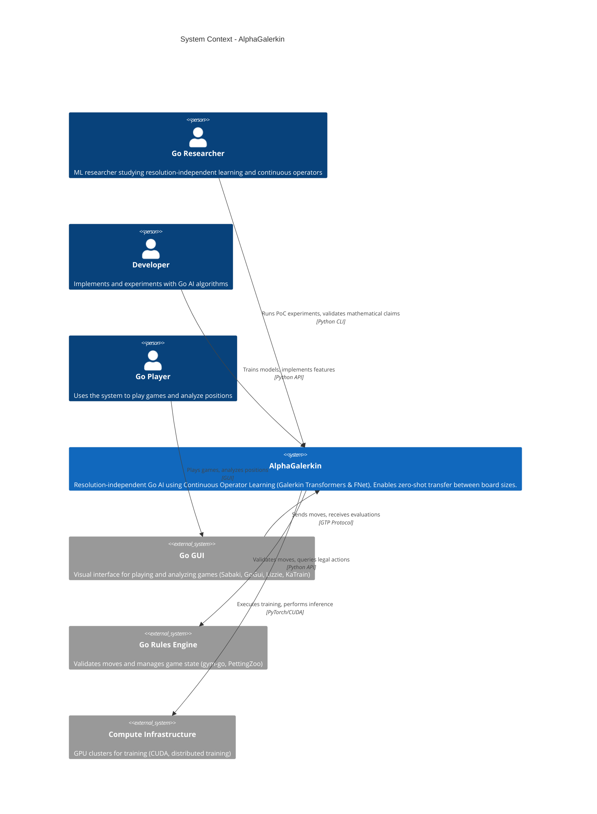
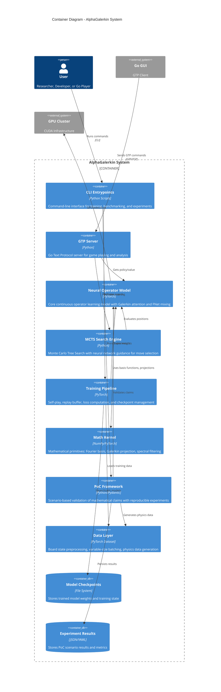
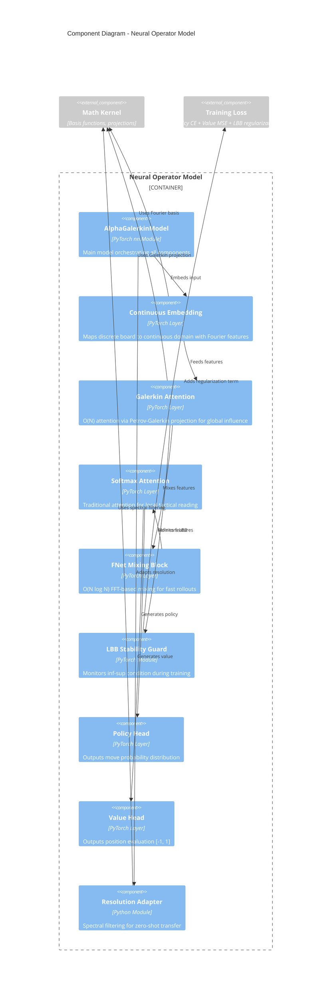
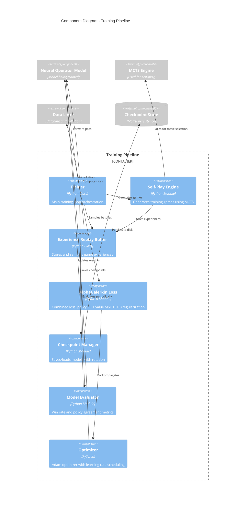
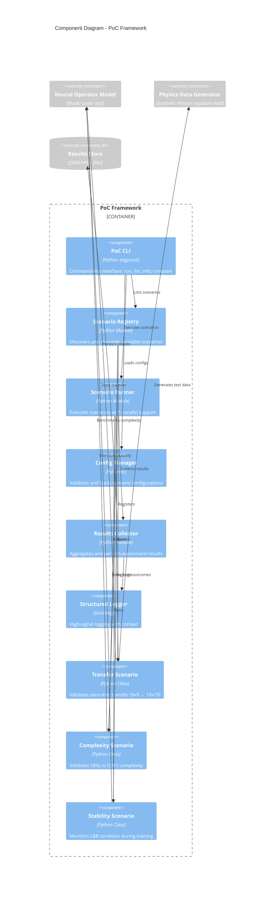
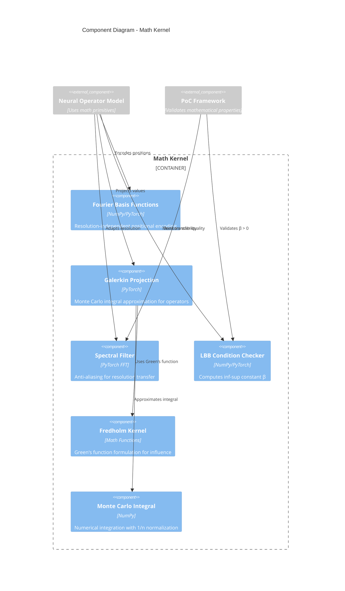
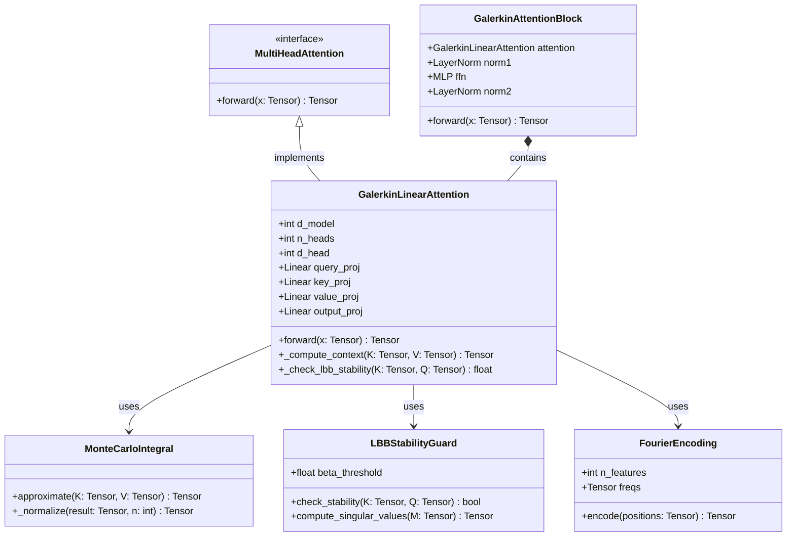
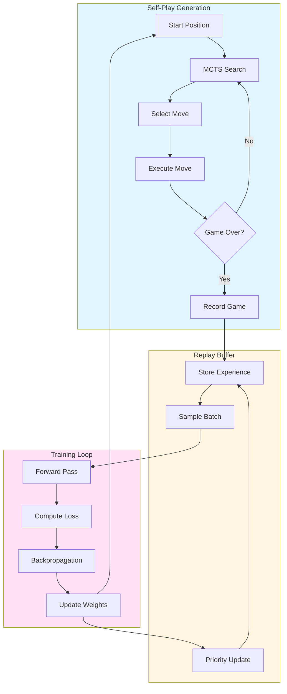
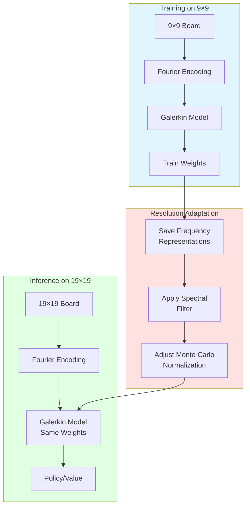
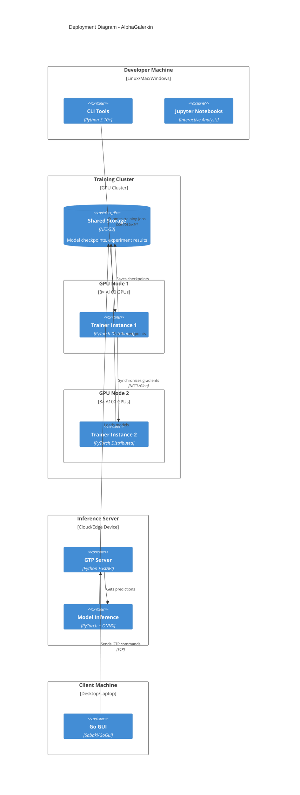

# AlphaGalerkin C4 Architecture (Mermaid Format)

This document provides a comprehensive C4 architecture model for the AlphaGalerkin system using Mermaid diagrams.
The C4 model consists of four levels: System Context, Containers, Components, and Code.

---

## Level 1: System Context Diagram

The System Context diagram shows how AlphaGalerkin fits into the broader ecosystem, highlighting the key users and external systems.



### Key Interactions

- **Researchers** validate core mathematical claims (zero-shot transfer, O(N) complexity, LBB stability)
- **Developers** train models and implement new features using the Python API
- **Go Players** interact via GTP-compatible GUIs
- **External Systems** provide game rules validation and compute resources

---

## Level 2: Container Diagram

The Container diagram shows the high-level technical building blocks of AlphaGalerkin.



### Container Responsibilities

| Container | Responsibility | Key Technologies |
|-----------|----------------|------------------|
| **CLI Entrypoints** | User interface for training, benchmarking, and experiments | Python, argparse, Hydra |
| **GTP Server** | Game playing interface compatible with Go GUIs | Python, GTP Protocol |
| **Neural Operator Model** | Resolution-independent position evaluation | PyTorch, Galerkin Attention, FNet |
| **MCTS Search Engine** | Tree search with neural guidance | Python, NumPy |
| **Training Pipeline** | Model training via self-play and supervised learning | PyTorch, distributed training |
| **Math Kernel** | Mathematical foundations and operators | NumPy, SciPy, FFT |
| **PoC Framework** | Validates mathematical claims through experiments | Pydantic, structlog |
| **Data Layer** | Data loading and preprocessing | PyTorch Dataset, padding/masking |

---

## Level 3: Component Diagram - Neural Operator Model

This diagram shows the internal components of the Neural Operator Model container.



### Component Descriptions

| Component | Responsibility | Mathematical Foundation |
|-----------|----------------|-------------------------|
| **Continuous Embedding** | Maps discrete grid to Fourier features on [0,1]² | Fourier positional encoding |
| **Galerkin Attention** | O(N) global influence modeling | Petrov-Galerkin projection, Monte Carlo integral |
| **Softmax Attention** | Local tactical reading with injectivity | Standard attention mechanism |
| **FNet Mixing** | Fast feature mixing via FFT | Spectral methods, O(N log N) |
| **Stability Guard** | Ensures well-posed learning | LBB inf-sup condition: dim(K) ≥ dim(Q) |
| **Policy Head** | Move distribution prediction | Cross-entropy loss |
| **Value Head** | Position evaluation | MSE loss |
| **Resolution Adapter** | Zero-shot board size transfer | Anti-aliasing, frequency filtering |

---

## Level 3: Component Diagram - Training Pipeline

This diagram shows the internal components of the Training Pipeline container.



### Training Pipeline Components

| Component | Responsibility | Implementation |
|-----------|----------------|----------------|
| **Trainer** | Main training loop with logging | Python class with Hydra config |
| **Self-Play Engine** | Generates training data via MCTS | Parallel game execution |
| **Replay Buffer** | Experience storage and sampling | Uniform and prioritized replay |
| **Loss Function** | Multi-objective optimization | Policy CE + Value MSE + LBB term |
| **Checkpoint Manager** | Model persistence with best tracking | File I/O with rotation policy |
| **Model Evaluator** | Performance metrics | Win rate, policy agreement |
| **Optimizer** | Weight updates | Adam with warmup and decay |

---

## Level 3: Component Diagram - PoC Framework

This diagram shows the internal components of the Proof-of-Concept Framework container.



### PoC Framework Components

| Component | Responsibility | Purpose |
|-----------|----------------|---------|
| **PoC CLI** | User interface for running experiments | `run`, `list`, `info`, `compare` commands |
| **Scenario Registry** | Discovery and management of scenarios | Auto-registration, metadata tracking |
| **Scenario Runner** | Parallel execution of experiments | Worker pool, timeout handling |
| **Config Manager** | Configuration validation | Pydantic schemas, YAML/Python configs |
| **Results Collector** | Aggregation and persistence | JSON/YAML output, comparison tools |
| **Transfer Scenario** | Zero-shot transfer validation | Train 9x9 → eval 19x19, MSE < 0.05 |
| **Complexity Scenario** | O(N) complexity verification | Timing benchmarks, scaling analysis |
| **Stability Scenario** | LBB condition monitoring | Singular value tracking, β > 0 check |

---

## Level 3: Component Diagram - Math Kernel

This diagram shows the mathematical primitives that underpin the system.



### Math Kernel Components

| Component | Mathematical Foundation | Purpose |
|-----------|------------------------|---------|
| **Fourier Basis** | $\phi_k(x) = e^{2\pi i k \cdot x}$ | Resolution-independent encoding |
| **Galerkin Projection** | $\langle Lu, v \rangle = \langle f, v \rangle$ | O(N) operator approximation |
| **Spectral Filter** | Low-pass filter in frequency domain | Anti-aliasing for transfer |
| **LBB Checker** | $\inf_u \sup_v \frac{\langle Lu, v \rangle}{\\|u\\| \\|v\\|} \geq \beta$ | Stability guarantee |
| **Fredholm Kernel** | $u(x) = \int K(x,y) f(y) dy$ | Influence field modeling |
| **Monte Carlo Integral** | $\frac{1}{n} \sum_{i=1}^n f(x_i)$ | Numerical integration |

---

## Level 4: Code Diagram - Galerkin Attention

This diagram shows the implementation details of the Galerkin Attention component.



### Key Implementation Details

**Galerkin Attention Algorithm:**
```python
# Step 1: Project to Query, Key, Value spaces
Q = query_proj(x)    # (batch, n, d_head)
K = key_proj(x)      # (batch, n, d_head)
V = value_proj(x)    # (batch, n, d_head)

# Step 2: Monte Carlo integral approximation
# Context = K^T V / n  (not K^T V / sqrt(d))
Context = einsum('bnd,bnm->bdm', K, V) / n

# Step 3: Reconstruct in Query basis
Output = einsum('bnd,bdm->bnm', Q, Context)

# Step 4: LBB stability check (training only)
if training:
    beta = compute_inf_sup_constant(K, Q)
    assert beta > beta_threshold
```

**Complexity Analysis:**
- Standard Attention: O(N² × d)
- Galerkin Attention: O(N × d²)
- For typical Go: N=361, d=32 → **10x speedup**

---

## Data Flow Diagrams

### Training Data Flow



### Inference Data Flow

```mermaid
flowchart LR
    Input[Board State<br/>17×H×W] --> Embed[Continuous<br/>Embedding]
    Embed --> Galerkin[Galerkin<br/>Attention<br/>6 layers]
    Galerkin --> FNet[FNet<br/>Mixing]
    FNet --> Softmax[Softmax<br/>Attention<br/>2 layers]
    
    Softmax --> Policy[Policy Head<br/>361+1 moves]
    Softmax --> Value[Value Head<br/>[-1, 1]]
    
    Policy --> MCTS[MCTS<br/>Search]
    Value --> MCTS
    
    MCTS --> Move[Best Move]
    
    style Input fill:#e1f5ff
    style Policy fill:#ffe1e1
    style Value fill:#e1ffe1
    style Move fill:#ffe1f5
```

### Resolution Transfer Flow



---

## Deployment Diagram



---

## Technology Stack

### Core Technologies

| Layer | Technology | Purpose |
|-------|-----------|---------|
| **Deep Learning** | PyTorch 2.0+ | Neural network implementation |
| **Numerical Computing** | NumPy, SciPy | Mathematical operations |
| **Configuration** | Hydra, Pydantic | Configuration management and validation |
| **Testing** | pytest, hypothesis | Unit and property-based testing |
| **Logging** | structlog | Structured logging |
| **Type Checking** | mypy, jaxtyping | Static type analysis |
| **Code Quality** | ruff | Linting and formatting |

### Key Libraries

```python
# Core dependencies
torch >= 2.0.0          # Deep learning framework
einops >= 0.7.0         # Tensor operations
jaxtyping >= 0.2.25     # Type annotations for arrays
pydantic >= 2.0.0       # Data validation
hydra-core >= 1.3.0     # Configuration management
structlog >= 23.0.0     # Structured logging
numpy >= 1.24.0         # Numerical computing
```

---

## Architecture Principles

### 1. Resolution Independence
- **Continuous Domain**: Treat board as Ω = [0,1]² rather than discrete grid
- **Fourier Encoding**: Position-independent frequency representation
- **Spectral Methods**: Proper anti-aliasing and frequency filtering

### 2. Mathematical Rigor
- **Galerkin Projection**: Well-founded operator approximation theory
- **LBB Stability**: Monitored inf-sup condition ensures convergence
- **Fredholm Operators**: Integral equation formulation for influence

### 3. Performance Optimization
- **O(N) Attention**: Linear complexity via Petrov-Galerkin projection
- **FFT Mixing**: O(N log N) spectral mixing for fast rollouts
- **CUDA Acceleration**: Full GPU utilization for training and inference

### 4. Testability
- **Property-Based Tests**: Mathematical properties verified with Hypothesis
- **PoC Framework**: Reproducible validation of core claims
- **Modular Design**: Independent testing of components

### 5. Configurability
- **Hydra Integration**: Hierarchical configuration management
- **Pydantic Schemas**: Runtime validation of parameters
- **Environment Variables**: Deployment-specific overrides

---

## Key Architectural Decisions

### Decision 1: Galerkin vs Standard Attention
- **Context**: Need O(N) complexity for large board sizes
- **Decision**: Use Petrov-Galerkin projection instead of softmax
- **Rationale**: Reduces complexity from O(N²d) to O(Nd²)
- **Trade-offs**: Requires careful normalization (1/n, not 1/√d)

### Decision 2: Hybrid Architecture (Galerkin + Softmax)
- **Context**: Balance global strategy and local tactics
- **Decision**: Galerkin layers for strategy, softmax for tactics
- **Rationale**: Galerkin captures long-range influence, softmax preserves injectivity for life/death
- **Trade-offs**: More complex than uniform architecture

### Decision 3: FNet for Fast Rollouts
- **Context**: MCTS requires thousands of neural evaluations
- **Decision**: FFT-based mixing as alternative to attention
- **Rationale**: 5× speedup for leaf evaluation
- **Trade-offs**: Slightly lower accuracy vs full attention

### Decision 4: PoC Framework for Validation
- **Context**: Need reproducible validation of mathematical claims
- **Decision**: Config-driven scenario framework
- **Rationale**: Ensures claims are testable and reproducible
- **Trade-offs**: Additional infrastructure complexity

### Decision 5: Pydantic for Configuration
- **Context**: Complex hyperparameter space with mathematical constraints
- **Decision**: Pydantic schemas with validators
- **Rationale**: Runtime validation, type safety, IDE support
- **Trade-offs**: More verbose than plain dicts

---

## Future Architecture Enhancements

### Planned Improvements

1. **Distributed Training**
   - Multi-node self-play generation
   - Gradient aggregation via NCCL
   - Model zoo for curriculum learning

2. **ONNX Export**
   - Convert PyTorch models to ONNX
   - Deploy on edge devices (Raspberry Pi, Jetson)
   - Quantization for int8 inference

3. **Multi-Game Support**
   - Abstract game interface
   - Support for Chess, Shogi, etc.
   - Shared continuous operator core

4. **Advanced MCTS**
   - Gumbel AlphaZero search
   - Value-based exploration
   - Policy improvement operators

5. **Enhanced PoC Framework**
   - Automated hyperparameter tuning
   - Statistical significance testing
   - Comparative visualizations

---

## References

- **C4 Model**: [c4model.com](https://c4model.com)
- **Galerkin Transformers**: Cao et al. (2021)
- **FNet**: Lee-Thorp et al. (2021)
- **AlphaZero**: Silver et al. (2017)
- **Fredholm Theory**: Classical operator theory

---

## Document Metadata

- **Version**: 1.0.0
- **Created**: 2026-01-26
- **Format**: Mermaid C4 Diagrams
- **Status**: Complete
- **Audience**: Developers, Researchers, Technical Stakeholders
