# C4 Architecture: PDE Game Framework

This document describes the architecture of the PDE Game Framework using Simon Brown's C4 model.
The framework enables AlphaZero-style MCTS to solve PDEs by treating equation solving as sequential
decision-making.

## Overview

The PDE Game Framework extends AlphaGalerkin's capabilities from board games (Go) to partial
differential equations. This novel approach frames PDE solving as a game where:

- **State**: Current approximation quality (basis set, mesh, solution)
- **Actions**: Strategic decisions (add basis, refine mesh, place collocation points)
- **Reward**: Error reduction per computational cost
- **Terminal**: Converged or budget exhausted

This enables MCTS to **look ahead** multiple refinement steps—something classical error indicators cannot do.

---

## Level 1: System Context

```
┌─────────────────────────────────────────────────────────────────────────────────────┐
│                              PDE GAME FRAMEWORK CONTEXT                             │
├─────────────────────────────────────────────────────────────────────────────────────┤
│                                                                                     │
│   ┌─────────────┐         ┌───────────────────────────────────────┐                │
│   │  Researcher │────────>│                                       │                │
│   │  / User     │         │       PDE GAME FRAMEWORK              │                │
│   └─────────────┘         │                                       │                │
│                           │  ┌───────────────────────────────┐    │                │
│   ┌─────────────┐         │  │ • PDE Operators               │    │                │
│   │ AlphaGalerkin│<──────>│  │ • Game Abstractions          │    │                │
│   │ Core        │         │  │ • Physics-Informed Loss      │    │                │
│   └─────────────┘         │  │ • Adaptive Loss Balancing    │    │                │
│                           │  │ • Multi-Scale Fourier        │    │                │
│   ┌─────────────┐         │  └───────────────────────────────┘    │                │
│   │   MCTS      │<──────> │                                       │                │
│   │  Engine     │         └───────────────────────────────────────┘                │
│   └─────────────┘                          │                                        │
│                                            │                                        │
│   ┌─────────────┐                          ▼                                        │
│   │  Training   │<─────────────────────────┘                                        │
│   │  Pipeline   │                                                                   │
│   └─────────────┘                                                                   │
│                                                                                     │
└─────────────────────────────────────────────────────────────────────────────────────┘
```

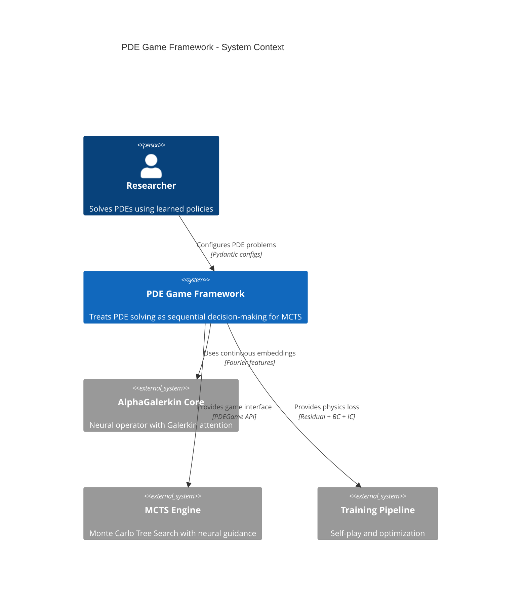

### External Entities

| Entity | Type | Description | Interaction |
|--------|------|-------------|-------------|
| Researcher | Human Actor | PDE scientist or ML researcher | Configures PDEs, analyzes results |
| AlphaGalerkin Core | System | Resolution-independent neural operator | Provides embeddings, attention |
| MCTS Engine | System | Tree search with learned policy/value | Calls PDEGame interface |
| Training Pipeline | System | Self-play, replay buffer, trainer | Uses physics-informed losses |

---

## Level 2: Container Diagram

```
┌─────────────────────────────────────────────────────────────────────────────────────┐
│                           PDE GAME FRAMEWORK CONTAINERS                              │
├─────────────────────────────────────────────────────────────────────────────────────┤
│                                                                                     │
│  ┌─────────────────────┐   ┌─────────────────────┐   ┌─────────────────────┐       │
│  │    PDE OPERATORS    │   │     GAME ENGINE     │   │   PHYSICS LOSSES    │       │
│  │    (src/pde/)       │   │  (src/pde/games/)   │   │ (src/training/)     │       │
│  ├─────────────────────┤   ├─────────────────────┤   ├─────────────────────┤       │
│  │ • PoissonOperator   │   │ • BasisSelectionGame│   │ • ResidualLoss      │       │
│  │ • BurgersOperator   │──>│ • MeshRefinementGame│──>│ • BoundaryLoss      │       │
│  │ • AdvDiffOperator   │   │ • PDEState          │   │ • PhysicsInformedLoss│      │
│  │ • HeatOperator      │   │ • PDEResult         │   │ • CombinedLoss      │       │
│  └─────────────────────┘   └─────────────────────┘   └─────────────────────┘       │
│            │                         │                         │                    │
│            │                         │                         │                    │
│            ▼                         ▼                         ▼                    │
│  ┌─────────────────────┐   ┌─────────────────────┐   ┌─────────────────────┐       │
│  │   CONFIGURATION     │   │    FOURIER FEATURES │   │   LOSS BALANCING    │       │
│  │   (src/pde/)        │   │   (src/modeling/)   │   │  (src/training/)    │       │
│  ├─────────────────────┤   ├─────────────────────┤   ├─────────────────────┤       │
│  │ • PDEConfig         │   │ • MultiScaleFourier │   │ • ReLoBRaLo         │       │
│  │ • PDEGameConfig     │   │ • AdaptiveFourier   │   │ • GradNorm          │       │
│  │ • BasisSelConfig    │   │ • ProgressiveFourier│   │ • Uncertainty       │       │
│  │ • MeshRefineConfig  │   │ • SpatialPosEnc     │   │ • SoftAdapt         │       │
│  └─────────────────────┘   └─────────────────────┘   └─────────────────────┘       │
│                                                                                     │
└─────────────────────────────────────────────────────────────────────────────────────┘
```

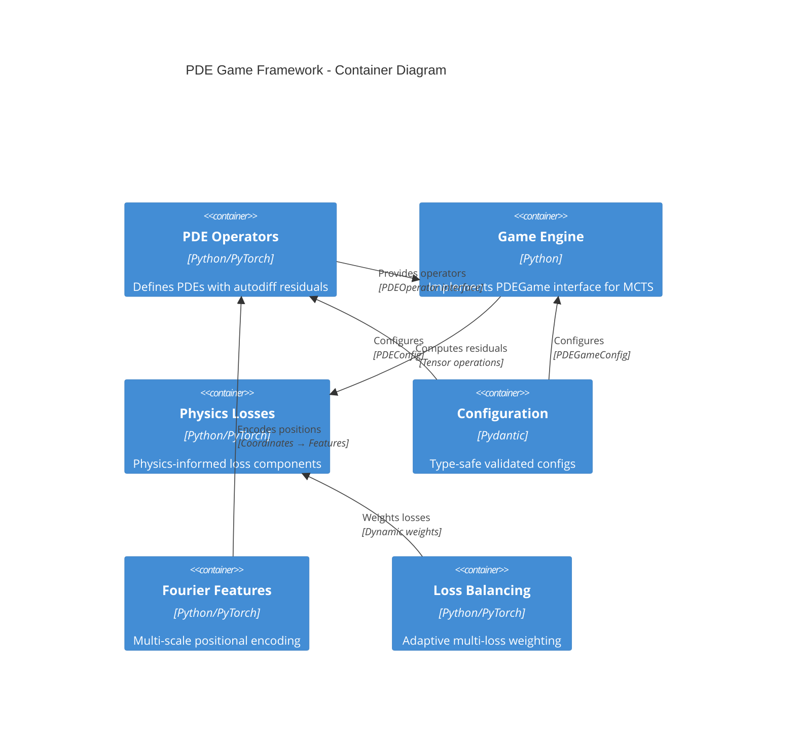

### Container Descriptions

| Container | Technology | Responsibility | Key Files |
|-----------|------------|----------------|-----------|
| PDE Operators | PyTorch + NumPy | Define PDE equations, compute residuals via autodiff | `src/pde/operators.py` |
| Game Engine | Python | Implement PDEGame interface for MCTS integration | `src/pde/games/*.py` |
| Physics Losses | PyTorch | Physics-informed loss terms (residual, BC, IC, conservation) | `src/training/physics_loss.py` |
| Configuration | Pydantic | Type-safe configs with validation | `src/pde/config.py` |
| Fourier Features | PyTorch | Multi-scale Fourier encoding for spectral bias mitigation | `src/modeling/multiscale_fourier.py` |
| Loss Balancing | PyTorch | Adaptive loss weighting (ReLoBRaLo, GradNorm, etc.) | `src/training/loss_balancing.py` |

---

## Level 3: Component Diagrams

### 3.1 PDE Operators Component

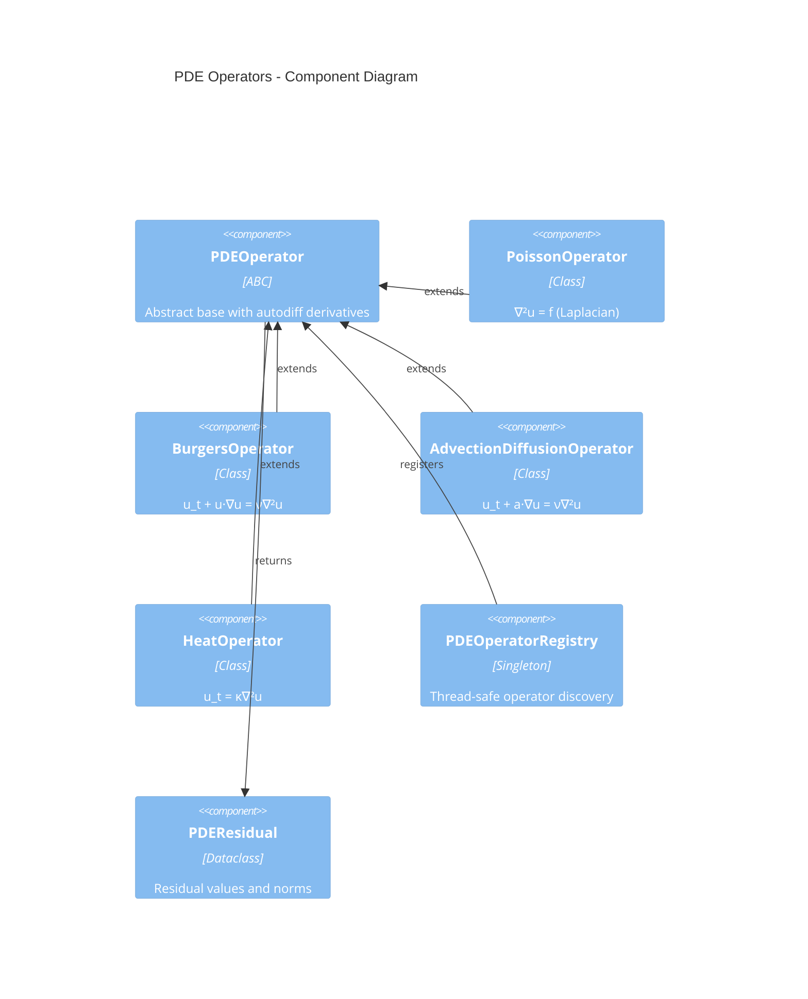

**Component Details:**

| Component | Responsibility | Complexity |
|-----------|----------------|------------|
| `PDEOperator` | Abstract interface with `residual()`, `source_term()`, `boundary_value()`, autodiff `compute_derivatives()` | O(N) per evaluation |
| `PoissonOperator` | Steady-state Poisson: `-∇²u = f` with DST-based exact solver for ground truth | O(N log N) spectral |
| `BurgersOperator` | Nonlinear Burgers with shock formation, viscosity parameter | Nonlinear iteration |
| `AdvectionDiffusionOperator` | Linear advection-diffusion with velocity field | O(N) evaluation |
| `HeatOperator` | Heat equation with thermal diffusivity | O(N) evaluation |
| `PDEOperatorRegistry` | Decorator-based registration, thread-safe singleton | O(1) lookup |

**Key Methods (PDEOperator):**

```python
class PDEOperator(ABC):
    @abstractmethod
    def residual(self, u: Tensor, coords: Tensor) -> PDEResidual:
        """Compute R = L(u) - f via automatic differentiation."""

    @abstractmethod
    def source_term(self, coords: Tensor) -> Tensor:
        """Compute forcing function f(x)."""

    @abstractmethod
    def boundary_value(self, coords: Tensor) -> Tensor:
        """Compute boundary condition g(x)."""

    def compute_derivatives(self, u: Tensor, coords: Tensor) -> dict[str, Tensor]:
        """Compute ∂u/∂x, ∂²u/∂x², ∇²u via torch.autograd."""
```

---

### 3.2 Game Engine Component

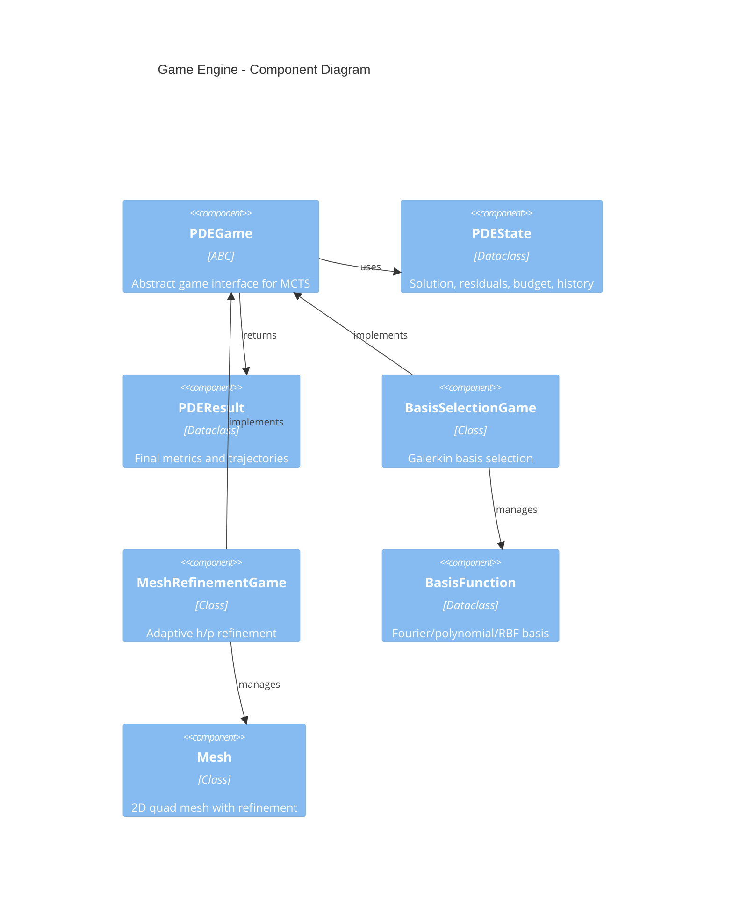

**PDEGame Interface:**

```python
class PDEGame(ABC):
    @property
    @abstractmethod
    def action_space_size(self) -> int: ...

    @abstractmethod
    def get_initial_state(self) -> PDEState: ...

    @abstractmethod
    def get_valid_actions(self, state: PDEState) -> list[int]: ...

    @abstractmethod
    def apply_action(self, state: PDEState, action: int) -> PDEState: ...

    @abstractmethod
    def get_reward(self, state: PDEState, prev_state: PDEState) -> float: ...

    @abstractmethod
    def is_terminal(self, state: PDEState) -> bool: ...

    @abstractmethod
    def to_tensor(self, state: PDEState) -> Tensor: ...
```

**Game Implementations:**

| Game | State Representation | Actions | Reward Shaping |
|------|---------------------|---------|----------------|
| BasisSelectionGame | Basis coefficients, solution, residuals | Add Fourier/poly/RBF basis | Error reduction - DOF cost |
| MeshRefinementGame | Mesh elements, refinement levels, solution | Refine element (h or p) | Error reduction - DOF cost |

---

### 3.3 Physics-Informed Loss Component

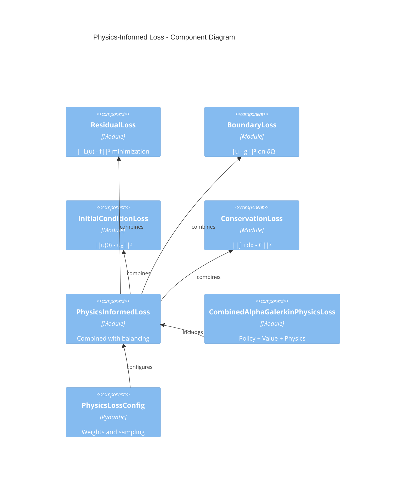

**Loss Formulation:**

```
L_total = w_r · L_residual + w_b · L_boundary + w_ic · L_initial + w_c · L_conservation

Where:
  L_residual = 1/N Σ ||L(u)(xᵢ) - f(xᵢ)||²     (PDE residual)
  L_boundary = 1/N_b Σ ||u(x_b) - g(x_b)||²    (Boundary conditions)
  L_initial  = 1/N₀ Σ ||u(x, 0) - u₀(x)||²     (Initial condition)
  L_conservation = |∫_Ω u dx - C|²              (Conservation laws)
```

---

### 3.4 Loss Balancing Component

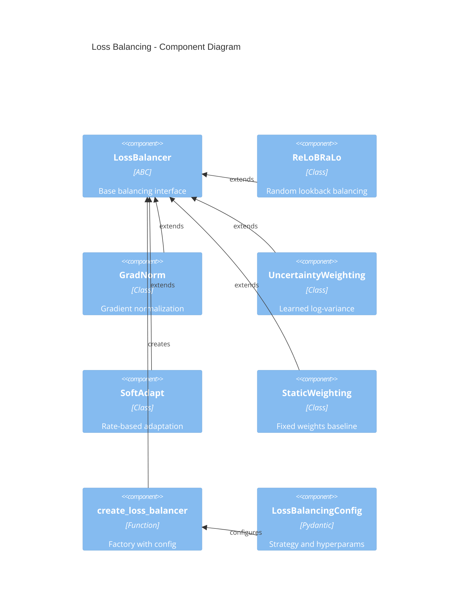

**Balancing Strategies:**

| Strategy | Formula | Use Case |
|----------|---------|----------|
| ReLoBRaLo | `wᵢ = softmax(Lᵢ(t) / Lᵢ(τ))` with random τ | Physics-informed neural networks |
| GradNorm | Normalize gradients to achieve equal training rates | Multi-task learning |
| Uncertainty | `wᵢ = 1/(2σᵢ²)` with learned σ | Heteroscedastic multi-objective |
| SoftAdapt | Weight by loss improvement rate | Faster convergence |

---

### 3.5 Multi-Scale Fourier Features Component

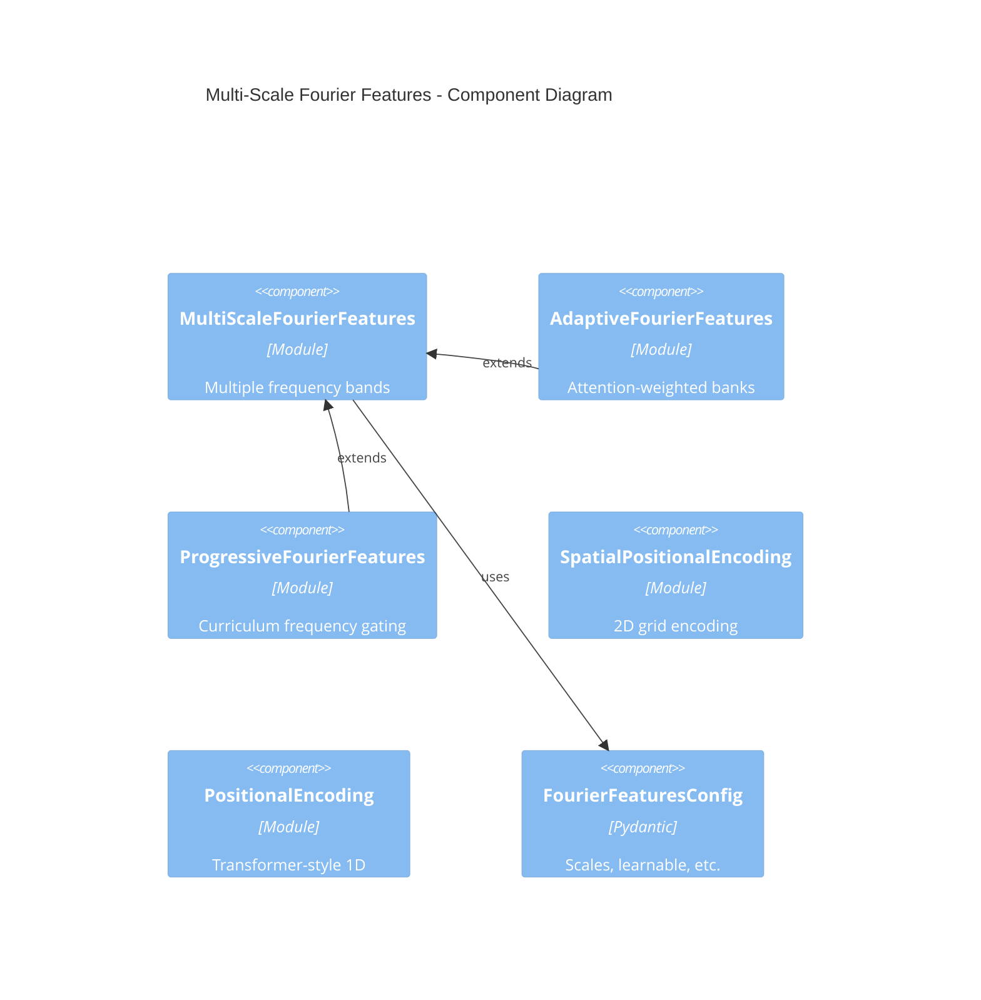

**Spectral Bias Mitigation:**

```
γ(x) = [x, sin(2πB₁x), cos(2πB₁x), ..., sin(2πBₖx), cos(2πBₖx)]

Where Bᵢ ~ N(0, σᵢ²) with σᵢ spanning orders of magnitude:
  - Low σ (1.0): Large-scale structure
  - Medium σ (10.0): Intermediate features
  - High σ (100.0): Fine details, sharp gradients
```

---

## Level 4: Code and ADRs

### 4.1 Key Class Diagram

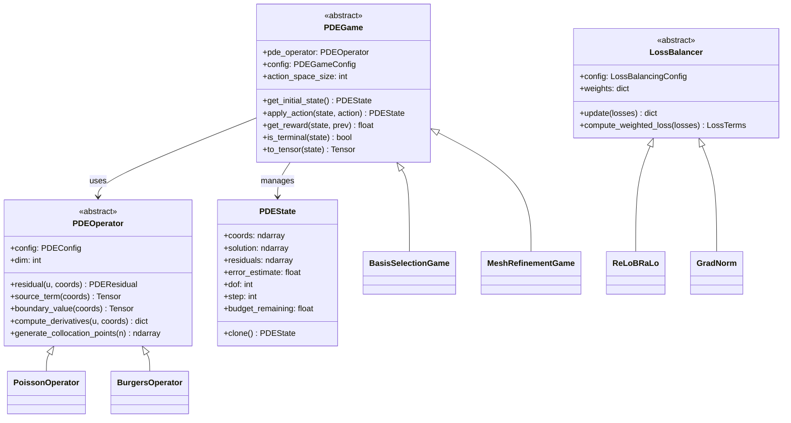

### 4.2 Sequence Diagram: MCTS with PDE Game

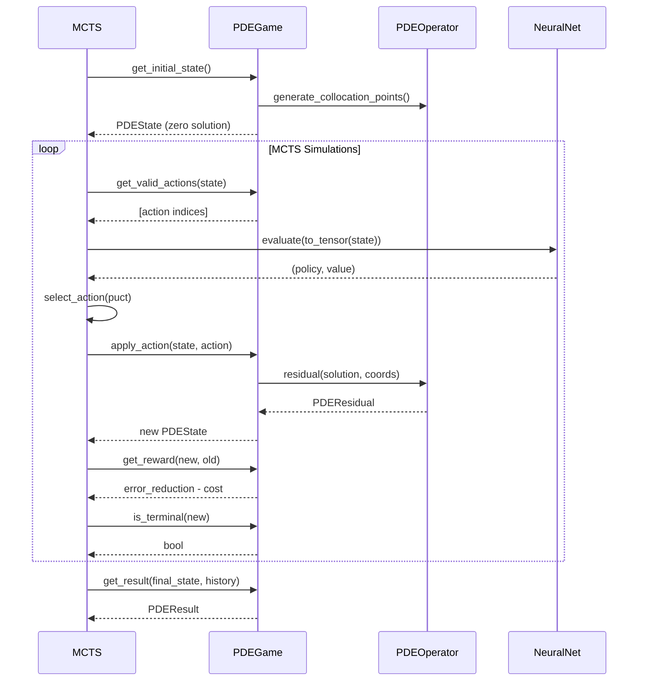

### 4.3 Architecture Decision Records

#### ADR-001: PDE Solving as Game

**Status:** Accepted

**Context:**
Traditional PDE solvers use local error indicators (Zienkiewicz-Zhu, Kelly) for adaptive refinement.
These indicators are myopic—they cannot look ahead multiple refinement steps.

**Decision:**
Frame PDE solving as a game compatible with AlphaZero MCTS:
- State = approximation quality
- Actions = refinement decisions
- Reward = error reduction / cost
- Value = expected final error

**Consequences:**
- (+) MCTS can plan ahead multiple steps
- (+) Reuses existing AlphaGalerkin infrastructure
- (+) Learned policy generalizes across PDE instances
- (-) Requires defining discrete action space
- (-) Training requires self-play or supervised curriculum

---

#### ADR-002: ReLoBRaLo for Physics Loss Balancing

**Status:** Accepted

**Context:**
Physics-informed losses have vastly different scales (residual ~1, BC ~0.01) and convergence rates.
Fixed weights require extensive tuning per problem.

**Decision:**
Implement ReLoBRaLo (Bischof & Kraus, 2022) as default balancing strategy:
- Track running loss history
- Compute relative change via random lookback
- Softmax to get adaptive weights

**Consequences:**
- (+) Automatic balancing without per-problem tuning
- (+) Robust to different PDE types
- (-) Introduces hyperparameters (β, τ, lookback)
- (-) Adds computational overhead for history tracking

**Alternatives Considered:**
- GradNorm: Requires shared layer, more complex
- Uncertainty: Adds learnable parameters

---

#### ADR-003: Multi-Scale Fourier Features

**Status:** Accepted

**Context:**
Neural networks exhibit spectral bias—they learn low frequencies first.
High-frequency solutions (shocks, boundary layers) are underrepresented.

**Decision:**
Implement multi-scale Fourier features with log-spaced frequency bands:
- Low σ (1.0): Captures large-scale structure
- High σ (100.0): Captures fine details
- Progressive gating for curriculum learning

**Consequences:**
- (+) Mitigates spectral bias
- (+) Enables learning of high-frequency features
- (+) Progressive features support curriculum
- (-) Increases embedding dimension
- (-) May need scale tuning for extreme problems

---

## Data Flow Diagrams

### Training Data Flow

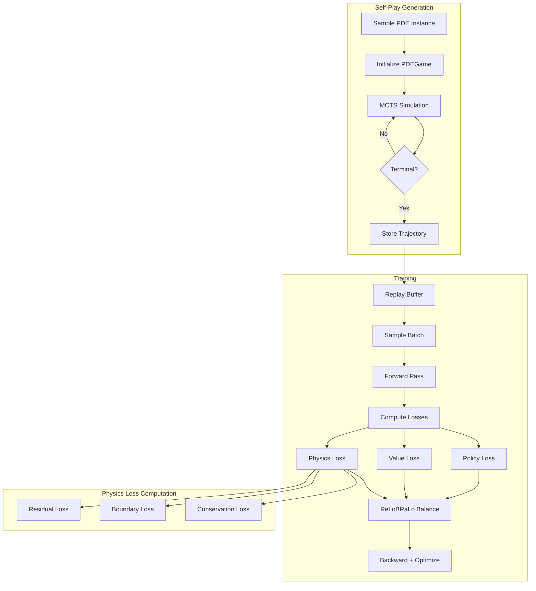

### Inference Data Flow

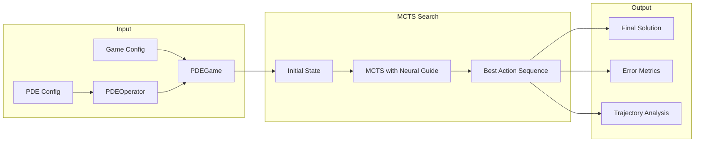

---

## Deployment Considerations

### Local Development
```
┌────────────────────────────────────────┐
│           Developer Machine            │
├────────────────────────────────────────┤
│  Python 3.11+ │ PyTorch │ CUDA (opt)  │
│  ──────────────────────────────────────│
│  src/pde/     │ Tests   │ Notebooks   │
└────────────────────────────────────────┘
```

### Distributed Training
```
┌────────────────────────────────────────────────────────────┐
│                    Training Cluster                         │
├─────────────────────┬────────────────────┬─────────────────┤
│  Self-Play Workers  │  Parameter Server  │  Trainer Node   │
│  (Ray / DDP)        │  (Model Zoo)       │  (PyTorch DDP)  │
├─────────────────────┴────────────────────┴─────────────────┤
│  Shared Storage: Checkpoints, Replay Buffer, Configs       │
└────────────────────────────────────────────────────────────┘
```

---

## Cross-Cutting Concerns

### Configuration Management
- All configs via Pydantic with validation
- No hardcoded values
- Deterministic hashing for reproducibility
- YAML/JSON serialization support

### Logging Strategy
- Structured logging via structlog
- Component-scoped loggers
- Metric logging for training curves
- Timed operations for profiling

### Testing Strategy
- Unit tests for all operators and games
- Property-based tests for mathematical invariants
- Integration tests for full game loops
- Coverage target: >90%

### Observability
- Loss component tracking (policy, value, physics)
- Weight evolution monitoring
- Error trajectory logging
- Checkpoint versioning

---

## Integration Points

### With AlphaGalerkin Core
```python
from src.modeling.embeddings import ContinuousEmbedding
from src.modeling.multiscale_fourier import MultiScaleFourierFeatures
from src.pde.games import BasisSelectionGame

# Integrate Fourier features with neural operator
embedding = ContinuousEmbedding(
    input_channels=17,
    d_model=256,
    n_fourier_features=128,
)
```

### With MCTS
```python
from src.mcts.search import MCTS
from src.pde.games import MeshRefinementGame

game = MeshRefinementGame(operator, config)
mcts = MCTS(
    game=game,  # PDEGame implements GameInterface-like API
    evaluator=neural_evaluator,
)
```

### With Training Pipeline
```python
from src.training.loss import AlphaGalerkinLoss
from src.training.physics_loss import CombinedAlphaGalerkinPhysicsLoss

loss_fn = CombinedAlphaGalerkinPhysicsLoss(
    pde_operator=operator,
    physics_weight=0.1,
)
```

---

## Quality Attributes

| Attribute | Approach |
|-----------|----------|
| **Performance** | O(N) operators, batched evaluations, GPU acceleration |
| **Scalability** | Distributed self-play, DDP training, model zoo |
| **Maintainability** | Pydantic configs, registry pattern, structured logging |
| **Testability** | Abstract interfaces, dependency injection, property tests |
| **Extensibility** | Registry-based operators, game abstraction |
| **Reliability** | Validation at boundaries, checkpoint recovery |

---

## References

1. Brown, S. (2018). The C4 Model for Software Architecture.
2. Raissi, M., et al. (2019). Physics-Informed Neural Networks.
3. Bischof, R., & Kraus, M. (2022). Multi-Objective Loss Balancing.
4. Tancik, M., et al. (2020). Fourier Features Let Networks Learn High Frequency Functions.
5. Silver, D., et al. (2017). Mastering the Game of Go without Human Knowledge.
