# AlphaGalerkin Video Compression - C4 Architecture

## Overview

This document describes the architecture of the AlphaGalerkin Neural Video Compression system using the C4 model (Context, Containers, Components, Code).

**Key Design Principles:**
- Resolution-independent: O(N) Galerkin attention + O(N log N) FNet mixing
- Zero-shot transfer: Train on one resolution, infer on another
- MCTS-based rate control for optimal bit allocation
- Differentiable end-to-end training with R-D optimization

---

## Level 1: System Context Diagram

Shows how the video compression system fits into its environment.

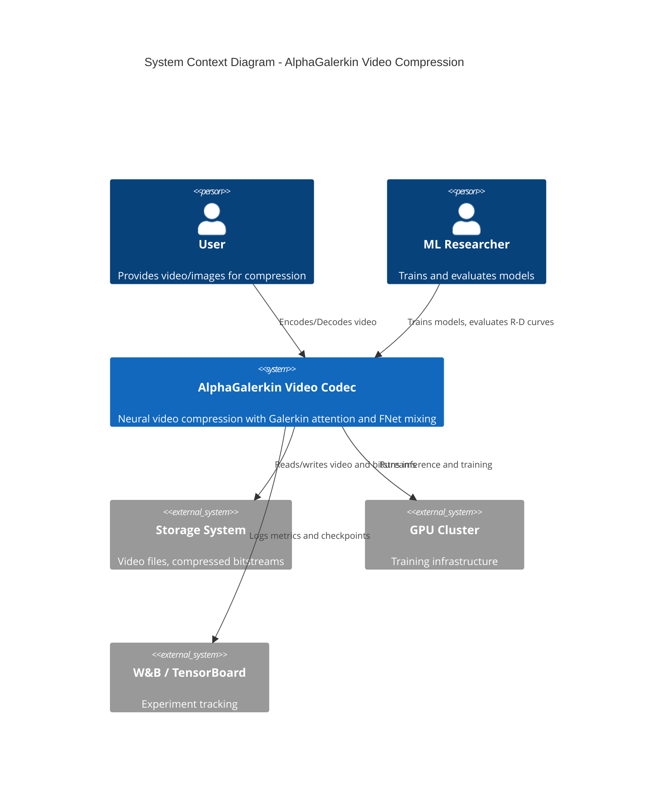

---

## Level 2: Container Diagram

Shows the high-level modules within the video compression system.

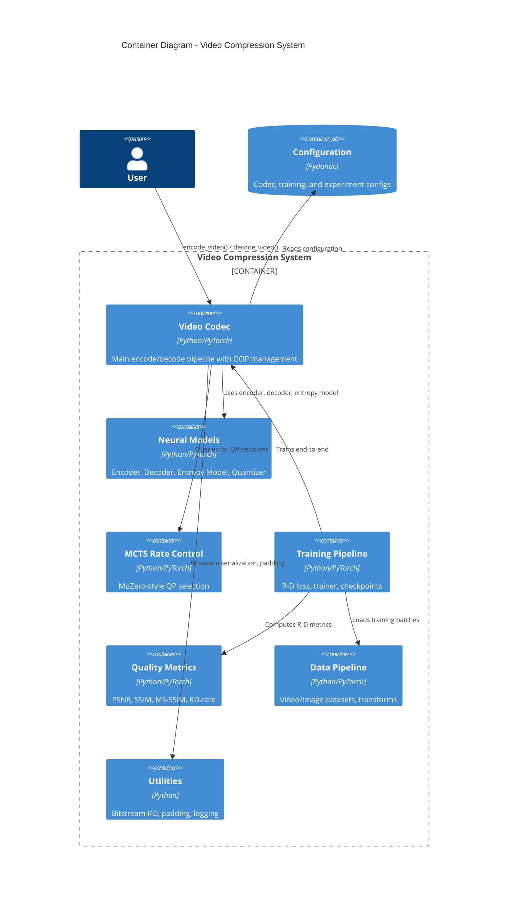

---

## Level 3: Component Diagrams

### 3.1 Neural Models Component

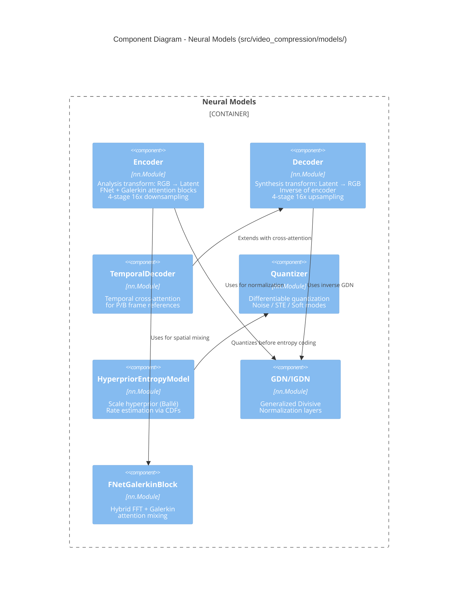

### 3.2 Codec Component

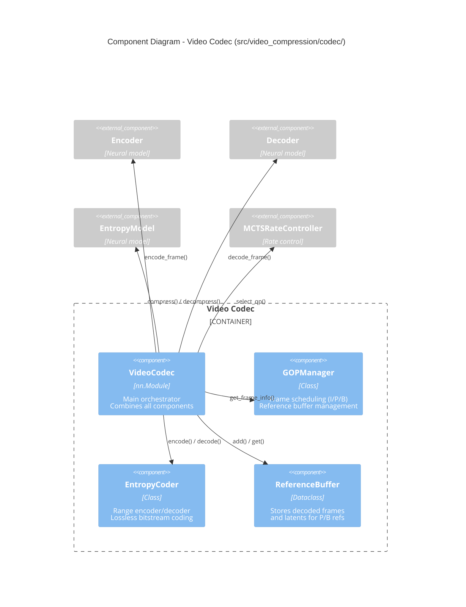

### 3.3 MCTS Rate Control Component

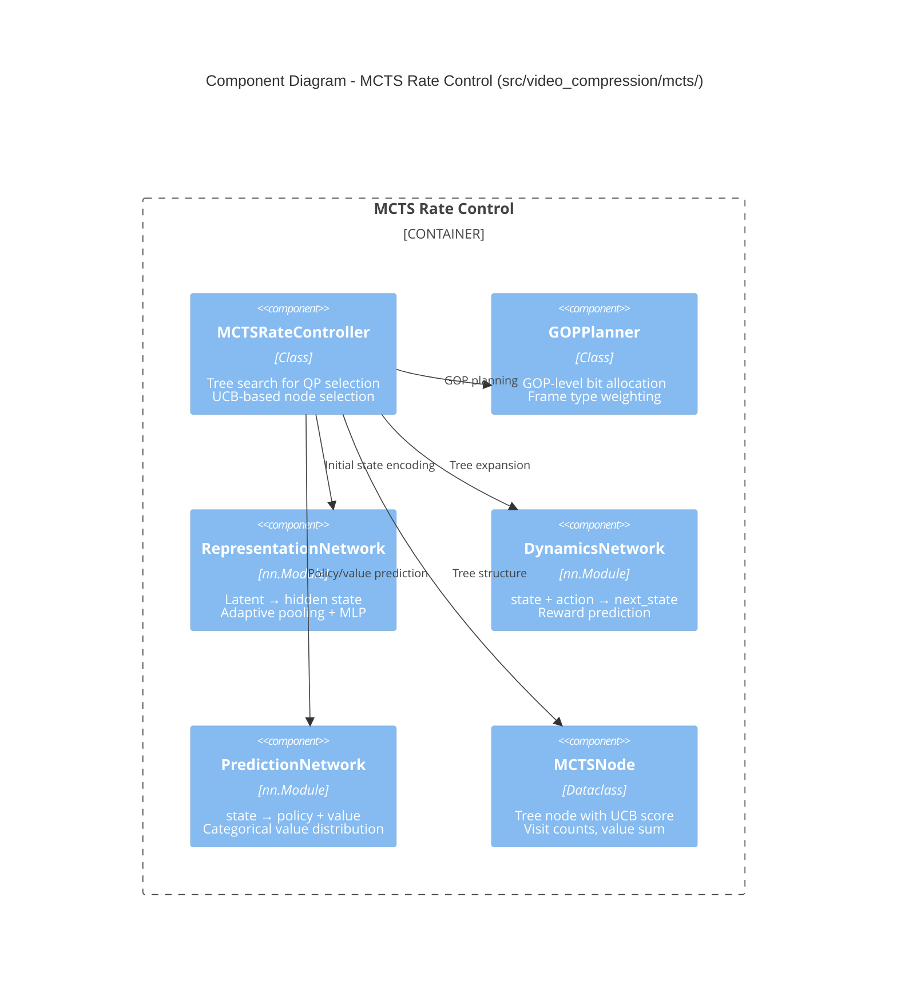

### 3.4 Training Component

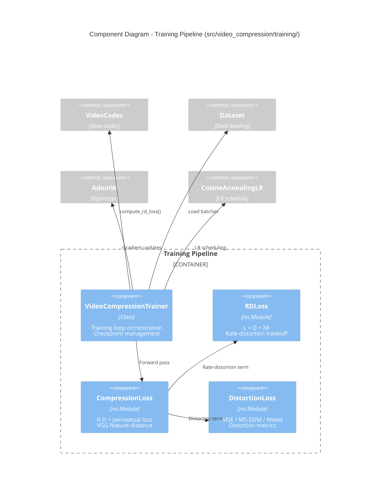

### 3.5 Model Zoo Component (Phase 2-B)

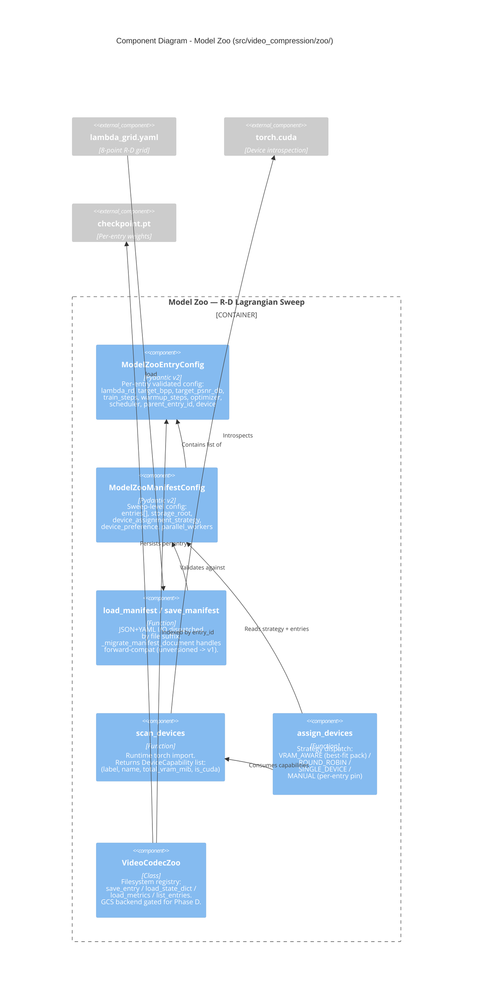

### 3.6 Sweep Orchestrator Component (Phase 2-D)

```mermaid
C4Component
    title Component Diagram - Sweep Orchestrator (src/video_compression/zoo/sweep.py + scripts/)

    Container_Boundary(sweep, "Sweep Orchestrator — Manifest-level R-D Grid Training") {
        Component(zoo_sweep, "ZooSweep", "Class", "Drives every entry in a manifest through<br/>a configurable EntryRunner.<br/>run() — serial; run_parallel() — one<br/>worker thread per device, same-device<br/>entries serialized inside their worker.")

        Component(entry_runner, "EntryRunner", "Protocol / Callable", "Pluggable single-entry execution unit.<br/>Default: default_entry_runner (in-process<br/>ZooTrainer). Subprocess variant via<br/>make_subprocess_entry_runner.")

        Component(subprocess_runner, "make_subprocess_entry_runner", "Factory Function", "Returns an EntryRunner that re-invokes<br/>train_compression_zoo_entry.py with<br/>CUDA_VISIBLE_DEVICES=<idx>.<br/>Translates parent cuda:N → child cuda:0.<br/>Reads metrics.json + checkpoint.pt to<br/>reconstruct ZooTrainingReport.")

        Component(should_skip, "should_skip", "Function", "Inspects persisted entry hash in<br/>VideoCodecZoo. Reruns of an unchanged<br/>entry (same config hash) skip cleanly.")

        Component(sweep_report, "SweepReport + EntryStatus", "Frozen Dataclasses", "Immutable result container.<br/>Statuses returned in manifest order<br/>regardless of completion order.")

        Component(cli_helpers, "cli_helpers", "Module", "Shared CLI primitives:<br/>load_dict (YAML/JSON), resolve_path,<br/>load_codec_config, resolve_entry,<br/>resolve_codec_config_for_entry,<br/>override_entry, resolve_device.")

        Component(zoo_cli, "train_compression_zoo.py", "CLI Script", "dry-run / train subcommands operating<br/>on a manifest YAML/JSON.<br/>--only-entry-id filter for single-entry<br/>reruns. Delegates to ZooSweep.")

        Component(entry_cli, "train_compression_zoo_entry.py", "CLI Script", "Single-entry training CLI; re-exports<br/>cli_helpers as _underscored aliases<br/>for back-compat monkeypatching in<br/>existing tests.")
    }

    Component_Ext(zoo_store2, "VideoCodecZoo", "Storage — Phase 2-B")
    Component_Ext(zoo_trainer, "ZooTrainer", "Training — Phase 2-C")
    Component_Ext(manifest2, "ModelZooManifestConfig", "Config — Phase 2-B")

    Rel(zoo_cli, zoo_sweep, "Constructs + calls run() / run_parallel()")
    Rel(zoo_sweep, entry_runner, "Calls for each entry")
    Rel(zoo_sweep, should_skip, "Checks before each entry")
    Rel(zoo_sweep, zoo_store2, "Reads hash / writes results")
    Rel(zoo_sweep, manifest2, "Reads entries + strategy")
    Rel(entry_runner, zoo_trainer, "default_entry_runner (in-process)")
    Rel(subprocess_runner, entry_cli, "Spawns subprocess via")
    Rel(zoo_cli, cli_helpers, "Uses for YAML/path/device resolution")
    Rel(entry_cli, cli_helpers, "Re-imports as _underscored aliases")
    Rel(sweep_report, zoo_sweep, "Returned by run() / run_parallel()")
```

### 4.1 Encoding Flow Sequence

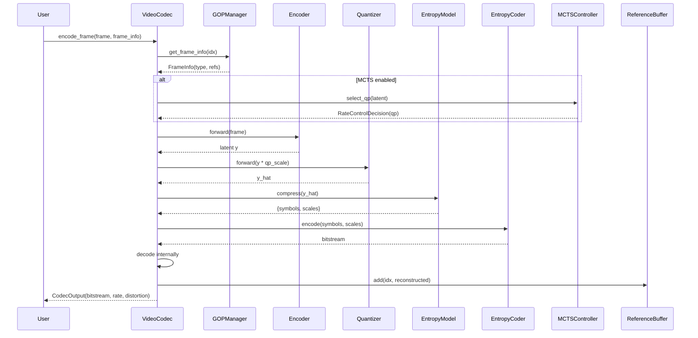

### 4.2 Training Flow Sequence

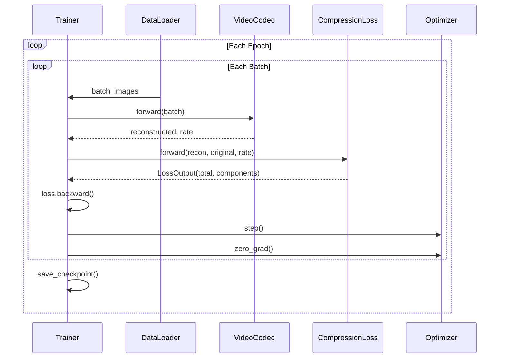

### 4.3 Class Relationships

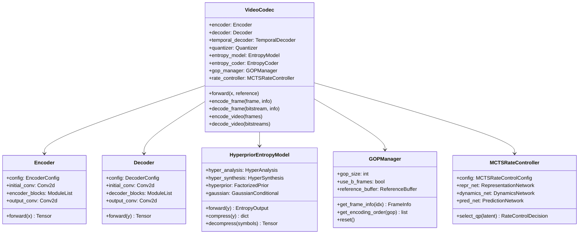

---

## Data Flow Diagrams

### Encoding Pipeline

```mermaid
flowchart TB
    subgraph Input
        A[RGB Frame<br/>B×3×H×W]
    end

    subgraph Encoder["Encoder (Analysis Transform)"]
        B[Initial Conv<br/>3→64 channels]
        C[DownsampleBlock ×4<br/>GDN + FNet-Galerkin]
        D[Output Conv<br/>→192 channels]
    end

    subgraph Quantization
        E[QP Scaling<br/>y / 2^((QP-23)/6)]
        F[Quantizer<br/>Noise/STE/Soft]
    end

    subgraph Entropy["Entropy Model"]
        G[HyperAnalysis<br/>y → z]
        H[HyperSynthesis<br/>z → σ]
        I[GaussianConditional<br/>p(y|σ)]
    end

    subgraph Coding
        J[EntropyCoder<br/>Range coding]
        K[Bitstream]
    end

    A --> B --> C --> D
    D --> E --> F
    F --> G --> H
    H --> I --> J --> K

    style Input fill:#e1f5fe
    style Coding fill:#c8e6c9
```

### Decoding Pipeline

```mermaid
flowchart TB
    subgraph Input
        A[Bitstream]
        B[Scales σ]
    end

    subgraph Decoding
        C[EntropyCoder<br/>Range decode]
        D[Reshape to<br/>B×192×H/16×W/16]
    end

    subgraph Inverse
        E[Inverse QP Scale<br/>y × 2^((QP-23)/6)]
    end

    subgraph Decoder["Decoder (Synthesis Transform)"]
        F[Initial Conv]
        G[UpsampleBlock ×4<br/>IGDN + Attention]
        H[Output Conv<br/>→3 channels]
    end

    subgraph Output
        I[RGB Frame<br/>B×3×H×W]
    end

    A --> C
    B --> C
    C --> D --> E --> F --> G --> H --> I

    style Input fill:#fff3e0
    style Output fill:#c8e6c9
```

---

## Configuration Structure

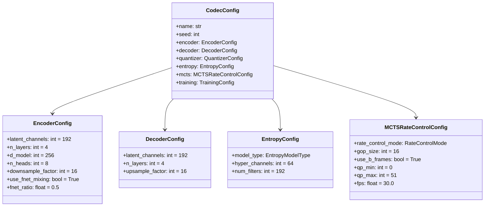

---

## Key Algorithms

### Galerkin Attention (O(N) Complexity)

```
Input: Q, K, V ∈ R^(N×d)

# Monte Carlo integral approximation
Context = K^T @ V / N          # (d×d) matrix

# Project queries onto basis
Output = Q @ Context           # (N×d) result

# Key insight: O(N) instead of O(N²) softmax attention
```

### FNet Mixing (O(N log N) Complexity)

```
Input: x ∈ R^(B×N×d) reshaped to (B×H×W×d)

# 2D FFT for spatial mixing
x_freq = rfft2(x, dim=(1,2))   # Real FFT
x_mixed = irfft2(x_freq)       # Inverse FFT

# No learnable parameters - pure frequency mixing
```

### MCTS QP Selection

```
1. Encode frame latent → state via RepresentationNetwork
2. Initialize root node with PredictionNetwork(state)
3. For n_simulations:
   a. Select leaf via UCB: argmax(Q + c*prior*sqrt(N_parent)/(1+N))
   b. Expand: DynamicsNetwork(state, action) → next_state
   c. Evaluate: PredictionNetwork(next_state) → policy, value
   d. Backpropagate value up tree
4. Return action with highest visit count
```

---

## Module Dependencies

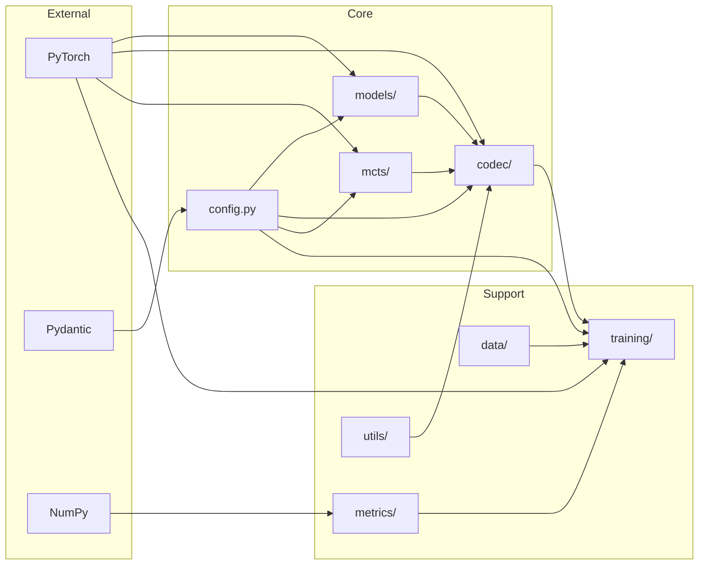

---

## Deployment View

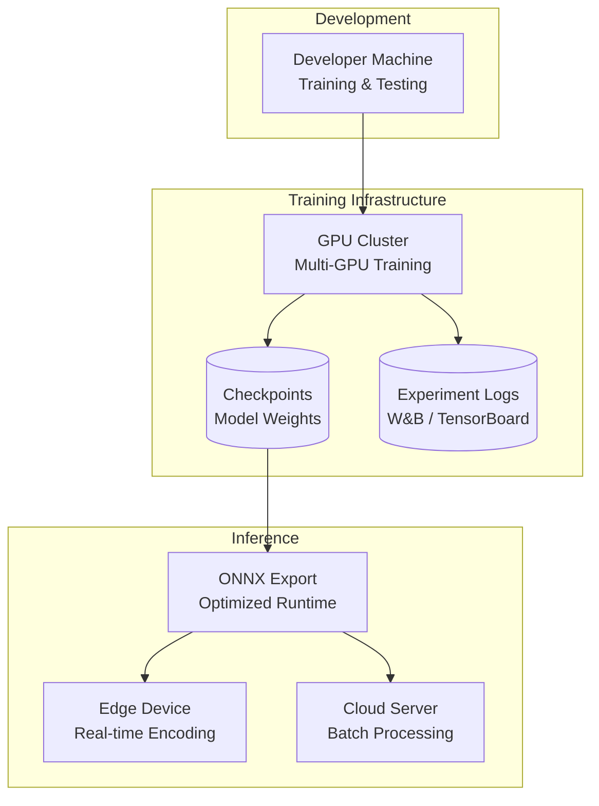

---

## Summary

The AlphaGalerkin Video Compression system is a modular, resolution-independent neural codec featuring:

1. **O(N) Galerkin Attention**: Linear complexity attention for scalability
2. **FNet Mixing**: O(N log N) FFT-based spatial mixing
3. **Scale Hyperprior**: Learned entropy model for rate estimation
4. **MCTS Rate Control**: MuZero-style tree search for optimal QP selection
5. **GOP Management**: Efficient I/P/B frame scheduling with reference buffers

The architecture supports zero-shot resolution transfer and end-to-end differentiable training with rate-distortion optimization.
