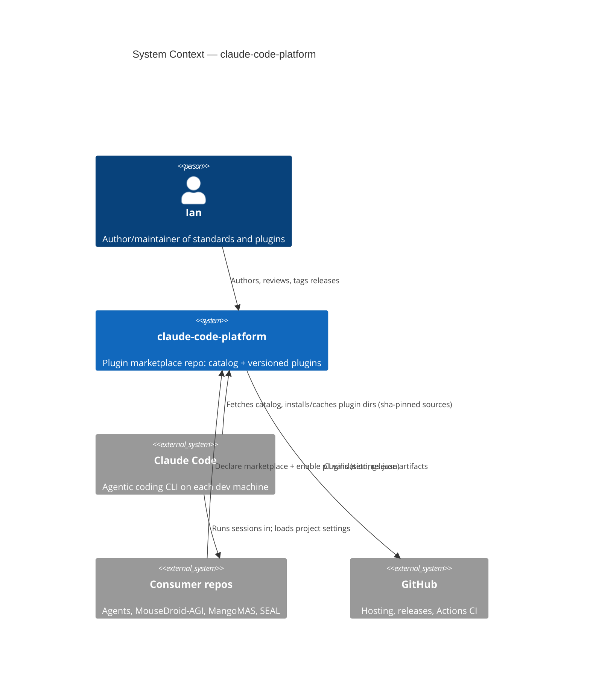
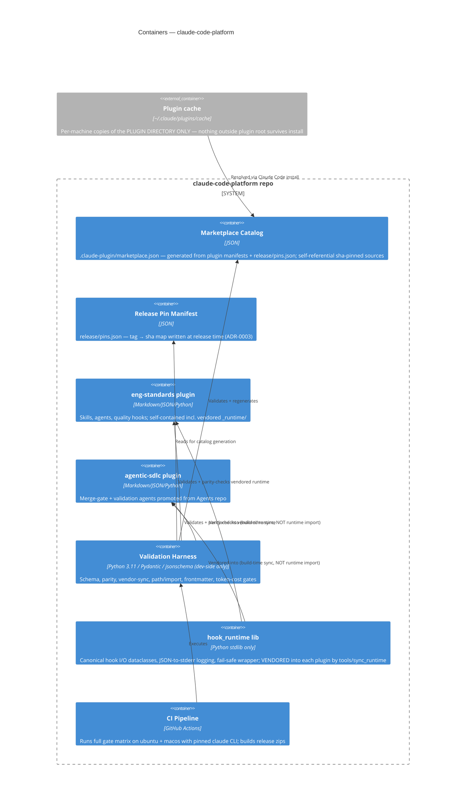
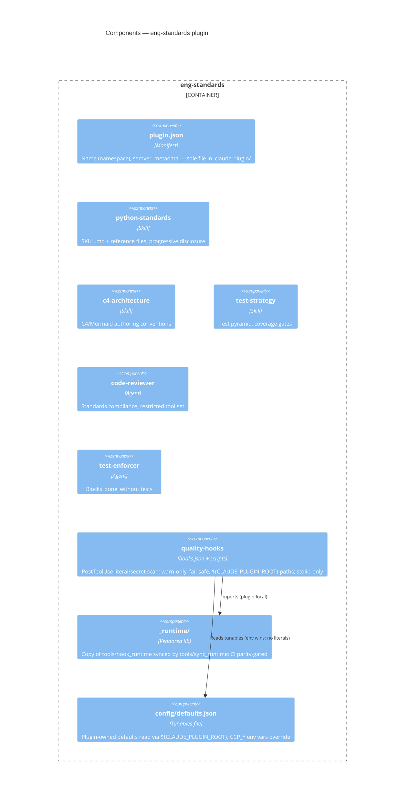
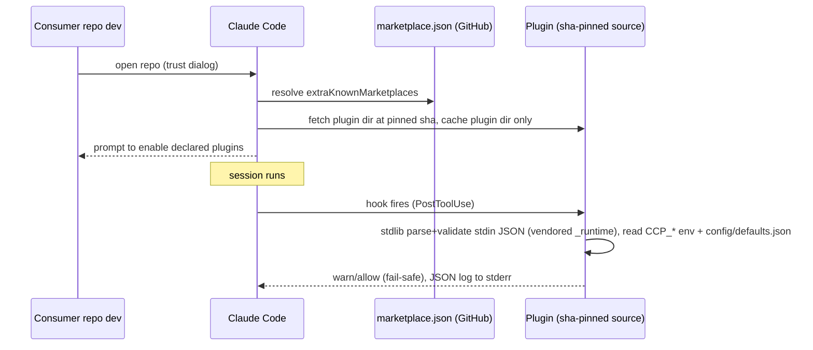

# Implementation Plan (Revised): `ianshank/claude-code-platform`

> Reusable Claude Code plugin marketplace: sub-agents, skills, hooks, and MCP
> wiring packaged as versioned, installable plugins consumed by `Agents`,
> `MouseDroid-AGI`, `MangoMAS`, `SEAL`, and future repos.

**Revision status:** this is the original implementation plan with the peer-review
corrections applied. See
[`docs/reviews/claude_code_platform_plan_review.md`](../reviews/claude_code_platform_plan_review.md)
for the review itself. Changes from the original are marked **[REVISED — Finding N]**;
everything unmarked survived review intact.

**Packaging decision (unchanged, verified correct):** the repository is a
**Claude Code plugin marketplace** — a git repo with
`.claude-plugin/marketplace.json` cataloging one or more plugins. Consumer repos
do not copy files; they declare the marketplace in `.claude/settings.json`
(`extraKnownMarketplaces` + `enabledPlugins`) and receive versioned, sha-pinned
updates.

---

## SECTION 1: OBJECTIVE FUNCTION

### 1.1 System Intent

```
I am building: a versioned Claude Code plugin marketplace that packages my
engineering standards (Protocol DI, Pydantic configs, no hardcoded values,
fail-safe defaults, full test coverage) as installable sub-agents, skills,
and hooks, so every one of my repos gets identical agentic tooling from a
single source of truth.
```

### 1.2 Success Criteria (Mechanically Verifiable) **[REVISED — Findings 5, 9]**

```
This succeeds when:
- [ ] `claude plugin validate --strict` passes for the marketplace root and
      every plugin in plugins/
- [ ] CI validation suite passes: JSON-schema checks on marketplace.json,
      plugin.json, hooks.json; frontmatter lint on all SKILL.md / agent.md;
      hook-runtime vendoring parity check; pytest on all hook scripts
      (100% of hook scripts covered)
- [ ] CI component-load smoke test: `claude --plugin-dir ./plugins/<name>`
      loads every plugin and lists every namespaced skill/agent
      (NOTE: this verifies component correctness, NOT the marketplace
      install path — see the manual release checklist for that)
- [ ] Release checklist (manual, per release): fresh temp dir containing only
      a .claude/settings.json declaring this marketplace auto-prompts install
      after trust and exposes every namespaced component
- [ ] Zero hardcoded paths: grep gate proves all intra-plugin paths use
      ${CLAUDE_PLUGIN_ROOT}; all tunables come from CCP_* env vars or the
      plugin's own config/defaults.json
- [ ] Two consumer repos (Agents, MouseDroid-AGI) pinned to a tagged release
      via per-plugin source sha in marketplace.json, and a breaking-change
      dry run shows old pins keep working
- [ ] Every hook script emits structured JSON logs to stderr and honors
      CCP_LOG_LEVEL / CCP_DEBUG without code changes
- [ ] Token-cost gate (best-effort): `claude plugin details` always-on cost
      per plugin ≤ 1,500 tokens; gate is tolerant-parse until a stable
      machine-readable output mode is confirmed
```

### 1.3 Problem Description (The "Three Paragraphs")

```
Agentic tooling (review agents, test-enforcement skills, quality hooks) is
currently duplicated and drifting across repos: Agents, MouseDroid-AGI,
MangoMAS, SEAL each carry their own .claude/ conventions. The core
coordination logic is a publish/subscribe contract: this repo publishes a
catalog of versioned plugins; consumer repos subscribe by marketplace
declaration and receive components under a stable namespace
(plugin-name:component), so nothing collides and nothing is copied.

Data flows in three loops. Authoring loop: component authored standalone →
tested with `claude --plugin-dir ./plugins/<name>` → promoted into the
catalog → CI validates → tagged release. Distribution loop: consumer repo's
.claude/settings.json declares the marketplace and enabled plugins; plugin
source entries in marketplace.json are pinned to the release sha → Claude
Code caches the plugin directory (and ONLY the plugin directory) to
~/.claude/plugins/cache/ → /plugin update pulls new versions. Runtime loop:
hooks fire on lifecycle events, scripts read config from env vars or the
plugin's own defaults file (never literals), and emit structured logs to
stderr for debugging. State that must stay synchronized:
marketplace.json entries ↔ each plugin.json (name/description do NOT
auto-sync — CI enforces parity; version parity is enforced by
`claude plugin validate` itself) AND the vendored hook runtime inside each
plugin ↔ the canonical copy in tools/hook_runtime (CI parity gate).
[REVISED — Findings 1, 6, 7]

Failure modes: catalog/manifest drift (CI parity check fails the build);
vendored-runtime drift (CI sync gate fails the build); breaking change
shipped to pinned consumers (semver + per-plugin source sha + a compat test
matrix that installs the previous tagged release against current consumer
contracts); hook script crash blocking a session (fail-safe: hooks exit 0
with a logged warning on unexpected errors unless explicitly gating);
hook import failure on consumer machines (prevented structurally: hook
scripts are stdlib-only and self-contained within the plugin directory);
path breakage across machines (${CLAUDE_PLUGIN_ROOT} everywhere, enforced
by grep gate). Invariant set: (1) every marketplace entry resolves to a
plugin that passes `claude plugin validate --strict`; (2) catalog metadata
== manifest metadata; (3) no component references an absolute or
repo-relative literal path, and no hook script imports anything outside the
plugin directory or the stdlib; (4) a consumer installing release X gets
bytes identical to the tagged release X plugin directory (guaranteed by the
self-referential sha-pinned source entries — see ADR-0003).
[REVISED — Findings 1, 2, 6]
```

---

## SECTION 2: FEASIBLE REGION (Constraints)

### 2.1 Hard Constraints (Violations = Failure) **[REVISED — Findings 1, 2, 3, 10]**

```
- Runtime: Claude Code (current stable); hook scripts in Python 3.11+
  STDLIB ONLY (no pydantic/structlog/any third-party import — consumer
  machines have no dependency-resolution mechanism for plugin hooks and
  network calls from hooks are prohibited). Shell is permitted only as a
  thin exec wrapper around a Python entrypoint.
- Self-containment: every file a hook script imports or reads at runtime
  lives INSIDE that plugin's directory (installed plugins cannot reference
  files outside their root — they are cached per-plugin). The shared hook
  runtime is vendored into each plugin by tools/sync_runtime and
  parity-gated in CI.
- Structure: .claude-plugin/ contains ONLY plugin.json (marketplace root
  contains only marketplace.json); skills/, agents/, hooks/, commands/ live
  at plugin root — never inside .claude-plugin/
- Paths: all intra-plugin references via ${CLAUDE_PLUGIN_ROOT}; no
  hardcoded absolute paths, usernames, repo names, or model strings
- Config: all tunables via env vars (CCP_* prefix) or the plugin's own
  ${CLAUDE_PLUGIN_ROOT}/config/defaults.json (env wins). Plugin-root
  settings.json is NOT a tunables store (it supports only agent /
  subagentStatusLine keys). Hook scripts validate their stdin JSON with
  typed stdlib parsing (dataclasses) before acting.
- Versioning: semver on every plugin.json; marketplace source entries for
  production releases are self-referential github sources pinned to the
  release sha (ADR-0003)
- Security: no secrets in any file; hooks never execute strings received
  from tool input without validation; PreToolUse gates are denylist-logged
- Compatibility: macOS (darwin-arm64) and Linux (x86_64/ARM64) are the
  supported targets; hook entrypoints are Python (not shell) so Windows
  consumers degrade gracefully rather than silently break; the platform
  policy is stated in each plugin README
```

### 2.2 Soft Constraints (Preferences) **[REVISED — Findings 2, 9]**

```
- Python (dev-side harness in tools/ and tests/ ONLY): Pydantic v2 models,
  structlog, full type hints, ruff + mypy clean. Hook scripts themselves
  are stdlib-only (hard constraint) but still fully type-hinted and
  mypy-clean.
- Skills: progressive disclosure — SKILL.md under ~150 lines, heavy
  reference material in adjacent files loaded on demand
- Agents: single responsibility per agent.md; declare tool restrictions
  (disallowedTools) explicitly rather than inheriting everything
- Testing: pytest for hook scripts (>90% coverage) via subprocess-driven
  stdin/stdout contract tests, one end-to-end smoke test per plugin
- Token budget: run `claude plugin details` in CI and warn/fail if a
  plugin's always-on context cost exceeds an agreed ceiling (start: 1,500
  tokens always-on per plugin); best-effort gate until output stability
  is confirmed
- Docs: every plugin has README.md with install line, component inventory,
  configuration table (env var | default | effect), and platform policy
```

### 2.3 Anti-Constraints (Explicit Freedoms)

```
You ARE permitted to:
- Restructure plugin boundaries (split/merge plugins) if namespacing or
  token cost argues for it
- Add PyPI dev-dependencies for the validation harness (jsonschema,
  pytest, structlog, pydantic, pyyaml, ruff, mypy) — dev-side only
- Write custom JSON Schemas where official ones are absent — derive them
  from the plugins-reference docs and mark them as best-effort
- Choose the CI matrix and caching strategy
- Author new skills/agents beyond the v0.1 set if a consumer repo's
  existing .claude/ contains something worth promoting
- Deviate from the consumer repos' current conventions when this repo's
  standard is strictly better — document the migration in each README
```

---

## SECTION 3: PERMISSION ARCHITECTURE

### 3.1 Scope (What You Can Touch)

```
IN SCOPE:
- /plugins/**            (all plugin content, incl. vendored _runtime/)
- /.claude-plugin/marketplace.json
- /tools/**              (validation harness, schemas, sync tools)
- /tests/**
- /.github/workflows/**
- /docs/**               (C4 diagrams, ADRs)
- /release/pins.json     (release pin manifest — see ADR-0003)
- CLAUDE.md, README.md, CHANGELOG.md

OUT OF SCOPE:
- Consumer repositories (Agents, MouseDroid-AGI, etc.) — integration
  changes there are proposed as separate PRs, never assumed
- ~/.claude/** on any machine (user-level config)
- Any file marked # DO NOT MODIFY
```

### 3.2 Autonomy Level

```
AUTONOMOUS (proceed without asking):
- Creating/editing plugin components within an agreed plugin boundary
- Writing/refactoring the validation harness and tests
- Running validation, lint, type-check, test commands
- Updating CLAUDE.md and docs

CONFIRM FIRST (ask before proceeding):
- Adding or removing a plugin from the catalog
- Any semver MAJOR bump (breaking change to a component contract)
- Adding an MCP server definition (.mcp.json) — these execute code on
  consumer machines
- Adding a PreToolUse hook that BLOCKS (vs. warns) — false positives here
  halt work in every consumer repo
- Deletions of >100 lines

PROHIBITED (do not attempt):
- Publishing/tagging releases (human-triggered only)
- Committing directly to main (PR + CI required)
- Network calls from hook scripts at runtime
- Third-party imports in hook scripts (stdlib only)   [REVISED — Finding 2]
- Storing any credential, token, or absolute user path in tracked files
```

### 3.3 Resource Budget

```
- Max iterations on a failing validation before requesting guidance: 3
- Max files modified per pass: 20
- Time-boxed doc research: fetch the official plugins-reference /
  marketplaces / hooks / subagents doc pages once per session, cache
  findings WITH source URLs and fetch date in CLAUDE.md, do not re-fetch
  per task
```

---

## SECTION 4: FEEDBACK LOOP SPECIFICATION

### 4.1 Verification Commands **[REVISED — Findings 1, 5, 7]**

```
# After writing code/content, run in this order:
1. ruff check tools/ tests/ plugins/**/hooks/scripts
2. mypy tools/ plugins/**/hooks/scripts
3. python -m tools.validate            # schema + parity + path/import gates:
                                       #   - marketplace.json schema
                                       #   - every plugin.json schema
                                       #   - catalog<->manifest NAME/DESCRIPTION
                                       #     parity (version parity is already
                                       #     gated by `claude plugin validate` —
                                       #     do not duplicate it)
                                       #   - vendored hook-runtime parity
                                       #     (plugins/*/hooks/scripts/_runtime
                                       #      == tools/hook_runtime)
                                       #   - frontmatter lint (SKILL.md, agents)
                                       #   - hooks.json schema
                                       #   - grep gate: no hardcoded paths,
                                       #     require ${CLAUDE_PLUGIN_ROOT}
                                       #   - import gate: hook scripts import
                                       #     stdlib + plugin-local modules only
4. claude plugin validate --strict .   # marketplace root
   claude plugin validate --strict ./plugins/<each>
5. pytest tests/unit/ -v               # unit tests for hook scripts + harness
6. pytest tests/e2e -v                 # smoke: launch claude --plugin-dir per
                                       #   plugin, assert components load and
                                       #   namespaced skills are listed
                                       #   (component correctness only; the
                                       #    marketplace install path is the
                                       #    manual release-checklist item)
```

### 4.2 Error Handling Protocol

```
ON LINT FAILURE:        fix automatically, re-run
ON TYPE ERROR:          analyze, fix types, re-run
ON SCHEMA FAILURE:      fix the offending manifest/frontmatter; if the
                        schema itself is wrong vs. official docs, fix the
                        schema and record the doc citation in an ADR
ON PARITY FAILURE:      marketplace.json is downstream — regenerate its
                        entries from plugin.json values + release/pins.json
                        (tools/sync_catalog); vendored-runtime drift —
                        re-run tools/sync_runtime
ON TEST FAILURE:        read output → root-cause → fix implementation (not
                        the test, unless the test contradicts the docs)
ON E2E LOAD FAILURE:    run claude --plugin-dir with CCP_DEBUG=1, inspect
                        stderr JSON logs, fix, re-run
ON REPEATED FAILURE (same error 3x):
                        stop, write analysis to docs/known-issues.md,
                        request human guidance
```

### 4.3 Success Verification

```
Before reporting completion:
1. All six verification commands pass locally
2. Manual smoke (release checklist item): fresh temp dir with only a
   .claude/settings.json that declares this marketplace → confirm install
   prompt + component listing (this — not CI — verifies the distribution
   path)                                              [REVISED — Finding 5]
3. `claude plugin details` per plugin: token costs within ceiling
4. Summary of changes + updated CHANGELOG entry
```

---

## SECTION 5: CONTEXT PERSISTENCE

### 5.1 Session Memory (CLAUDE.md)

```
# CLAUDE.md
## Build/Validate Commands
- python -m tools.validate : full static validation gate
- python -m tools.sync_runtime : re-vendor hook_runtime into all plugins
- python -m tools.sync_catalog : regenerate marketplace.json from manifests
    + release/pins.json
- claude plugin validate --strict . : official marketplace check
- claude plugin validate --strict ./plugins/<name> : official manifest check
- pytest tests/unit/ -v : harness + hook unit tests
- pytest tests/e2e -v : plugin load smoke tests
- claude --plugin-dir ./plugins/<name> : interactive local test
- /reload-plugins : pick up edits without restart

## Architecture Decisions
- [date] ADR-0001 Marketplace repo, not template repo: versioned
  distribution, sha pinning, no file copying.
- [date] ADR-0002 Hook runtime is stdlib-only and vendored per plugin:
  installed plugins are cached per-plugin and cannot import outside their
  directory; consumer machines have no dependency resolution for hooks.
  tools/hook_runtime is the source of truth; tools/sync_runtime vendors it;
  CI parity-gates drift.                              [REVISED — Findings 1, 2]
- [date] ADR-0003 Release/pinning model: marketplace entries are
  self-referential github sources pinned to the release sha. Release flow:
  tag → record sha in release/pins.json → sync_catalog stamps entries →
  commit catalog. plugin.json cannot carry its own future sha, hence the
  separate pin manifest.                              [REVISED — Finding 6]
- [date] Catalog is generated from manifests + pins (parity invariant).
- [date] Hooks fail-safe (warn+exit 0) unless explicitly gating.
- [date] Hook blocking semantics (exit codes / JSON decision output)
  empirically verified on [date] against Claude Code vX.Y — record findings
  here; the plugin docs do not specify them.          [REVISED — Finding 8]

## Known Issues
- (maintained as discovered)
```

### 5.2 Information to Preserve Across Sessions

```
- Verified doc facts (plugin.json fields, hooks event names, frontmatter
  keys) WITH source URLs AND fetch dates — these specs evolve
- Empirically verified behaviors the docs don't specify (hook exit codes,
  symlink dereferencing at install, `plugin details` output format)
- Token-cost measurements per plugin over time
- Consumer-repo pin versions (which repo is on which release sha)
- Rationale for every blocking hook
```

### 5.3 Information That Can Be Re-derived

```
- File tree, dependency versions (lockfile), current test status,
  component inventory (claude plugin details)
```

---

## SECTION 6: EXECUTION PROTOCOL

### 6.1 Initial Actions (Always Do First)

```
1. Read CLAUDE.md
2. Fetch and cache current official docs: plugins, plugins-reference,
   plugin-marketplaces, hooks, sub-agents, skills (specs change; never
   trust memory for frontmatter/schema fields)
3. Scan: find plugins -maxdepth 3 -type f | sort
4. Run python -m tools.validate + pytest to establish baseline
```

### 6.2 Implementation Order (Phased) **[REVISED — Findings 1, 2, 6, 8, 11]**

```
PHASE 0 — Skeleton + Harness (the foundation everything depends on)
  1. Repo scaffold: .claude-plugin/marketplace.json, plugins/, tools/,
     tests/, release/pins.json, docs/, CI workflow
  2. ADRs FIRST (they constrain everything downstream):
       ADR-0001 marketplace-not-template (carry over)
       ADR-0002 stdlib-only vendored hook runtime
       ADR-0003 self-referential sha-pinned release model
  3. tools/validate: schemas, name/description parity check, vendored-
     runtime parity check, path-literal grep gate, stdlib-import gate,
     frontmatter linter
  4. tools/hook_runtime: shared STDLIB-ONLY Python lib for hooks —
     dataclass input models parsed from stdin JSON, logging-based JSON
     formatter to stderr, CCP_LOG_LEVEL/CCP_DEBUG handling, fail-safe
     wrapper. tools/sync_runtime vendors it into each plugin as
     hooks/scripts/_runtime/.
  5. Empirical spike (recorded in CLAUDE.md): hook exit-code/blocking
     semantics; whether same-marketplace symlinks are dereferenced at
     install; `claude plugin details` output parseability.
  6. CI: matrix (ubuntu, macos) running Section 4.1 end to end; installs
     a PINNED @anthropic-ai/claude-code; no API key required (all steps
     are offline — validate/details/--plugin-dir load smoke only).

PHASE 1 — First plugin: `eng-standards` (highest shared value)
  skills/  python-standards      (Protocol DI, Pydantic configs, asyncio,
                                  structlog, no-hardcoded-values patterns)
           c4-architecture       (authoring C4 context/container/component
                                  docs + Mermaid conventions)
           test-strategy         (test pyramid, coverage gates, fixture
                                  patterns)
  agents/  code-reviewer         (standards compliance, single concern)
           test-enforcer         (verifies new code ships with tests;
                                  fails review otherwise)
  hooks/   PostToolUse warn-only hook: flags hardcoded literals/secrets
           patterns in edited files (warn first; promote to blocking only
           after false-positive rate is measured in real use). Stdlib-only,
           imports vendored _runtime.
  config/  defaults.json         (plugin-owned tunables file; env wins)

PHASE 2 — Second plugin: `agentic-sdlc` (promotes proven patterns from
  ianshank/Agents)
  agents/  merge-gate-reviewer, e2e-validator
  skills/  taskspec-authoring, outcome-scoring
  (Only components already battle-tested in Agents get promoted — this
  repo is a distillery, not a lab.)

PHASE 3 — Consumer integration
  First tagged release: tag v0.1.0 → record sha in release/pins.json →
  sync_catalog → catalog commit (per ADR-0003)
  PRs to Agents and MouseDroid-AGI: .claude/settings.json with
  extraKnownMarketplaces + enabledPlugins (boolean map — see Appendix B);
  delete the duplicated local .claude/ components they replace
  Manual release-checklist run: fresh consumer dir → trust → install
  prompt → namespaced components listed
  Compat matrix test added to CI: previous tagged release must still
  load cleanly

PHASE 4 — Hardening
  Blocking-hook promotion (with measured FP rate), .mcp.json for shared
  MCP servers (CONFIRM FIRST), token-cost regression tracking, release
  automation (tag → pins.json → catalog → zip artifact → --plugin-dir
  testable)
```

### 6.3 Completion Checklist

```
□ All success criteria (1.2) met
□ All verification commands pass in CI on both OS targets
□ C4 docs current (see below) and referenced from README
□ CLAUDE.md updated; CHANGELOG entry written
□ Known limitations documented (e.g., schema fields inferred vs. official,
  Windows support policy, token-gate best-effort status)
```

---

## C4 ARCHITECTURE

### Level 1 — System Context (unchanged)



### Level 2 — Containers **[REVISED — Findings 1, 6: hooklib is vendored at build time, not imported at runtime; pins.json added]**



### Level 3 — Components (inside `eng-standards`) **[REVISED — Findings 1, 3]**



### Dynamic view — distribution & runtime **[REVISED — Findings 1, 2]**



---

## Appendix A — Repository Layout **[REVISED — Findings 1, 3, 6]**

```
claude-code-platform/
├── .claude-plugin/
│   └── marketplace.json          # catalog (generated; parity-checked;
│                                 #   self-referential sha-pinned sources)
├── release/
│   └── pins.json                 # tag → sha map (ADR-0003)
├── plugins/
│   ├── eng-standards/
│   │   ├── .claude-plugin/plugin.json
│   │   ├── skills/{python-standards,c4-architecture,test-strategy}/SKILL.md
│   │   ├── agents/{code-reviewer,test-enforcer}.md
│   │   ├── hooks/hooks.json
│   │   ├── hooks/scripts/        # Python stdlib-only entrypoints
│   │   │   └── _runtime/         # vendored copy of tools/hook_runtime
│   │   ├── config/defaults.json  # plugin-owned tunables (env wins)
│   │   └── README.md
│   └── agentic-sdlc/             # Phase 2
├── tools/
│   ├── validate/                 # schema/parity/path/import/frontmatter gates
│   ├── sync_catalog.py           # manifests + pins.json → marketplace.json
│   ├── sync_runtime.py           # tools/hook_runtime → plugins/*/_runtime
│   └── hook_runtime/             # canonical stdlib-only hook lib
├── tests/
│   ├── unit/                     # harness + hook script tests
│   └── e2e/                      # --plugin-dir load smoke tests
├── docs/
│   ├── architecture/c4.md        # diagrams above
│   └── adr/                      # 0001 marketplace, 0002 vendored runtime,
│                                 # 0003 release/pinning model
├── .github/workflows/ci.yml
├── CLAUDE.md
├── CHANGELOG.md
└── README.md
```

## Appendix B — Consumer Integration Contract **[REVISED — Finding 4]**

```jsonc
// Consumer repo: .claude/settings.json
{
  "extraKnownMarketplaces": {
    "ianshank-platform": {
      "source": { "source": "github", "repo": "ianshank/claude-code-platform" }
    }
  },
  // enabledPlugins values are BOOLEANS — there is no {enabled, scope} object
  "enabledPlugins": {
    "eng-standards@ianshank-platform": true
  }
}
```

Pinning note: the consumer settings above cannot pin a sha. Pinning is
delivered by the **marketplace side**: each plugin's source entry in
`marketplace.json` is a self-referential github source carrying the release
`sha` (which takes precedence over `ref`), so what consumers install is exactly
the tagged release regardless of marketplace HEAD (ADR-0003).

Backwards compatibility rules: MAJOR = component removed/renamed or a
warn-hook promoted to blocking; MINOR = new component; PATCH = content fix.
CI here installs the previous tag against current consumer contracts before
any release.
