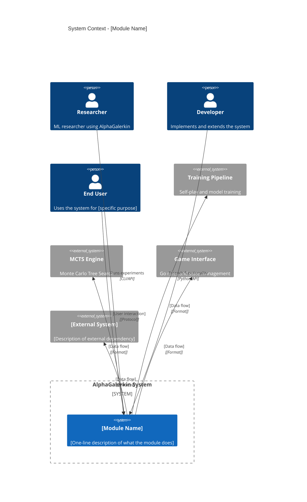
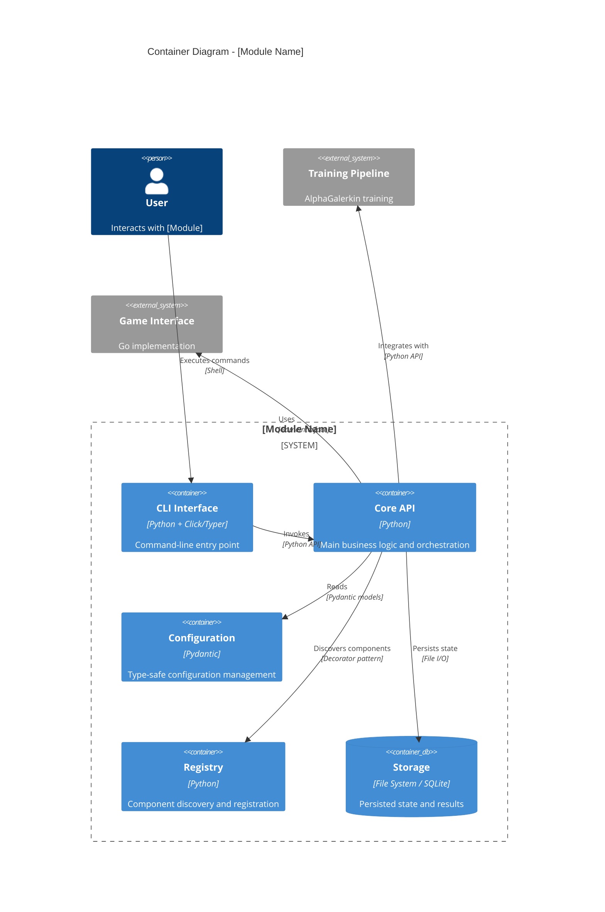
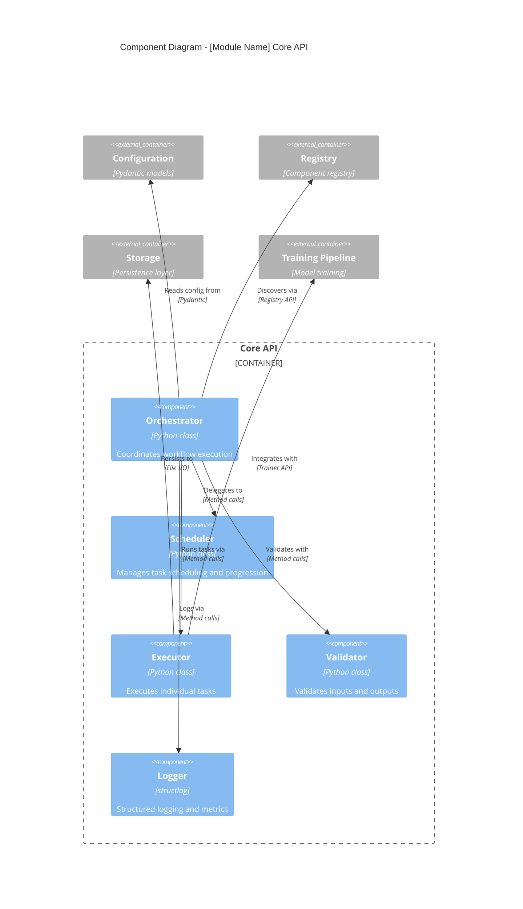
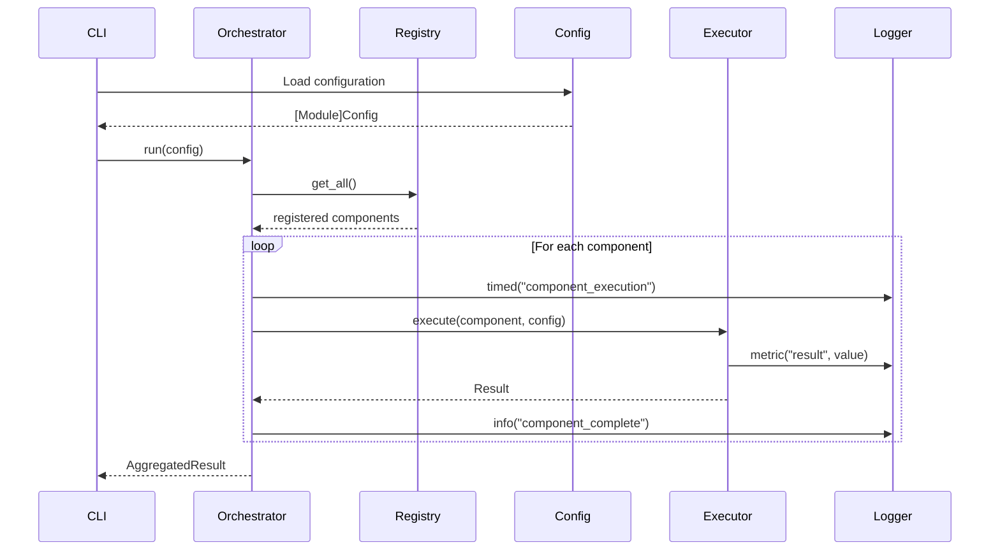
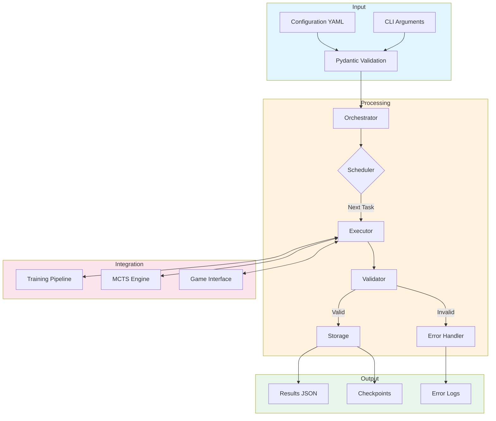
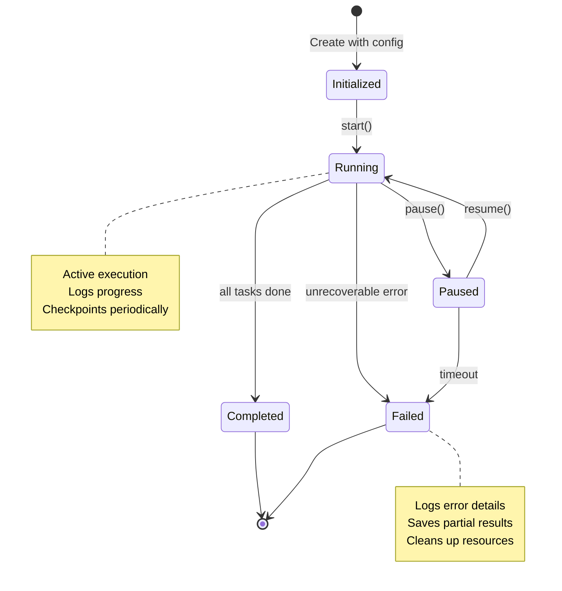
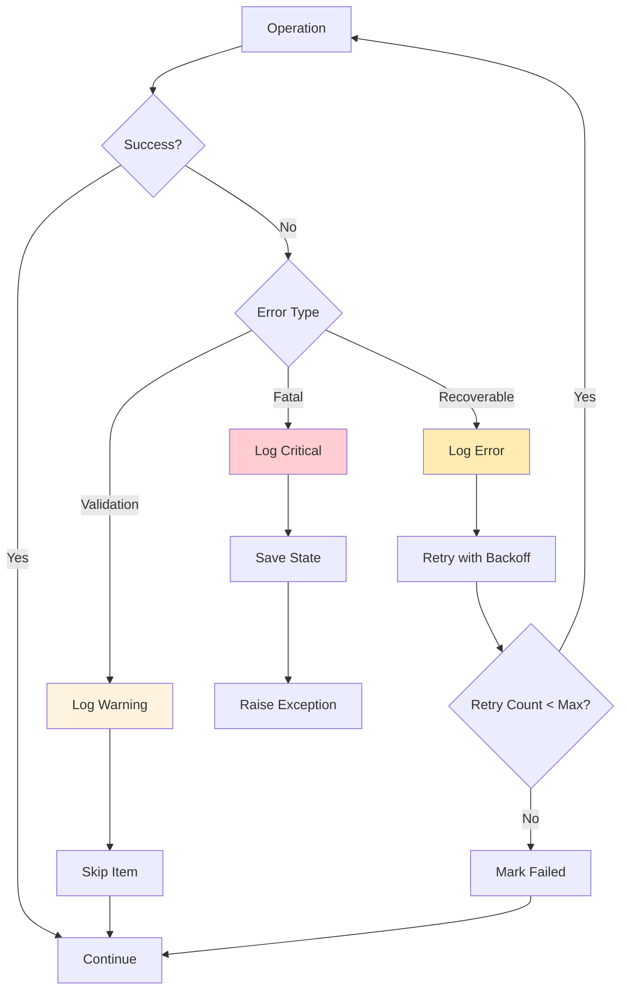

# C4 Architecture Template for AlphaGalerkin Modules

> **Template Version:** 1.0
> **Based On:** Simon Brown's C4 Model (https://c4model.com)
> **Format:** Mermaid diagrams for automated rendering

---

## How to Use This Template

1. Copy this file to `docs/architecture/[module]_c4.md`
2. Replace all `[Module]` placeholders with your module name
3. Fill in each level with module-specific details
4. Add Architecture Decision Records (ADRs) for non-obvious choices
5. Update the main `c4_mermaid.md` to link to your module

---

## Level 1: System Context

Shows how [Module] fits within the broader AlphaGalerkin system and interacts with external entities.



### Context Description

| Entity | Type | Description | Interaction |
|--------|------|-------------|-------------|
| Researcher | Person | [Role description] | [How they use this module] |
| Developer | Person | [Role description] | [How they extend this module] |
| Training Pipeline | System | Existing training infrastructure | [Data exchanged] |
| MCTS Engine | System | Search and evaluation | [Data exchanged] |
| [External] | External System | [Description] | [Protocol/format] |

---

## Level 2: Container Diagram

Shows the major containers (deployable units) within [Module].



### Container Descriptions

| Container | Technology | Responsibility | Key Files |
|-----------|------------|----------------|-----------|
| CLI Interface | Python + Typer | User-facing commands | `src/[module]/cli.py` |
| Core API | Python | Business logic | `src/[module]/[core].py` |
| Configuration | Pydantic v2 | Type-safe config | `src/[module]/config.py` |
| Registry | Python | Component discovery | `src/[module]/registry.py` |
| Storage | File/SQLite | State persistence | `src/[module]/storage.py` |

---

## Level 3: Component Diagram

Shows the internal components of the Core API container.



### Component Descriptions

| Component | Responsibility | Interfaces | Dependencies |
|-----------|----------------|------------|--------------|
| Orchestrator | High-level workflow coordination | `run()`, `stop()` | Scheduler, Executor |
| Scheduler | Task scheduling and progression logic | `next_task()`, `is_complete()` | Config |
| Executor | Individual task execution | `execute(task)` | Training, Storage |
| Validator | Input/output validation | `validate_input()`, `validate_output()` | Config |
| Logger | Structured logging | `info()`, `metric()`, `timed()` | structlog |

---

## Level 4: Code / Architecture Decision Records

### Class Diagram (Key Abstractions)

```mermaid
classDiagram
    class Base[Module] {
        <<abstract>>
        +config: [Module]Config
        +logger: [Module]Logger
        +execute()* Result
        +validate() bool
    }

    class [Module]Config {
        +name: str
        +param_int: int
        +param_float: float
        +param_list: list[int]
        +model_config: ConfigDict
        +compute_hash() str
    }

    class [Module]Registry {
        -_instance: [Module]Registry
        -_lock: Lock
        -_items: dict
        +register(name, cls)
        +get(name) type
        +list_items() list[str]
        +clear()
    }

    class [Module]Logger {
        -_base: BoundLogger
        -_context: dict
        +bind(**context) [Module]Logger
        +info(event, **kw)
        +metric(name, value, **tags)
        +timed(operation) ContextManager
    }

    class Concrete[Module]A {
        +execute() Result
    }

    class Concrete[Module]B {
        +execute() Result
    }

    Base[Module] <|-- Concrete[Module]A
    Base[Module] <|-- Concrete[Module]B
    Base[Module] --> [Module]Config
    Base[Module] --> [Module]Logger
    [Module]Registry --> Base[Module]
```

### Sequence Diagram (Typical Workflow)



---

## Architecture Decision Records (ADRs)

### ADR-[NNN]: [Decision Title]

**Status:** [Proposed | Accepted | Deprecated | Superseded]

**Context:**
[What is the issue that we're seeing that is motivating this decision or change?]

**Decision:**
[What is the change that we're proposing and/or doing?]

**Consequences:**
- (+) [Positive consequence]
- (+) [Another positive consequence]
- (-) [Negative consequence or trade-off]
- (-) [Another trade-off]

**Alternatives Considered:**
1. [Alternative 1]: [Why rejected]
2. [Alternative 2]: [Why rejected]

---

### ADR-001: Use Pydantic v2 for Configuration

**Status:** Accepted

**Context:**
Configuration management requires type safety, validation, and serialization. Options include raw dicts, dataclasses, attrs, or Pydantic.

**Decision:**
Use Pydantic v2 BaseModel for all configuration classes with `ConfigDict(extra="forbid", validate_assignment=True)`.

**Consequences:**
- (+) Compile-time type checking with mypy
- (+) Runtime validation with clear error messages
- (+) JSON/YAML serialization built-in
- (+) Consistent with existing AlphaGalerkin patterns
- (-) Slight overhead vs raw dicts
- (-) Learning curve for Pydantic v2 syntax

---

### ADR-002: Thread-Safe Singleton Registry

**Status:** Accepted

**Context:**
Components need to be discovered at runtime without explicit imports. The registry pattern enables plugin-style extensibility.

**Decision:**
Implement registry as thread-safe singleton using double-check locking pattern with `threading.Lock`.

**Consequences:**
- (+) Safe for multi-threaded scenarios (testing, distributed training)
- (+) Single source of truth for registered components
- (+) Decorator-based registration is intuitive
- (-) Singleton makes testing require explicit cleanup
- (-) Global state can be harder to reason about

---

### ADR-003: Structured Logging with structlog

**Status:** Accepted

**Context:**
Logging must support both human-readable development output and machine-parseable production logs.

**Decision:**
Use structlog with context binding and configurable renderers (console for dev, JSON for prod).

**Consequences:**
- (+) Consistent log format across all modules
- (+) Context automatically included in all logs
- (+) Easy to parse in log aggregation systems
- (+) Timing context managers for performance tracking
- (-) Requires configuration at startup
- (-) Slightly more verbose than basic logging

---

### ADR-004: [Your Decision Here]

**Status:** Proposed

**Context:**
[Describe the context...]

**Decision:**
[Describe the decision...]

**Consequences:**
- (+) [Positive]
- (-) [Negative]

---

## Data Flow Diagram



---

## State Machine (if applicable)



---

## Error Handling Strategy



---

## Integration Points

### With Training Pipeline

```python
# Example integration with src/training/trainer.py
from src.training.trainer import Trainer
from src.[module].config import [Module]Config

class [Module]Executor:
    def __init__(self, trainer: Trainer, config: [Module]Config):
        self.trainer = trainer
        self.config = config

    def execute_training_step(self) -> dict[str, float]:
        """Integrate with training pipeline."""
        # Use trainer's existing infrastructure
        loss = self.trainer.train_step()
        return {"loss": loss}
```

### With Game Interface

```python
# Example integration with src/games/interface.py
from src.games.interface import GameInterface
from src.games.registry import GameRegistry

class [Module]GameAdapter:
    def __init__(self, game_name: str = "go"):
        self.game = GameRegistry().get(game_name)
        if self.game is None:
            raise ValueError(f"Game '{game_name}' not registered")

    def get_state_tensor(self, state) -> torch.Tensor:
        """Convert game state to tensor for evaluation."""
        return self.game.state_to_tensor(state)
```

### With MCTS

```python
# Example integration with src/mcts/search.py
from src.mcts.search import MCTSSearch
from src.mcts.evaluator import FNetEvaluator

class [Module]SearchAdapter:
    def __init__(self, model, config: [Module]Config):
        self.evaluator = FNetEvaluator(model)
        self.search = MCTSSearch(
            evaluator=self.evaluator,
            n_simulations=config.mcts_simulations,
        )

    def get_policy(self, state) -> torch.Tensor:
        """Get move policy from MCTS."""
        return self.search.search(state).policy
```

---

## Checklist for C4 Completion

- [ ] Level 1 (Context): All external entities and relationships documented
- [ ] Level 2 (Container): All deployable units identified
- [ ] Level 3 (Component): All internal components with responsibilities
- [ ] Level 4 (Code): Key classes, sequences, and ADRs documented
- [ ] Data flow diagram shows input → processing → output
- [ ] Error handling strategy documented
- [ ] Integration points with existing modules documented
- [ ] All placeholders replaced with module-specific content
